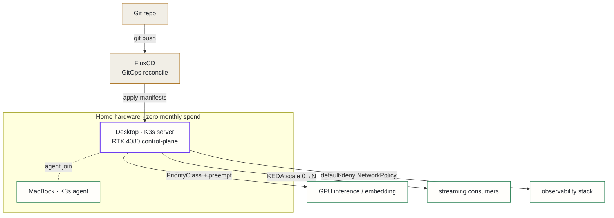

## Context

The platform needed real orchestration — GPU inference serving, Kafka streaming consumers, a full observability stack, and scheduled jobs — running on a single GPU node plus a MacBook, with **no cloud budget**.

Three forces pulled toward Kubernetes specifically rather than something simpler:

1. **GPU scheduling.** A single RTX 4080 has to be shared between an LLM server and an embedding workload that cannot coexist in VRAM. That needs a scheduler with priorities and preemption, not a process manager.
2. **Autoscaling on a queue.** Streaming consumers should scale from zero on Kafka lag and scale back down when idle — KEDA territory.
3. **A learning surface.** A secondary but explicit goal was to build production-grade Kubernetes and SRE experience: GitOps, NetworkPolicies, RBAC, the real ops failure modes. A managed control plane hides exactly the surface worth learning.

## Decision

Run **K3s** — a single-binary, CNCF-conformant Kubernetes distribution — on the home hardware, with FluxCD driving everything from Git.

K3s gives the full Kubernetes API and ecosystem (Helm, KEDA, NetworkPolicies, CRDs) in a footprint light enough to run on a desktop, with batteries-included defaults (local-path storage, a packaged load balancer and ingress) that remove a chunk of bootstrapping.

## Alternatives considered

- **Managed cloud Kubernetes (EKS/GKE/AKS)** — rejected: a persistent GPU node bills monthly whether or not it is busy, which is untenable for a home lab; it also surrenders direct control of GPU scheduling and the networking/ops surface the platform is specifically designed to build experience on.
- **Full upstream `kubeadm` cluster** — rejected: the same API as K3s but with materially more components to install, secure, and keep patched by hand; the heavier control plane buys nothing at single-node scale.
- **Docker Compose** — rejected: no GPU-aware scheduling, no queue-driven autoscaling, no NetworkPolicies; choosing it would mean rebuilding those primitives by hand, and none of the result would transfer to production Kubernetes patterns.

## Consequences

**Positive**: production-grade orchestration — GitOps, NetworkPolicies, KEDA autoscaling, priority-based GPU sharing — at zero monthly cost, on hardware already owned. Every pattern learned here is the same pattern used at scale.

**Accepted costs**: you own every crash personally — Season 1 Episode 6 documents 6,812 pod restarts during one bad week of bring-up. A single control-plane node is a single point of failure (later addressed by adding dedicated worker nodes and node-separated backup). Home-grade networking and power mean the platform must be resilient to the node simply disappearing.
