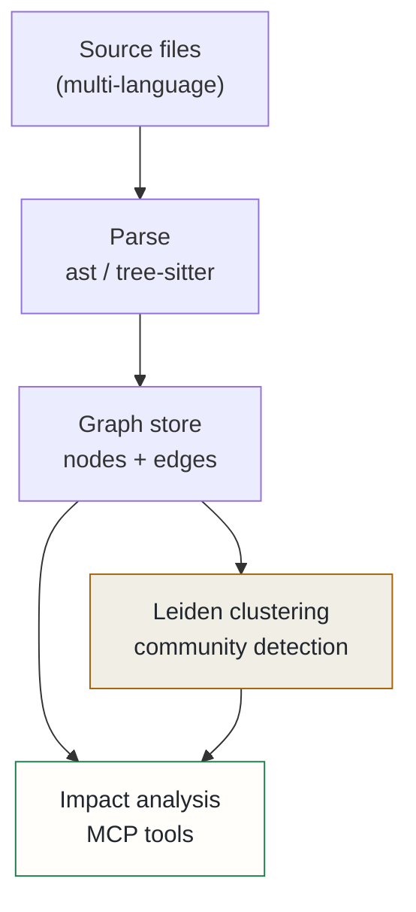

## Context

Semantic search retrieves documents by meaning; it cannot answer "which modules break if I change this function?" That question requires a structural model of the codebase — a graph of how things connect and depend on each other.

The platform had a working Program Dependency Graph (PDG) system: a graph of nodes and edges extracted from Python source via the standard `ast` module, stored in a graph database, and exposed via MCP tools for impact analysis and module search. It answered structural questions that vector search couldn't. But it had three hard limits:

**Single language.** Python-only. Infrastructure, TypeScript, Go, or Kubernetes YAML was invisible.

**Single repository.** Modules from different repos couldn't be linked. "If I change this shared library, which services break?" had no answer.

**Flat symbol lookup.** Impact analysis returned flat lists of dependent modules. It didn't surface the functional clusters that structure a codebase — the boundary between the auth subsystem and the search pipeline was not represented anywhere.

## Decision

Extend the existing PDG into a modular code-knowledge graph with three new capabilities, building on the existing infrastructure without new services.

**Multi-language parsing.** Python continues using the `ast` module (proven). All other languages use tree-sitter with per-language grammars — a single parsing model that covers Go, TypeScript, Bash, HCL, YAML, and Dockerfile via dedicated grammar packages. Each file extension selects its parser; the resulting nodes and edges flow into the same graph schema.

**Leiden community detection.** After each index pass, run the Leiden graph-clustering algorithm over the call graph. The result is a set of automatically discovered `Community` nodes — functional clusters inferred from actual call density rather than directory structure. A `get_communities` MCP tool exposes these clusters; a `get_processes` tool groups search results by traced execution flows rather than flat symbol matches. The distinction matters: a flat list of seventeen functions that call `validate_token` is noise; a grouped view showing three execution flows that each pass through it is useful.

**Cross-layer edges.** Infrastructure nodes — Kubernetes services, Helm charts, Dockerfiles — are parsed from YAML and linked to the Python modules they deploy, via typed `DEPLOYS` edges. The graph connects code to infrastructure in a single traversal, making it possible to ask "which service deploys the module I'm about to change?"

The graph backend is abstracted behind a `GraphBackend` protocol so the storage layer can be swapped without changing the analysis logic.

## Alternatives considered

- **Sourcegraph or GitHub CodeQL** — rejected: both are cloud-anchored or require substantial enterprise licensing for self-hosted use. The point of the platform is that code never leaves the cluster.
- **Keyword and semantic search alone** — rejected: semantic search retrieves documents by meaning but cannot traverse dependency edges. Answering "what breaks if I change X" requires a graph, not cosine similarity.
- **Keep the Python-only PDG** — rejected: the language boundary meant infrastructure nodes (YAML, Dockerfiles) and any frontend code were permanently invisible, making cross-layer impact analysis impossible regardless of how well the Python graph worked.

## Consequences

**Positive**: the graph becomes a genuine structural layer alongside vector recall — different stores for different kinds of truth. Impact analysis is no longer limited to a single language. Community detection gives new contributors an immediate architectural map without reading every directory. Cross-layer edges make infrastructure changes traceable to their code consequences. The `get_communities` and `get_processes` tools are operational; Phase A is complete.

**Accepted costs**: tree-sitter integration introduces per-language grammar bindings as new dependencies to maintain. Leiden clustering adds a post-index step that is slow on cold start and cached on subsequent runs. The `proposed` status reflects that multi-repo namespace and cross-repo edge traversal — the full enterprise scope — are not yet implemented. The single-repo, multi-language base is working; the cross-repo phases remain in progress.
