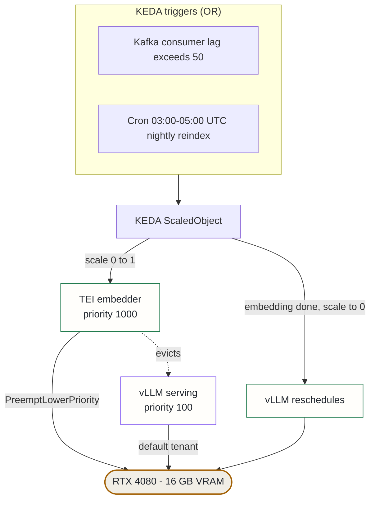

## Context

The platform runs on a single RTX 4080 (16 GB VRAM). Three workloads need the GPU:

1. **vLLM serving** (~15.6 GB) — primary LLM for agent routing and research.
2. **TEI embedding** (Qwen3-Embedding-4B, 2560d, ~8 GB) — the production embedder whose vector dimension matches the Qdrant collection. Used by the nightly reindex and on-demand by the Jira connector.
3. **A legacy code-graph embedder** (separate StatefulSet).

The first two cannot coexist — vLLM's allocator pins the full card. HAMi fractional sharing was ruled out: vLLM is sized to consume essentially all 16 GB, leaving no usable fraction for TEI. The historical workaround was a manual scale-up/scale-down operator pattern, which left two failure modes: ad-hoc connector bursts needed TEI immediately but found it scaled to 0, and a forgotten scale-down caused inference outages until noticed. Once the Jira connector went live, these bursts became a routine daily event. The manual model became untenable.

## Decision

Deploy a **KEDA + PriorityClass GPU swap controller**:

1. Two `PriorityClass` objects set an unambiguous preemption order: TEI at priority 1000 (`PreemptLowerPriority`), vLLM at priority 100.
2. A KEDA `ScaledObject` (not just a ScaledJob) drives TEI 0↔1 based on two OR-ed triggers: Kafka consumer-group lag exceeding 50 messages, or a daily cron window (03:00–05:00 UTC) matching the nightly bulk re-embedding job.
3. vLLM remains the default GPU tenant and is evicted automatically when embedding work arrives; it reschedules once TEI scales back to 0.

Retry coupling: the connector consumer's exponential backoff (~30 s) is deliberately sized to absorb TEI's model load time so the first few embedding requests after a cold scale-up do not fail.

## Alternatives considered

- **HAMi fractional GPU sharing** — rejected: vLLM consumes ~15.6 of 16 GB; there is no usable fraction left for TEI regardless of slicing.
- **Pure cron scheduling (no Kafka trigger)** — rejected: adequate for the deterministic nightly reindex but too coarse for ad-hoc connector bursts; embedding requests would queue for hours waiting for the next cron window.
- **Run TEI on CPU** — rejected: Qwen3-Embedding-4B on CPU embeds ~10× slower than GPU (measured during a model migration); the nightly reindex would not complete within its two-hour window.
- **Add a second GPU** — rejected for now: the right long-term answer, but capex-bound. The PriorityClass design is reversible — when a second GPU lands, the priority annotations can be dropped.

## Consequences

**Positive**: TEI runs at 0 replicas ~90% of the day, reclaiming ~8 GB VRAM for inference. Eliminates the "forgot to scale down" failure mode. Workload-driven, not operator-driven.

**Accepted costs**: vLLM cold start (~60 s) on every swap; Ollama on CPU provides a fallback during the gap. Only one of {vLLM, TEI} can hold the GPU at a time — adding a fourth GPU workload would require a second physical GPU or a more sophisticated scheduler.
