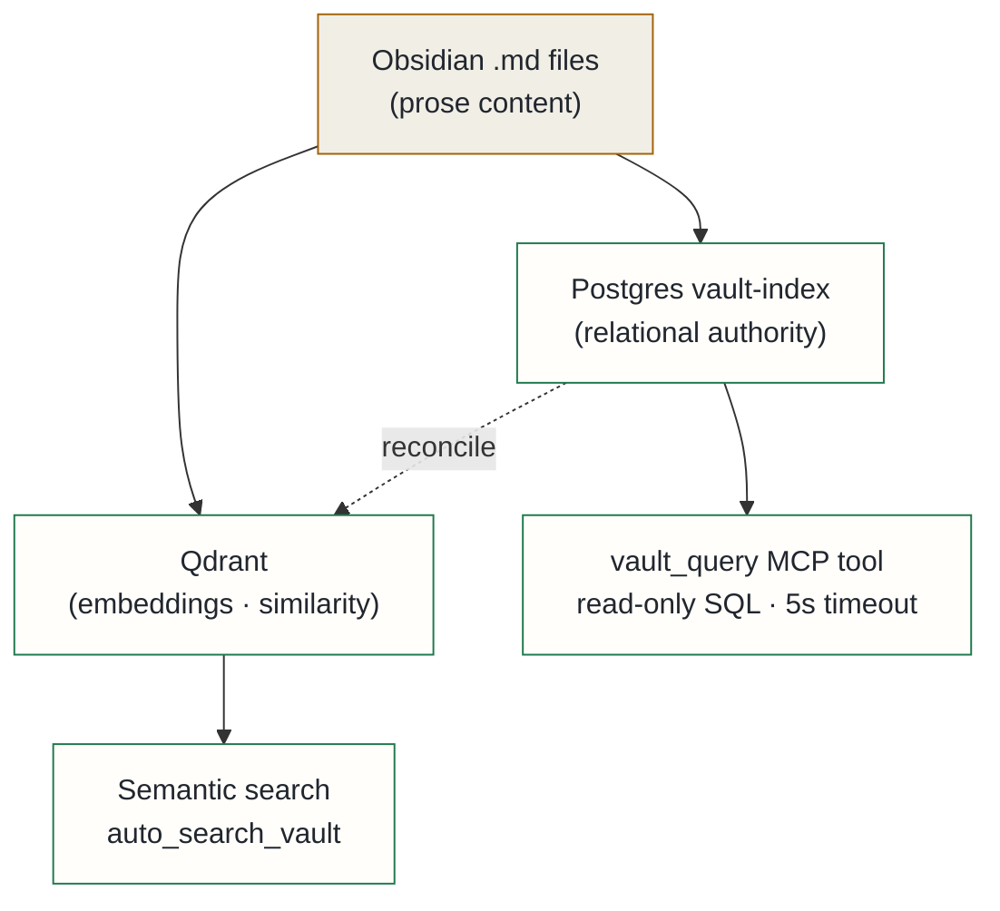

## Context

The Obsidian vault (~6,000 markdown files) is the institutional memory of the platform. Three query tools already existed for navigating it: Qdrant semantic search, Grep, and file reads. Each does its job well. None of them handles a specific and recurring class of question.

Three question shapes kept appearing that none of the existing tools could answer efficiently:

**1. Structured predicates.** "All ADRs with status=Proposed." "Documents tagged architecture created in April." These require exact-match filters over structured fields — Qdrant's payload filters work in theory, but they silently drop results at the edges of filter composition.

**2. Relational joins.** "Which docs reference this Jira issue?" "What's linked from the top-level HLD and when was each link last verified?" These require joins across tables: documents, tags, backlinks, cross-references. Qdrant has no join model.

**3. Aggregations and timelines.** "Benchmark scores over time." "Tag frequency by namespace." These are pure relational workloads.

Two incidents made the cost concrete. A Qdrant payload filter silently dropped results when used as a source filter — there was no authoritative source to cross-check. A freshness-filtering feature had to be bolted on as an afterthought because Qdrant couldn't cleanly compose date predicates with similarity scores. Both problems were symptoms of the same structural gap: relational queries belong in a relational database.

## Decision

Deploy a **Postgres structured index over the vault** as a first-class query tier, running alongside Qdrant, not replacing it. The underlying principle: *different stores for different kinds of truth*.

Authority is divided cleanly:

1. **Obsidian (.md files)** — authoritative for prose content.
2. **Postgres (vault-index)** — authoritative for derived structured metadata: the tag vocabulary, backlink graph, cross-references, status fields. A hybrid schema: typed columns with btree indexes for hot fields (date, type, status), a JSONB column with GIN index for long-tail frontmatter.
3. **Qdrant** — authoritative for embeddings and similarity scores. Its payload is treated as a cache reconciled via the Postgres `blocks` table.
4. **FalkorDB** — unchanged, continues to own the code and document knowledge graph.

A new MCP tool, `vault_query`, exposes read-only SQL to the language model: SQL-validated, 5-second timeout, auto-LIMIT. The indexer runs as a Kafka-triggered incremental job on the same event stream as the vector indexer, so both stores stay in sync from one source.

## Alternatives considered

- **Continue with Qdrant + Grep + file reads** — rejected: this approach consumed large amounts of context tokens to answer questions that would be one SQL row. More importantly, fuzzy search *misses* matching documents on structured questions, producing qualitatively wrong answers.
- **Pure JSONB schema, no typed columns** — rejected: simpler to implement but loses column statistics for the query planner on hot-path fields. The evidence from the Postgres community converges on a hybrid schema for exactly this use case — typed columns where cardinality is known, JSONB for the long tail.
- **Elasticsearch / MongoDB for the structured layer** — rejected: Elasticsearch is a search engine, not a relational store; joins are awkward and the schema change story is painful. MongoDB's SSPL license blocks an eventual enterprise deployment path. Postgres JSONB covers the schemaless use case and gives the relational joins that are the whole point.

## Consequences

**Positive**: the language model gains a new query mode for questions Qdrant structurally cannot answer. Postgres becomes the reconciliation point — if the vector index drifts or is rebuilt, the source of truth for metadata stays intact and can be used to re-embed from scratch. Importantly, Postgres exposes the messy reality of vault frontmatter (inconsistent field names, noisy tags) that Qdrant's blob payload hides — making data quality observable and improvable.

**Accepted costs**: a new database pod adds operational overhead — persistent volume claim, network policy, backup, monitoring. Vault changes now fan out to two write paths; drift is mitigated by sharing the Kafka event trigger, but it cannot be eliminated entirely. Schema migrations are required when core typed fields change, though JSONB absorbs unknown frontmatter keys gracefully. Exposing SQL to a language model is a new threat surface even at read-only — mitigated by a read-only Postgres user, statement timeout, and automatic result capping.
