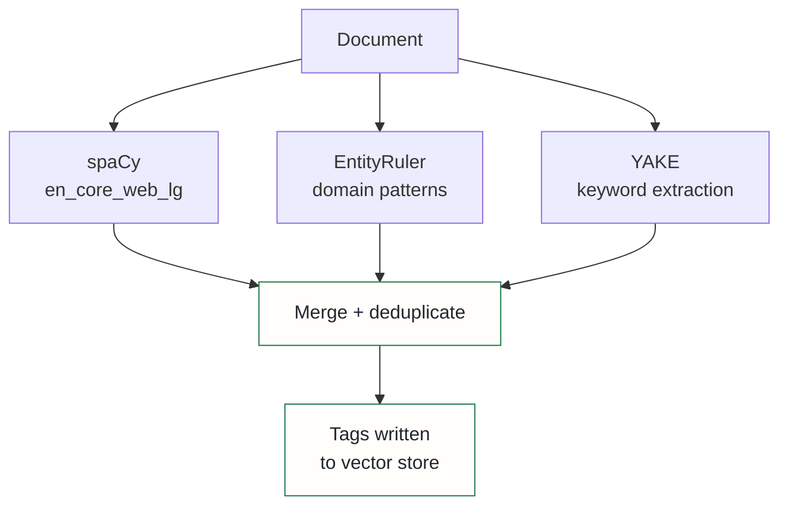

## Context

The vault auto-tagging pipeline extracted named entities — technical terms, project names, concepts, tools — from every document and wrote them as searchable tags into the vector store. The original implementation used a large language model to do this extraction via zero-shot prompting.

The argument for an LLM was obvious: the entity types are open-ended and contextual, and LLMs generalise to arbitrary categories without labelled training data. This seemed like the natural fit.

Two failures changed the analysis. The first was a performance problem: a model swap to a newer reasoning model exposed that the pipeline was consuming roughly 4,600ms per file on GPU, with most of the budget going to chain-of-thought tokens the extraction task did not need. The second failure was more serious: on a sample document, 75% of extracted tags were fabricated — entities that did not appear anywhere in the source text. The root cause was the vault context injected into every extraction prompt. LLMs generate entities from everything in their context window, not just the text being tagged. When the prompt includes background context about the knowledge base, they extract from the background.

Academic NER literature confirms this is a known failure mode of prompt-based extraction: span-based models that score each text span independently achieve higher precision and have zero hallucination risk by construction, because they cannot generate tokens outside the input document.

## Decision

Replace LLM-based extraction entirely with a span-based stack running on CPU.

**Tier 1 (synchronous, CPU):** spaCy `en_core_web_lg` combined with an EntityRuler component holding domain-specific patterns for platform vocabulary — infrastructure tools, framework names, project identifiers. spaCy scores each text span against its training distribution; the EntityRuler adds deterministic rule-based matches for terms the statistical model may not cover. YAKE (a statistical keyword extractor) supplements both with high-salience multi-word phrases, using term frequency and positional co-occurrence with no ML inference. The three components run in parallel over the same document; their outputs are merged and deduplicated.

**Tier 2 (batch, GPU):** GLiNER for zero-shot custom entity types not covered by the rule set. This remains on the roadmap; the Tier 1 stack covers the production workload.

The LLM's role in entity tagging is none. Downstream LLM reasoning *about* extracted entities is a separate concern; extraction itself must not use a generative model.

## Alternatives considered

- **Keep the LLM with a revised prompt** — rejected: the hallucination rate was a property of the approach, not the prompt. A generative model in an extraction context will sample from everything in the context window; fixing that requires a different model class, not a better prompt.
- **GPU-accelerated LLM via the existing inference server** — rejected: the inference GPU is allocated to embedding; sharing it with a large extraction model introduces contention. The span-based stack runs at under 10ms per file on CPU, making the GPU tradeoff unnecessary.
- **GLiNER only, skipping spaCy** — rejected: GLiNER requires a GPU batch pass and adds model dependency overhead. The EntityRuler and spaCy combination covers the majority of domain entities deterministically, which is cheaper and more predictable for the synchronous tagging path; GLiNER is reserved for the cases they miss.

## Consequences

**Positive**: hallucination rate drops to zero by construction — span-based models cannot generate text outside the input. Latency drops from ~4,600ms per file to under 10ms. The EntityRuler makes domain coverage explicit and auditable: if a term is missing, adding a pattern requires no retraining. The pipeline no longer competes with embedding inference for GPU resources, which simplifies scheduling across the platform.

**Accepted costs**: recall on unusual or novel entity types is bounded by what spaCy's training data and the EntityRuler patterns cover. A term the model hasn't seen and that no rule matches will be missed silently. The rule set requires ongoing maintenance as new tools and projects enter scope. The Tier 2 GLiNER batch pass is the planned answer for known-unknown entity types, but it is not yet deployed.
