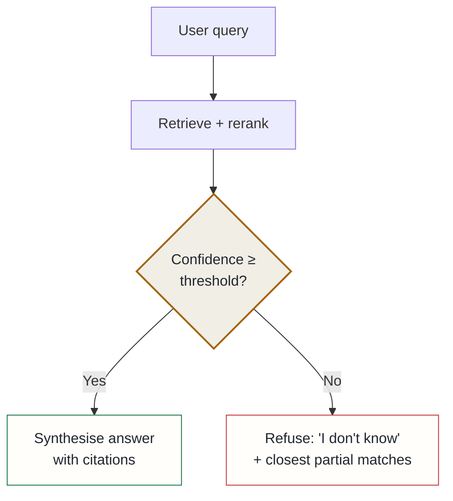

## Context

The RAG pipeline answered **every** query, including ones where the retrieved context was irrelevant to the question. A confident, fluent, wrong answer is the worst possible failure mode for a knowledge system: it is indistinguishable in tone from a correct one, so it quietly erodes trust in every other answer.

The signal to act on was already in the pipeline and being thrown away. Retrieval produces scores — vector similarity, BM25 rank, and a cross-encoder rerank score — and when the top results are genuinely unrelated, those scores are low and clustered. The system had the evidence that it was about to guess; it just wasn't using it to change behaviour.

## Decision

Add a **refusal gate** between retrieval and synthesis. When the retrieval confidence for a query falls below a threshold, the system does not synthesise an answer — it returns an explicit "I don't know," lists the closest partial matches it *did* find, and stops.

The principle: the system should act correctly at the boundary of its own knowledge, rather than pushing the burden of detecting low confidence onto whoever reads the answer.

## Alternatives considered

- **Return a "best effort" answer with a low-confidence note** — rejected: still produces a confidently phrased hallucination; a caller cannot reliably tell a low-confidence synthesis from a high-confidence one, which is the exact failure being eliminated.
- **Surface an uncertainty flag in the response body without changing the answer** — rejected: adds a field but no behavioural change, and shifts the interpretation of confidence onto every caller instead of the system handling it once, correctly.
- **Always answer, but cite sources and let the reader judge** — rejected: citations on irrelevant context look like evidence and make a wrong answer *more* persuasive, not less.

## Consequences

**Positive**: faithfulness improved measurably on the benchmark suite — the system stopped fabricating answers when it had no grounding. "I don't know, but here's the nearest thing I found" is a genuinely useful response that also invites the user to rephrase.

**Accepted costs**: a small share of *answerable* queries now refuse because their confidence sits just under the line — a precision/recall trade that has to be tuned. The threshold is a single dial with real consequences in both directions, so it is set conservatively and revisited against the benchmark rather than guessed.
