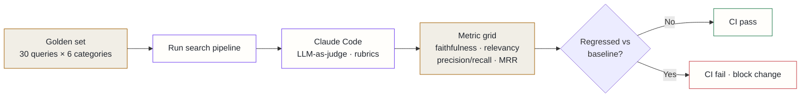

## Context

Search "worked" — but that was a vibe, not a measurement. There was no answer to three questions that actually matter:

- Is a given answer **faithful** to the documents it cites, or partly invented?
- Did the **right document rank first**, or did the answer happen to be salvageable from rank 5?
- Did last week's change quietly make any of this **worse**?

Without numbers, every tuning change was a guess, and regressions were invisible until something felt off in normal use. The pipeline needed a quality signal that runs in CI and fails loudly.

## Decision

Build a benchmark suite that borrows its shape from the academic RAG-evaluation literature rather than inventing metrics:

- **HELM-style scenario grid** — a fixed golden set of 30 queries × 6 categories, so coverage is explicit and every run scores the same matrix.
- **RAGAS metrics** — faithfulness, answer relevancy, context precision, context recall.
- **RAGBench-style attribution** + **MRR** — whether the cited spans support the claim, and where the right document ranked.
- **Claude Code as the LLM judge**, scoring against structured rubrics — no external evaluation API spend.

## Alternatives considered

- **Commercial eval API (off-the-shelf RAGAS service)** — rejected: bills external API spend on every CI run, and the scores would come from a different model than the one in production, making quality drift over time hard to attribute.
- **Manual spot-checking** — rejected: not automatable, not reproducible, and a single reviewer cannot consistently score 180 query-category pairs (30 × 6); it gives no regression signal when code changes.
- **Exact-match / lexical metrics only (BLEU, ROUGE, F1)** — rejected: cheap and deterministic, but they reward surface overlap, not faithfulness — a fluent wrong answer can score well, which is precisely the failure mode being measured.

## Consequences

**Positive**: search quality became a **number that can regress in CI**. Tuning changes are now evaluated, not guessed, and a quiet regression fails the build instead of shipping.

**Accepted costs**: a caveat is stapled to every score — results are relative to Claude's judgment and are **not** comparable to GPT-4-scored RAGAS runs, so absolute numbers are only meaningful against this suite's own baseline. LLM-as-judge also has some run-to-run variance, so the gate compares against a baseline band rather than a single brittle threshold.
