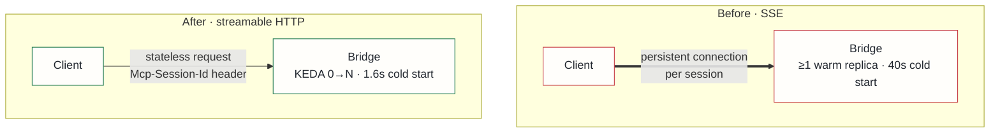

## Context

The MCP bridge exposes 29 tools to Claude Code and was served over **SSE** (Server-Sent Events). Two problems compounded each other:

1. **Cold starts.** The bridge is a KEDA-scaled workload that scales to zero when idle. The first tool call of a session had to wait for a pod to start — up to **40 seconds**. Every new working session paid that tax up front, which is brutal for an interactive tool.
2. **Connection-per-session.** SSE holds a long-lived connection open for each client session. That statefulness fights scale-to-zero (you cannot drop a pod that is holding open connections) and complicates load balancing — the transport itself was pinning the bridge to "always at least one warm replica."

The MCP specification's 2025-03 revision introduced a **streamable HTTP** transport designed for exactly this shape of deployment.

## Decision

Migrate the bridge to **streamable HTTP**: stateless request/response with optional streaming for long-running tool calls, and session continuity carried in an `Mcp-Session-Id` header rather than a held-open socket.

Because requests are now independent, the bridge can scale to zero and back without orphaning a connection, and any replica can serve any request.

## Alternatives considered

- **Keep SSE with a warm minimum replica** — rejected: removes the cold-start pain only by paying an idle-node tax 24/7, which defeats the point of a scale-to-zero workload.
- **WebSocket transport** — rejected: not part of the MCP spec, so client support is nonstandard and fragile; adopting it would mean betting on a bespoke transport for a protocol whose whole value is interoperability.
- **Tune SSE cold start without changing transport** (smaller image, faster boot) — rejected: shaves seconds but cannot fix the structural connection-per-session statefulness; the transport, not the image, was the constraint.

## Consequences

**Positive**: cold starts dropped **~96% (40 s → 1.6 s)**, so the first tool call of a session is effectively instant. KEDA can now scale the bridge safely to zero, reclaiming resources when no session is active. The stateless model also makes horizontal scaling trivial.

**Accepted costs**: clients pinned to older MCP SDK versions needed an upgrade path, so SSE and streamable HTTP were both served for one release cycle before SSE was retired. This ADR supersedes ADR-029, which chose SSE under the prior spec.
