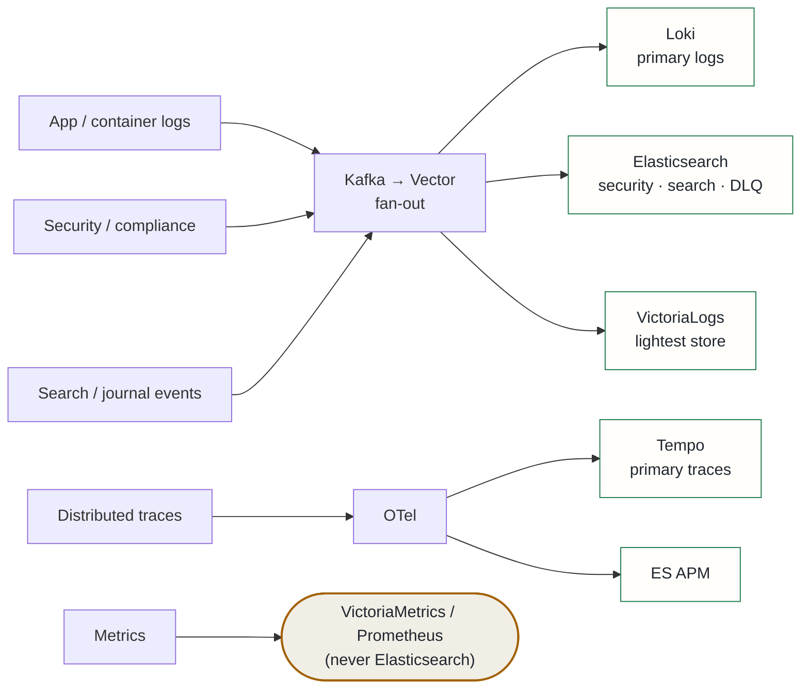

## Context

A prior ADR established Kafka → Vector → Elasticsearch for LLM observability. In practice the platform now runs an intentional **multi-backend observability rig**: running VictoriaLogs/VictoriaMetrics alongside Elasticsearch gives hands-on parity with both tool families — the overlapping stores are deliberate learning infrastructure, not waste.

Two recurring questions needed a standing answer:

1. Which signal goes to which backend?
2. What are the ingestion field-mapping standards so every backend gets correct, consistent, non-spoofable data?

This ADR records those decisions. It was prompted by the VictoriaLogs deployment and the discovery that the Elasticsearch leg had been silently dropping all logs (root cause: Vector elasticsearch sinks must set `bulk.action: create` and supply `@timestamp` for data-stream targets — omitting either causes ES to reject with HTTP 400 and Vector to silently drop the event).

## Decision

### 1. Routing matrix

| Signal | Primary store | Secondary (learning/compare) | Rationale |
|---|---|---|---|
| Application/container logs | Loki | Elasticsearch + VictoriaLogs | Three log stores in parallel = the learning rig. VictoriaLogs is the lightest (15–30× less disk than ES). |
| Security/compliance logs | Elasticsearch | VictoriaLogs | ES retention, RBAC, and audit tooling; clamped timestamps (see below). |
| Distributed traces | Tempo | Elasticsearch APM | Tempo is primary; ES APM for ES-native trace analysis. |
| Metrics | **VictoriaMetrics / Prometheus** | — | Metrics do NOT go to Elasticsearch. ES TSDB exists but is the wrong tool at this scale. |
| Search/analytics (journal, vault events) | Elasticsearch | — | Full-text and faceted search complements the vector RAG layer. |
| Dead-letter queue | Elasticsearch | — | Need to inspect failed records; small volume, high ops value. |

### 2. Field-mapping standards (all log backends)

- **Message field**: the human-readable body only. Never JSON-pack the whole record into the message field (kills compression); keep structured fields separate.
- **Timestamp**: use the original event time (`timeUnixNano`), not processing time. Use infallible VRL conversions with a fallback to ingest time — a malformed event timestamp must never abort the transform and drop the record (audit-log evasion guard).
- **Anti-spoof clamp**: event-supplied time is clamped to `[now−90d, now+5m]`; outside that, fall back to ingest time. Retain `vector_processed_at` as the non-spoofable forensic timestamp.
- **Stream/label fields**: low-cardinality, stable producer identity only (`namespace`, `pod`, `app`, `service`). `level`/`severity` is a filter field, not a stream key. Never use `trace_id`, `user_id`, or IP as a stream field (cardinality explosion). High-cardinality values are fine as regular fields, just not as stream labels.

### 3. Topology pattern

Each new Kafka-sourced signal gets a Vector source + a `create`-mode ES data-stream sink (plus optional Loki/VictoriaLogs sinks), reusing the same fan-out pattern. Pod logs are the exception — they need a `kubernetes_logs` Vector source rather than a Kafka sink.

## Alternatives considered

- **Single log backend (VictoriaLogs only)** — rejected: defeats the explicit hands-on parity goal; running all three lets the platform compare query latency, disk cost, and label model across ES, Loki, and VictoriaLogs against the same data.
- **Metrics into Elasticsearch (TSDB mode)** — rejected: VictoriaMetrics and Prometheus are purpose-built and far lighter; ES TSDB is the wrong tool at home-lab scale and would waste significant RAM and disk.
- **OTEL collector direct-to-ES, skipping Kafka/Vector** — rejected: the Kafka buffer + Vector fan-out decouples producers from sink health. An earlier ES outage proved the value of that buffer: logs queued in Kafka while ES was down, then drained without data loss once ES recovered.

## Consequences

**Positive**: clear, repeatable rule for where any new signal goes; security/compliance logs are tamper-evident (clamped event time + forensic ingest timestamp); metrics stay out of ES; three log stores give a genuine comparison baseline.

**Accepted costs**: triple-writing logs costs ~3× log storage and ingest CPU (accepted: VictoriaLogs, the added store, is the cheapest of the three); four stores plus Tempo to keep healthy; field-mapping standards must be applied per-sink in Vector VRL, creating some duplication across transforms.
