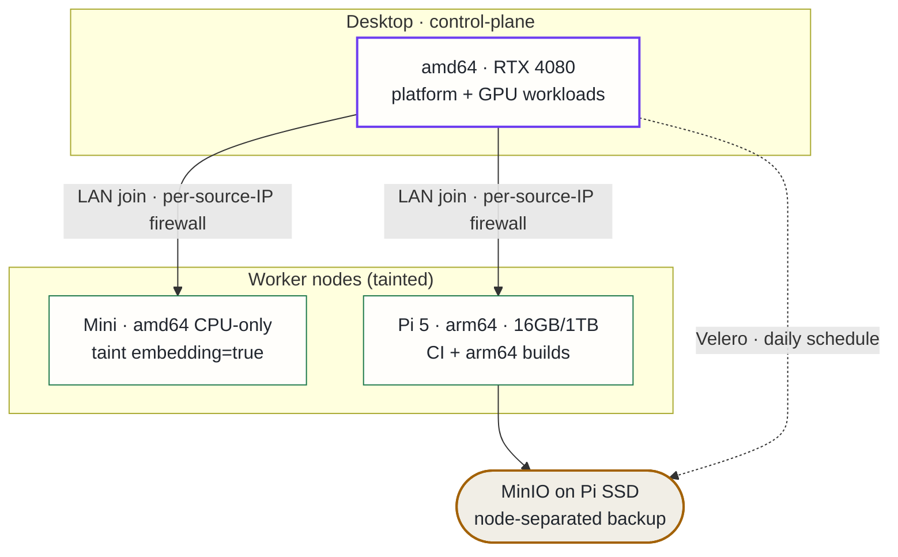

## Context

The cluster grew from a single control-plane node (desktop, amd64 + GPU) to three:

- **Desktop** — control-plane/master, amd64, RTX 4080; runs the platform and GPU workloads.
- **Mini worker** — amd64 CPU-only, dedicated to embedding (taint `embedding=true`).
- **Pi 5 worker** — Raspberry Pi 5 16 GB / 1 TB SSD, **arm64**.

Adding heterogeneous nodes surfaced recurring questions without documented answers: how nodes join, how to prevent the scheduler from placing unrunnable workloads on wrong-arch nodes, where backups live when the primary node is also the only backup target, and why cross-namespace NetworkPolicies silently dropped traffic.

## Decision

Six conventions, binding going forward:

**1. LAN join + per-source-IP firewall rules.** Agents join over LAN (not Tailscale). The control-plane firewall gates the k3s API, flannel VXLAN, and kubelet ports per agent source IP. (Tailscale-based join does not work: inbound Tailscale to the desktop is currently dropped by a firewall/CNI ordering conflict.)

**2. Dedicated-node taint pattern.** Every worker carries a `NoSchedule` taint encoding its purpose. Workloads opt in with a matching toleration + nodeSelector. Joining a node untainted causes the scheduler to spread pods that cannot run there (wrong arch, missing GPU, wrong hostPath) — observed live before this rule was established.

**3. arm64 is for CI, not for platform images.** Platform service images are amd64-only. The Pi is used for lint/validate CI and native arm64 multi-arch builds only. When pinning an image by digest for an arm64 target, pin the multi-arch index digest — a per-arch amd64 digest 404s on arm64.

**4. Node-separated backup tier.** A second MinIO instance runs on the Pi's SSD as a non-default Velero backup location, with a daily schedule and longer TTL than the primary. A desktop failure no longer takes the backups with it.

**5. NetworkPolicy under kube-router: use ipBlock, not podSelector.** kube-router does not populate the source ipset for cross-namespace podSelector ingress peers — the selector matches but the ipset is empty, producing silent packet drops. Use `ipBlock: 10.42.0.0/16` (cluster pod CIDR) for allow-from-pods rules. Trade-off: any in-cluster pod can reach the port (still credential-gated); true namespace scoping needs the CNI bug fixed.

**6. Gaming-mode resilience via Pi pinning.** Services that must survive the desktop being scaled down for gaming are pinned to the Pi via nodeSelector and toleration.

## Alternatives considered

- **Tailscale-based node join** — rejected for now: inbound Tailscale to the desktop is dropped; would need the CNI/firewall ordering fixed first.
- **Namespace-scoped NetworkPolicies** — not viable on this CNI version; empty selector ipsets make them silently ineffective.
- **Single backup location on the desktop** — rejected: no node separation means a desktop hardware failure takes both the cluster and its backups simultaneously.
- **Untainted general-capacity workers** — rejected: causes the scheduler to place unrunnable pods (wrong arch, missing GPU) across nodes, producing CrashLoopBackOff at runtime instead of a clear scheduling error.

## Consequences

**Positive**: backup durability via physical node separation; CI offloaded from the memory-pressured desktop onto a 24/7 low-power node; gaming-mode-resilient CI lane; deterministic, documented workload placement.

**Accepted costs**: NetworkPolicies are broader than ideal under this CNI; node join is a manual firewall + agent step; arm64 contributors must tag CI jobs and know that amd64 builds stay on the desktop.
