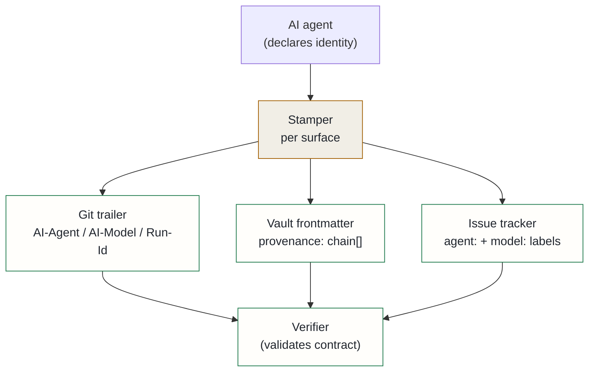

## Context

The platform is now built by several AI coding agents running concurrently — Claude Code, Codex, and local-model services — plus direct-API scripts. They all produce artifacts: git commits, vault markdown, issue tracker entries. Every one of those artifacts was indistinguishable at the producer level. The git committer on every commit was the human owner's identity. There was no way to tell which model wrote which commit.

The problem was worse than cosmetic. A commit-trailer hook that was supposed to stamp session identity onto commits was misattributing under concurrency: it guessed the most-recently-modified session log by working directory and timestamp, which meant a Codex commit could wear a Claude session ID, and two concurrent Claude sessions could cross-stamp each other.

**Three gaps drove the decision:**

**1. Attribution was broken at the source.** The identity protocol relied on heuristics rather than authoritative declarations from the agent itself.

**2. No producer identity on any surface.** Not on git commits, not in vault documents, not on issue tracker entries. Every artifact looked like it came from the same undifferentiated human+AI blob.

**3. No integrity guarantee.** Without a signed record of which model produced an artifact, there was no way to route review decisions by producer, no way to build a cross-model quality scorecard, and no trail for IP and ownership purposes.

## Decision

A unified provenance **contract** — a versioned schema, an identity protocol, per-surface output formats, and a per-agent key registry — that every tool conforms to. The contract is the product; each surface has a stamper; a verifier validates artifacts. New tools onboard by conforming to the schema, without requiring changes to the verifier.

The identity protocol fixes the misattribution root cause: **declare, never guess**. The interactive harness resolves identity from its own authoritative session variable. Any other conforming tool — Codex, future agents — declares itself via environment variables set in its own config. API scripts stamp from the model parameter and account alias at call time. A canonical model registry normalises friendly names to exact canonical identifiers and rejects vague strings.

Per-surface stampers project one canonical record onto each artifact store: git trailers carry agent, model, provider, invocation type, and a human-readable co-author alias; vault documents carry a `provenance.chain[]` block; issue tracker entries carry filterable `agent:` and `model:` labels. One hook stamps every agent's commits; the schema is the same regardless of surface.

Phase 2 adds cryptographic integrity: per-agent ed25519 SSH keys sign both git commits and vault documents, upgrading the plain-text record to non-repudiable attribution. Phase 3 feeds the stamped artifacts into a revealed-preference quality scorecard: was the commit reverted? Did the test pass? Was the document edited after indexing? Grouped by model, this produces a cross-source model evaluation that complements controlled benchmarks.

## Alternatives considered

- **Plain-text `generated_by` fields on each surface, no shared schema** — rejected: bespoke per-surface fields are not verifiable, cannot be queried uniformly, and do not survive surface-specific reformatting.
- **Rely on git committer email alone to distinguish agents** — rejected: the misattribution bug demonstrated that committer identity is set by the human operator's git config, not by the producing agent; it cannot be trusted under concurrency.
- **Defer until a commercial tool exists** — rejected: the misattribution was already corrupting the audit trail in production; fixing the identity protocol was a bug fix, not a feature.

## Consequences

**Positive**: every artifact is attributable to an exact model at the moment of production. New tools onboard by conforming to the contract — the verifier requires no changes. The misattribution bug is eliminated at the source. Cross-model quality evaluation becomes possible once enough signed artifacts accumulate. The IP and ownership trail is clear.

**Accepted costs**: every agent must actively declare its identity rather than relying on ambient context — a conformance burden that must be enforced for new tools. Cryptographic commit signing requires per-committer key selection at commit time, which is fiddly in a multi-agent setup. The model registry requires manual updates when a model identifier changes. The shared provenance schema must be coordinated across all agents that write to the same artifact stores.
