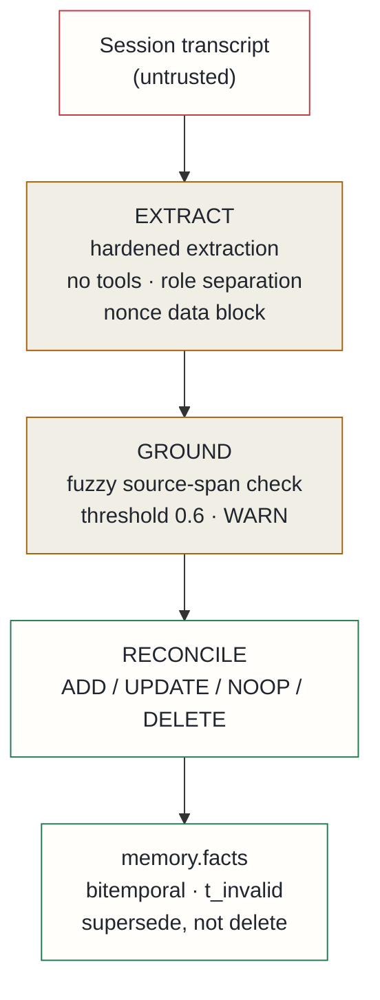

## Context

The memory subsystem extracts typed facts from session transcripts once, at ingest, using a lightweight first-pass model. Review of the stored output revealed the problem concretely: a sample set of stored facts included bare tool-name stubs duplicated across two extraction runs, and thin decisions with no rationale — just the conclusion, not the *why*. A pilot re-read of the same sessions with a more capable model recovered specifics the first pass dropped: version pins, port numbers, the reasoning behind architectural choices.

Two additional problems surfaced during the pilot that shaped the design:

**1. Transcript injection.** A session transcript contains real user and assistant turns with genuine instructions. Passing untrusted transcript text into a less-steered model caused hijacking on 2 of 5 test sessions — the model *continued the session* rather than extracting facts. The transcript is instruction-bearing data from an uncontrolled source.

**2. The gate must supersede, not filter for novelty.** Re-extraction mostly produces *richer versions of facts that already exist* rather than net-new facts. A "drop if similar" gate would discard the enriched version and keep the bare stub — exactly backwards.

## Decision

Adopt a **three-stage hardened dream-enrich pipeline**, running offline and idle — never on the query hot path.

**Stage 1 — Extract.** The transcript is passed to an LLM call with no tools, no external access, and the agentic system prompt replaced entirely with an extractor identity. The transcript goes in the user role inside a data block delimited by an unguessable nonce, which is stripped from the transcript first to prevent separator-spoof attacks. The extraction prompt asks for atomic-with-context facts (not bare names), a salience score of 1–10, and explicit keep/discard criteria with few-shot examples. Post-pass validation drops any fact that is malformed or missing required keys — a hijacked model that emits instructions rather than JSON produces only invalid output that is discarded. Adversarial testing on an instruction-laden transcript produced zero side effects.

**Stage 2 — Ground.** Each extracted fact carries a `source_span` quoting the transcript text it came from. Grounding checks what fraction of the span's distinctive content tokens are present in the transcript. At threshold 0.6, this correctly flags fabricated spans while accepting paraphrased real ones. Currently a warning, not a hard gate: it becomes a gate once the write path is trusted.

**Stage 3 — Reconcile.** For each candidate, retrieve the most similar existing facts, then a second hardened extraction call decides: **ADD** (net-new), **UPDATE** (candidate is materially richer — supersede the existing fact), **NOOP** (existing is equal or better), or **DELETE** (candidate contradicts an existing fact that is now stale). Supersede is non-destructive: facts are invalidated via a `t_invalid` bitemporal column, not deleted. The schema gains three columns: `context_description` (fixing bare-name stubs), `salience`, and `source_span`.

## Alternatives considered

- **Net-new-only novelty gate** — rejected: this discards richer supersede versions, which are the primary output of a re-extraction pass. The whole purpose is to replace low-fidelity facts with high-fidelity ones.
- **Less capable model as default for cost** — deferred: without the hardening above, the weaker model was hijacked on 2 of 5 sessions. A hardened quality comparison across models is needed before committing to one for production.
- **Datamarking on by default** — rejected: datamarking corrupts the verbatim `source_span` quotes that grounding depends on. The no-tools constraint already makes a hijack inert, so datamarking adds no security benefit here.

## Consequences

**Positive**: re-extraction recovers high-fidelity facts — the rationale behind decisions, specific versions, the context around a choice. The supersede gate preserves signal instead of deduplication-destroying it. The pipeline is injection-safe by construction: no tools, role separation, output validation, and adversarial testing that produced zero side effects. The bitemporal schema preserves full history; enriched facts coexist with their predecessors.

**Accepted costs**: per-session LLM token cost, bounded by a budget cap. Grounding is a warning until the write path lands — the pipeline has been validated end-to-end in dry run, but nothing mutates stored facts yet. Initial matching uses content-token overlap rather than vector similarity, setting a recall ceiling until the embedder is available. The schema requires a migration for three new columns and one enum value.
