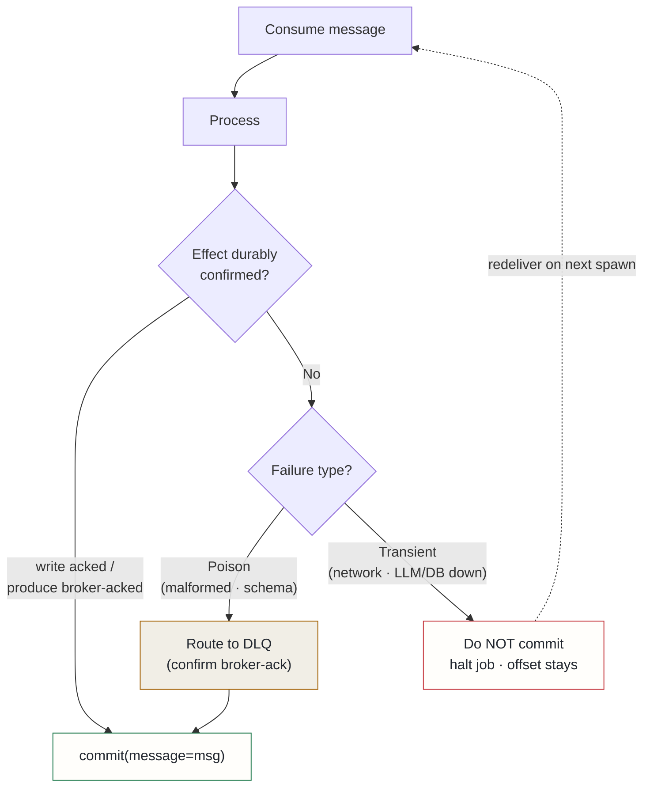

## Context

An audit of Kafka producers and consumers across the platform uncovered 15 findings (8 high severity) sharing two root causes that silently lose events while offsets and watermarks advance:

**1. Commit-on-failure.** Consumers committed offsets when processing failed, treating transient infrastructure failures (LLM API unavailability, database outage, filesystem error) as if they were poison messages. The invariant — *commit only after confirmed write* — was honoured in some loops and inverted in others. One consumer committed on any exception "to avoid infinite retry"; a postgres indexer committed even when its write returned `success=False`.

**2. Fire-and-forget produce.** `producer.produce()` without a delivery callback, with `flush()` return value ignored. `flush()` returning 0 means only that the local queue drained — a message whose broker delivery failed also leaves the local queue. Without a callback, broker-side failures are invisible; callers then advance checkpoints or commit input offsets for events that never reached the topic.

Two amplifying patterns:

- **Parameterless `consumer.commit()` defeats deliberate offset skipping.** A bare `commit()` commits the current position of every assigned partition, so deliberately leaving an offset uncommitted for a failed message is undone by the next successful message's bare commit.
- **DLQ retry identity is unstable.** The DLQ retry consumer keyed its retry count on the DLQ wrapper's own ID, but each failed reprocessing minted a new DLQ event with a fresh UUID — `max_retries` was never reached.

## Decision

Eight rules, binding on every Kafka producer and consumer in the platform:

1. **Commit after confirmed effect only.** An offset is committed only when the message's effect is durably confirmed: downstream write succeeded, output produce was broker-acked, or message was classified poison.
2. **Classify failures: poison vs transient.** *Poison* (malformed JSON, schema failure — deterministic): log + commit + skip. *Transient* (network, broker, LLM/DB unavailability — retryable): do NOT commit; for KEDA short-lived consumers, halt the job so the offset stays put.
3. **Commit by message, never by position.** `consumer.commit(message=msg)` is the only allowed form in processing loops. Bare `consumer.commit()` is banned.
4. **Every produce registers a delivery callback.** Single-message produce uses a helper that confirms synchronously; batch produce uses a `DeliveryTracker` that collects per-message callbacks and confirms the batch. `flush() == 0` is necessary but not sufficient.
5. **Checkpoints advance only over confirmed deliveries.** If any delivery in a batch failed, the watermark does not advance.
6. **DLQ routing must itself be confirmed.** Commit the input offset after routing to a DLQ only when the DLQ produce was broker-acked.
7. **DLQ retry identity is the original event.** Retry counts key on stable identity (content hash of original topic + event), never on the DLQ wrapper's own ID.
8. **No unobserved async tasks.** `asyncio.create_task` for fire-and-forget publishing must hold a strong reference and surface exceptions in the done callback — GC may drop the task mid-flight.

## Alternatives considered

- **Increase retry budgets without changing commit semantics** — rejected: retries on top of commit-on-failure still lose the event on the final retry; the root cause is that the offset advances before the effect is confirmed, not that we retry too few times.
- **Per-consumer bespoke reliability logic** — rejected: the audit found 8 high-severity findings precisely because each consumer had its own interpretation of when to commit; a shared set of helpers enforced by a source-contract test is the only way to prevent drift.

## Consequences

**Positive**: transient outages stop deleting data — events redeliver instead of vanishing. Broker-side produce failures become visible and block the checkpoint. DLQ retry limits actually bound retries. "Zero events lost" becomes assertable from delivery reports.

**Accepted costs**: halting a KEDA job on transient failure trades throughput for durability (redelivery on next spawn, possible duplicate effects — all consumers are idempotent upserts or dedup-guarded). A poison message misclassified as transient can wedge a partition until fixed (mitigation: classification happens at the parse/validate boundary, which is deterministic). Per-produce confirmation adds latency bounded by existing flush timeouts.
