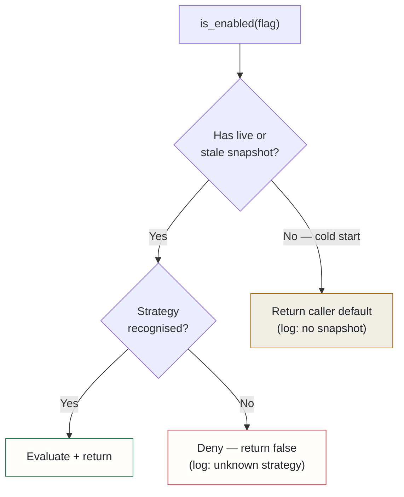

## Context

The feature-flag client controlled which capabilities were active in the pipeline — multi-hop reasoning, experimental rerankers, cost-intensive synthesis steps. When the flag service was reachable, flags behaved correctly. An audit of the client confirmed two ways it failed open when the service was not:

**Transient refresh failures discarded live snapshots.** Any exception in the background refresh task — a service restart, a single timed-out request — set a fallback flag that directed all subsequent checks to an empty in-memory client. The empty client returns the caller's supplied default. The capability pipeline passes `default=True` for its flags. The failure chain: service becomes briefly unreachable → the client discards a valid flag snapshot → every capability turns on.

**Unknown activation strategies evaluated to enabled.** When the client encountered a strategy name it didn't recognise — from a newer service version or a custom strategy — the unrecognised case fell through to `return True`. A flag gated by any unknown strategy behaved as unconditionally enabled.

Both bugs share the same failure shape: the system lacked enough information to evaluate a flag, so it guessed "on." For most applications that is a defensible default. For LLM capability flags it is not. Deliberately disabled features are often disabled because they are expensive, experimental, or being kill-switched during an incident. A kill switch that re-enables itself during the outage that most needs it is worse than no kill switch. Operators reason about flags as though OFF means off; this implementation was violating that contract silently.

## Decision

Two rules, applied consistently across all flag evaluations:

1. **Refresh failure retains the last-good snapshot.** The client falls back to the empty in-memory client only when it has never successfully fetched flags — cold start with no prior state. Any subsequent refresh failure, however many in a row, preserves the last known flag set. A stale-but-real snapshot always beats an empty one. Staleness is logged with the snapshot size so it is visible in monitoring.

2. **Unknown strategy denies.** If the client cannot prove a flag should be on, it is off. The denial is logged with the strategy name so new strategy types surface the first time they appear in production.

A third point to be explicit about: per-flag caller defaults (`is_enabled(flag, default=True)`) continue to apply for flags the service has never registered. That is configuration absence — the flag does not exist — which is distinct from infrastructure failure. The fail-closed rules govern failure, not absence.

## Alternatives considered

- **Set all capability defaults to False** — rejected: `default=True` for unregistered capabilities is a deliberate product stance, not a bug. A new capability should be on until explicitly disabled, not dark until explicitly lit. The problem was the client conflating "flag registered but service unreachable" with "flag not registered." Changing all defaults would fix the symptom in a way that obscures the real distinction.
- **Longer timeout before discarding the snapshot** — rejected: a longer timeout still eventually discards a valid snapshot on sustained failure; the correct fix is never discarding it on transient failure.

## Consequences

**Positive**: kill switches hold during service outages. Disabled capabilities — particularly expensive or experimental ones — stay disabled regardless of infrastructure blips. A/B variants stop flapping to their defaults on refresh failures, which was silently corrupting experiment cohort assignment.

**Accepted costs**: a flag flipped in the service during an outage is not visible to the platform until the next successful refresh. The stale snapshot continues serving the pre-outage value. This is strictly better than serving an empty set, but it means flag changes do not take effect instantaneously under degraded conditions. Flags using genuinely new strategy types stay off until the client is updated to recognise them — the correct default, but it means new strategies require a coordinated client update before they can be used.
