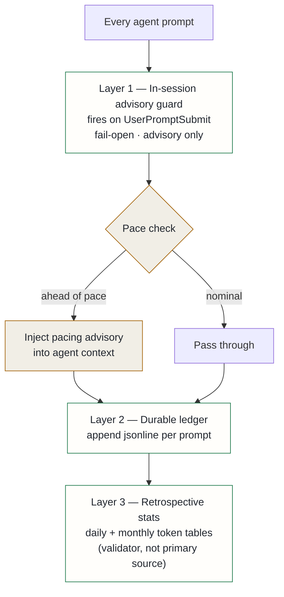

## Context

Running two AI coding agents on flat-rate subscriptions sounds simple until you try to pace them. Neither vendor provides proactive in-session usage signals. Both agents can exhaust their quota in a single bursty evening session, and the failure mode — a hard stop mid-task — is the worst possible time to discover the problem.

The two agents have structurally different data exposure:

**Claude** exposes raw per-message token counts in local session logs, but no server-side quota readout. The guard must estimate spend against a self-configured weekly budget by parsing those logs.

**Codex** exposes server-truth quota percentages (a 5-hour rolling window and a 7-day rolling window) in its own session logs, but no cumulative token counters. The guard reads the vendor's own numbers directly.

This asymmetry is permanent — a property of what each vendor publishes, not an implementation gap. The two guards share advisory surface and tier labels but draw on opposite data sources. A second wrinkle: the local Claude session logs are written by multiple processes (session resume, compaction, sidechain replay), which introduced roughly 58% duplicate entries. Treating those duplicates as additive overcounted spend by around 2.4×, which was only caught by cross-checking against the retrospective stats tool.

A third wrinkle emerged later: Claude usage from browser, mobile, and other surfaces shares the same subscription limit but never appears in the local session logs. Local parsing alone understates total consumption.

## Decision

A common **three-layer governance pattern** applied to each agent:

**Layer 1 — In-session advisory guard.** A hook fires before every prompt, reads current usage state, and injects a pacing advisory into the agent context if the pace warrants it. The Claude guard parses local session logs with deduplication by message ID (fixing the 2.4× overcounting bug) and projects a forward trajectory over the remaining week — replacing a naive cumulative percentage with a rate-aware forecast that relaxes the nag automatically on frugal days. The Codex guard reads the vendor's own quota percentages directly from the most recent session snapshot, adds a staleness warning if the snapshot is old, and appends the local-time window reset. Both guards fail open on any error and can be disabled via environment variable. Neither blocks; both inject advisory context.

An account-aware arbitration layer sits above the local parsers. A structured checkpoint can record account-observed usage (including browser, mobile, and other surfaces that never appear in local logs). When active, the account checkpoint is the headline source; local parsing is a secondary validator. The deduplication logic also collapses multiple host corpora that share the same logical session transcript into one count, preventing double-counting across machines.

**Layer 2 — Durable ledger.** Every guard posts a structured record to a log store on each prompt. This provides a persistent usage timeline, enables cross-agent aggregated views in a single dashboard, and separates the concern of record-keeping from the concern of in-session pacing.

**Layer 3 — Retrospective stats.** A command-line tool reads both vendors' local session logs and produces daily and monthly token tables. This is a validator and trend input, not a primary source. Its dollar figures are API list-price equivalents — they measure token volume, not flat-rate subscription pressure, and must not be cited as subscription cost.

## Alternatives considered

- **Use Langfuse for subscription tracking** — rejected: Langfuse models cost as tokens-times-unit-price and has no concept of rolling quota windows. It would measure API-equivalent spend, not the quota pressure that determines whether a session will hit a hard stop.
- **Hard-blocking guards** — rejected: budget pressure is advisory. A hard block mid-task loses in-progress work and makes the agents unusable when telemetry breaks. Fail-open is the correct behaviour for a pacing signal.
- **Vendor dashboards only** — rejected: dashboards provide no in-session signal, require context-switching out of the agent mid-task, and offer no cross-agent aggregated view spanning both subscriptions simultaneously.

## Consequences

**Positive**: per-prompt pacing is visible in both agents without manual dashboard checks. Cross-agent usage sits in a single persistent log stream that can be queried and visualised uniformly. The account-aware arbitration layer surfaces browser and mobile consumption that was previously invisible to local estimates. The deduplication fix and forward-projection throttle made the Claude guard's output honest — it now correctly relaxes when pace is fine and warns only when trajectory is genuinely problematic.

**Accepted costs**: the guards are advisory only. A long session or a runaway autonomous task can exhaust quota despite warnings — the system informs, it does not enforce. The Codex guard depends on an undocumented but stable field in the vendor's session log schema; schema drift would silently degrade the guard to a no-op. Account checkpoints for the Claude cross-surface delta are manually observed truth until a stable machine-readable account usage source exists from the vendor.
