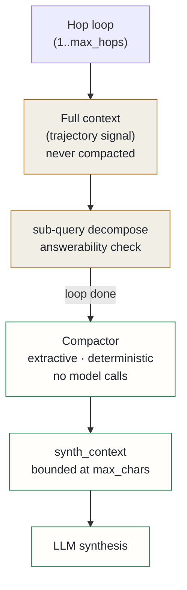

## Context

`MultiHopRAG` builds up its reasoning context by simple concatenation across hops with no pruning. With up to five hops and fact blocks of 400–800 characters each, the accumulated context easily reaches 4–8K characters before synthesis. That entire string is forwarded verbatim to the synthesis stage regardless of how much of the earlier-hop material is still relevant.

Two effects compound: synthesis token cost scales linearly with hop count, and late hops receive all context at equal weight even when earlier-hop material is stale. A five-hop query with no compaction sends roughly five times the tokens of a one-hop query even when most intermediate hops were exploratory dead-ends.

**A design revision on day one.** The original approach compacted context *between hops*. An offline evaluation falsified the "behaviour-neutral" premise: at tight budgets, inter-hop compaction evicted answerability evidence from the shared context string that drives sub-query selection on every hop — causing 2 of 10 test queries to over-run from 2 hops to the maximum of 5, *increasing* token cost. A one-line patch was rejected by adversarial review: the patch was discarded by the per-hop re-decomposition each iteration. The root cause was that one `context` variable served two incompatible roles — the reasoning trajectory and the synthesis payload. Compacting it mutated both.

## Decision

Separate the two roles that one variable was conflating. The **full context** drives all trajectory decisions throughout the hop loop and is never compacted — hop trajectory is provably identical whether compaction is on or off at any budget. A separate **`synth_context`** is compacted once, after the loop, and used only for synthesis. This is where the token reduction lands: 34–75% reduction observed on the offline evaluation set.

The compactor is a pure function — no I/O, no model calls, deterministic. Lines are selected in priority order against a hard character budget:

| Priority | Criterion |
|---|---|
| 0 | Line contains a key term from any still-open sub-query |
| 1 | Line belongs to the most-recent hop block |
| 2 | All other lines, ranked by query-term overlap descending |

"Pinning" means priority, not budget exemption — a high-priority line that would push total characters over `max_chars` is still skipped. Exempting high-priority lines would make worst-case output size unbounded. The key-term extractor is shared between the compactor and the answerability heuristic, removing a divergence where two different tokenisation approaches could disagree on what counted as a relevant term.

The feature ships flag-gated off by default. With the flag off the code path is a byte-for-byte no-op versus the pre-compaction implementation. Enablement is blocked on a quality evaluation: 10 golden queries with compaction on and off, confirming median `context_chars` drops materially, hop counts are unchanged, and answer quality delta is within noise.

## Alternatives considered

- **Abstractive compaction (LLMLingua / RECOMP-abstractive)** — deferred: achieves higher compression by rewriting sentences, but requires a model call on the hot path, adding latency and GPU dependency. YAGNI until the extractive baseline fails the quality evaluation and a gap is demonstrated.
- **Sentence-level granularity** — deferred: `_build_context` already emits one fact per line, so line and fact are equivalent in current output. Sentence-level splitting adds tokenisation overhead with no present benefit.
- **Soft budget (score threshold)** — rejected: a threshold filter produces output of unbounded length, defeating the core goal of bounding synthesis prompt size. Hard budget was the only option compatible with the token-reduction objective.

## Consequences

**Positive**: synthesis prompt token cost is bounded at `max_chars` characters regardless of hop count. The reasoning trajectory is provably unaffected by compaction. The shared key-term extractor removes the divergence that previously existed between the compactor and the answerability heuristic. Zero latency penalty when disabled; no GPU dependency when enabled. The `context_chars` field in response metadata makes compaction impact measurable without new monitoring infrastructure.

**Accepted costs**: extractive compaction cannot shorten an individual fact line — very long single lines are kept whole or dropped entirely. A high-priority line can be dropped if it collectively pushes the budget over the limit; this is a deliberate trade-off against unbounded output. The default budget was chosen conservatively and may need per-query-type tuning after the quality evaluation runs.
