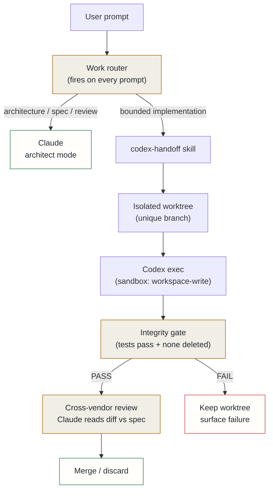

## Context

Measured usage showed that coding tasks — implementation, debugging, refactoring — accounted for roughly 80% of weighted token consumption. A separately-held Codex subscription was sitting at around 30% utilisation. The cheapest route to fitting within a tighter Claude budget was to shift coding work to Codex, but ad-hoc manual routing had already been tried and kept failing: it is easy to forget when deep in a task, and the discipline only matters if it is automatic.

The deeper problem was architectural. Just routing by memory produces neither reliability nor quality gains. Research on multi-agent systems (arXiv:2601.12307) shows that same-model multi-agent arrangements match single-agent performance — the quality advantage only survives across *different* base models. It also shows that naive handoffs carry substantial overhead: up to 41% quality loss from poorly structured multi-agent calls, and 54% of tokens spent on inter-agent communication when context is dumped rather than spec'd. And test-gaming by autonomous coding agents is well-documented (36–75% of cases in some evaluations edit tests rather than code when unconstrained).

These three forces — budget, research evidence, and autonomy risk — shaped the design.

## Decision

A **single-interface, Claude-drives-Codex** division of labour:

1. **Role split.** Claude handles architecture, specification, review, orchestration, and documentation. Codex handles bounded implementation. The user talks only to Claude; Claude invokes Codex as a subprocess via a skill command.

2. **Handoff mechanics.** A `/codex-handoff` skill turns a spec into a structured lane: isolate in a git worktree on a unique branch, run Codex with sandbox isolation (workspace-write only, no network, no user config), apply an integrity gate that fails if test assertions were deleted or the suite does not pass, then run a cross-vendor review where Claude reads the diff against the original intent. The worktree is merged on PASS and discarded on FAIL.

3. **Always-on routing.** A `UserPromptSubmit` hook fires before every prompt. It reads current usage state from both agents and emits one of four directives: `CLAUDE_ARCHITECT` (keep on spec/review), `CODEX_HANDOFF` (route implementation), `CLAUDE_SMALL_FIX` (trivial edit too small to route), or `PAUSE_HEAVY_WORK` (both agents near exhaustion). A pending-handoff state closes the failure mode where an architecture turn is followed by a short user approval — "go", "ok" — that would otherwise restart Claude implementation.

The lane contract — the prompt injected before every Codex run — enforces platform rules (issue-first development, staging protocol for docs, provenance trailers, no secrets) even though Codex runs in an isolated subprocess without access to the normal rules directory.

## Alternatives considered

- **Stay on the higher-capacity subscription tier** — rejected: the Codex subscription already provided the capacity; paying for both at maximum tier was pure waste.
- **Mix models within Claude (Sonnet for coding turns)** — rejected: this applies a partial multiplier to Claude usage, not zero; Codex removes coding from the Claude cap entirely, which is structurally different.
- **Same-vendor Claude sub-agents for implementation** — rejected: the research evidence shows no quality gain from homogeneous multi-agent arrangements; the cross-vendor split is the specific regime where the advantage survives.

## Consequences

**Positive**: coding runs on a separate budget that was already paid for and underused. The cross-vendor review is a free adversarial check: Claude evaluating a Codex diff cannot self-prefer, which catches the test-gaming failure mode that same-model self-review misses. Worktree isolation makes autonomy safe — a bad Codex run is a discarded branch, not a corrupted working tree.

**Accepted costs**: the handoff overhead — spec writing, worktree setup, gate execution, review — makes this the wrong path for trivial edits; the routing heuristic must correctly classify task size to avoid applying the full ceremony to one-liners. The integrity gate catches test deletion but not semantic weakening of assertions; the cross-vendor review is the second line of defence against that. Codex has its own rolling quota windows; the budget routing must watch both agents' state, not just one.
