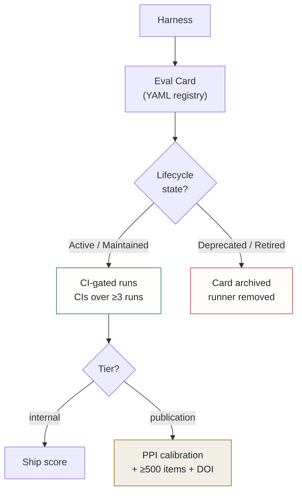

## Context

Six evaluation harnesses accumulated organically with no shared standard for structure, metadata, versioning, judge calibration, lifecycle, or documentation. A discovery pass surfaced three failure modes that are worse than having no harnesses at all:

**Silent dead harnesses.** One harness — a routing accuracy benchmark — had silently skipped every CI run for five months due to an import error. Its reported status was "present." It had measured nothing for nearly half a year.

**Overlapping harnesses with no canonical winner.** Two memory benchmarks measured nearly the same capability with different data, different scorers, and no defined relationship between them. Both ran; neither was authoritative. When they disagreed, there was no principled way to decide which result to trust.

**Statistically indefensible LLM-judge scores.** Two harnesses used a language model as a judge and reported raw point estimates with no confidence intervals, no run count, and no calibration. The measured noise floor at N=5 is ±0.07 — enough to reverse a ranking. Presenting a single number implies a precision the method doesn't have.

There is no single industry RFC for evaluation harnesses, but five external standards have converged on compatible primitives: BetterBench (lifecycle rubric, 46 criteria), the lm-evaluation-harness versioned task unit, the UK AISI Inspect architecture (Dataset/Solver/Scorer), MLCommons Croissant dataset metadata, and EvalCards per-harness records.

## Decision

Adopt a four-component governance framework drawing on those converged standards, with a tiered rigor model.

**Component 1 — Standard architecture.** Every harness decomposes into three orthogonal primitives: a Dataset (labelled samples, content-hashed and seed-locked for synthetic corpora), a Solver (the system under test), and a Scorer (correctness function — deterministic or calibrated LLM-judge). Solver/Scorer orthogonality is the mechanism that lets a single benchmark expose both a synthetic and a live-bridge Solver variant without forking — this resolves the two-memory-benchmark duplication cleanly.

**Component 2 — Eval Card registry.** One YAML card per harness under a shared registry directory. Mandatory fields: a version integer that must bump on any scoring change, calibration status, lifecycle state, and a BetterBench score. A pre-commit gate rejects any harness missing a valid card — the same enforcement pattern as the existing Dockerfile lint gates.

**Component 3 — Lifecycle states.** Draft → Active → Maintained → Deprecated → Retired. A harness that skips or errors on its scheduled CI run auto-transitions to Deprecated. Retired harnesses keep their card in the registry — provenance is preserved even after the runner is removed.

**Component 4 — Tiered rigor.** Both tiers require confidence intervals over ≥3 runs. Publication-tier harnesses additionally require prediction-powered inference calibration against human-annotated anchors, ≥500 items across ≥3 seeds, external system baselines, and a persistent dataset DOI. The two-tier design keeps internal harnesses cheap while keeping the structure publication-ready — a harness can be promoted without re-architecting.

The immediate application: six fragmented harnesses consolidate to four governed plus one retired plus one new, all carded.

## Alternatives considered

- **Lightweight convention (README per harness, no registry)** — rejected: the silent five-month dead harness is exactly what a machine-readable lifecycle state and scheduled CI check would have caught. A convention with no enforcement is not a governance framework.
- **Single rigor level for all harnesses** — rejected: applying publication-tier requirements to every internal benchmark would block new harnesses from reaching Active state cheaply. The tiered model lets structure and rigor scale independently.

## Consequences

**Positive**: dead harnesses self-flag via the Deprecated transition rather than accumulating silently; LLM-judge scores become statistically defensible with reported CIs; the memory benchmark has a clear upgrade path to publishable; new harnesses are born compliant rather than accumulating technical debt.

**Accepted costs**: up-front migration requires writing six cards, implementing the registry pre-commit gate, and refactoring the duplicate memory harnesses into one Solver-variant pair. PPI calibration — required at publication tier only — needs approximately 150 human-annotated anchor examples per judged harness; that cost is deferred until a harness is actually nominated for external publication.
