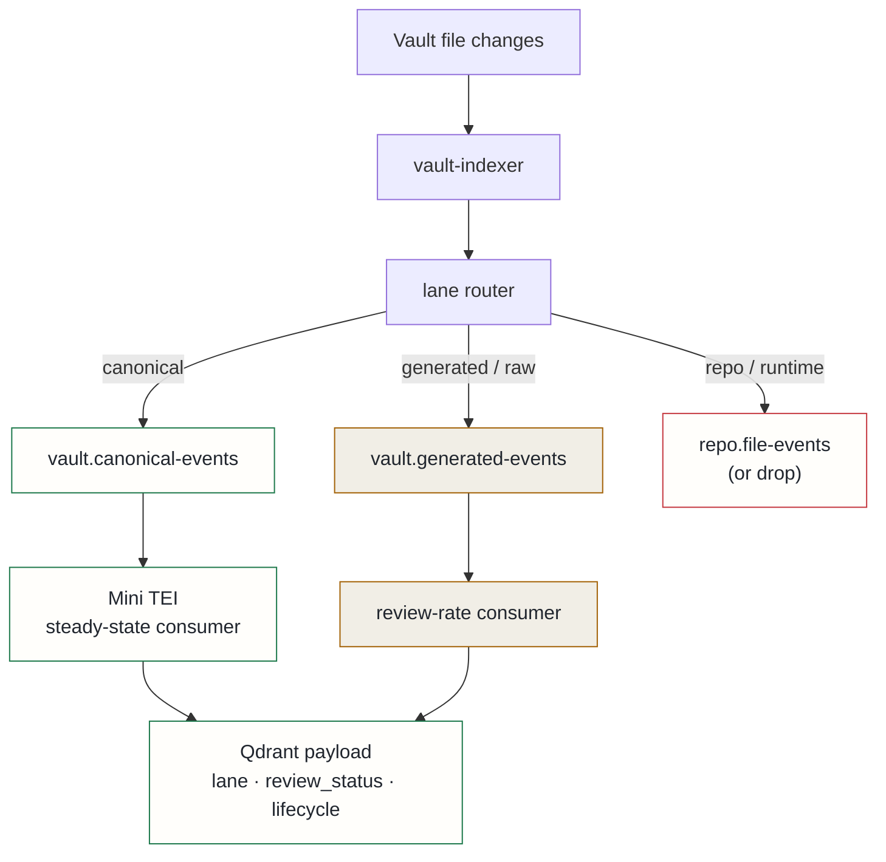

## Context

A recurrence of embedding queue lag exposed a deeper problem: the hot embedding path was not a clean stream of vault knowledge. It was a mixed filesystem event stream.

Two producers were writing to the same Kafka topic. One watched the vault directory — the intended source of ADRs, incident reports, handovers, and implementation reports. The other watched the entire repo root, which meant test files, GitOps manifests, Python environment directories, deduplication caches, and NER cache JSON all entered the same queue as canonical architecture documents. The vault-root producer also duplicated vault events under a different path prefix.

The practical effect: the embedding service that should be sizing its capacity against "how many canonical docs does the platform produce per day" was instead absorbing unbounded repo churn. Queue lag was opaque — was canonical work piling up, or was it thousands of transient runtime files? Capacity planning was structurally impossible.

This is distinct from poison-pill handling. A poison pill is a deterministically malformed message that will never succeed on retry; the correct response is to log, metric, and commit its offset. That fix was separate. This problem is about the composition of the input stream before any message is even attempted.

## Decision



Introduce three explicit ingest lanes and make retrieval scoring lane-aware.

**Lane 1 — Canonical hot lane.** ADRs, HLDs, LLDs, incident reports, handovers, runbooks, active and completed implementation plans. The Mini TEI steady-state workload. Archived documents do not leave this lane merely because they moved to an archive directory; lifecycle metadata decides whether a document is still authoritative, not its path.

**Lane 2 — Generated/raw review lane.** AI research raw drops, local-model summaries, streaming journal material, machine-generated SRE investigations. Indexed at a slower rate and tagged with `lane: generated`, `review_status`, and provenance metadata. Only `promoted` or explicitly useful generated material appears in default retrieval with strong weight; unreviewed content is demoted by default and only surfaces when a query explicitly asks for raw or generated material.

**Lane 3 — No-index / repo-event lane.** Virtual environment directories, package trees, test suites, GitOps manifests, runtime caches. These must not reach the vault embedding consumer. If code intelligence needs repo events, it owns its own topic and consumers — repo churn must not backpressure vault knowledge retrieval.

At retrieval time the scoring rule becomes policy-driven:

```
final_score =
  semantic_relevance
  + lane_trust_weight
  + lifecycle_weight
  + query_intent_temporal_weight
  - generated_raw_staleness_penalty
```

Canonical documents do not decay because they are old — they are demoted only when lifecycle metadata says they are superseded. GPU embedding is treated as a burst lane triggered by a measured lag threshold, not the default steady-state path.

## Alternatives considered

- **Single topic with a required `lane` field** — acceptable as a transitional step, not the target. A physical topic split gives independent KEDA scaling, lag alerting, and backpressure controls per lane.
- **Broad directory exclusions** — rejected: already partially in place and missed the repo-root watcher entirely. Directory exclusions also incorrectly blanket-exclude archive paths that contain authoritative historical records.
- **GPU embedding as the default path** — rejected: GPU is a shared resource whose primary consumer is LLM inference. Treating it as the default embedder makes capacity planning for both workloads impossible and creates contention under normal operating conditions.

## Consequences

**Positive**: the hot embedding queue becomes a trusted stream of vault knowledge rather than a mixed filesystem event feed. Mini TEI capacity can be sized against the workload it is actually meant to handle. Generated content remains useful and searchable without silently polluting canonical retrieval scores. GPU burst activation becomes an explicit, observable, GitOps-controlled decision.

**Accepted costs**: path classification policy becomes more precise and requires tests — broad directory exclusions are no longer sufficient. Migration spans producers, consumers, Qdrant payload metadata, and retrieval scoring. Some generated and unreviewed material will be less visible in default search until promoted, which requires operators to have a promotion workflow.
