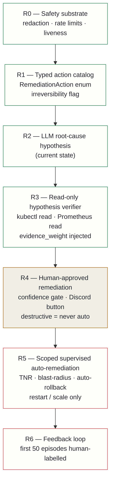

## Context

The platform's SRE brain currently operates at what I'm calling rung 2 of an autonomy ladder: it consumes alert events from a message queue, collects diagnostic context (pod state, logs, metrics), invokes an LLM triage engine, and emits a structured result — severity, root-cause hypothesis, recommended action, confidence — to notification channels and an issue tracker. It takes no remediation action.

Before going further, I wanted an honest assessment of where the frontier actually is. ITBench (IBM/Red Hat, ICML 2025) benchmarks state-of-the-art LLM agents solving only **13.8% of SRE scenarios**. Commercial leaders sit at rungs 3–4 in their own autonomy models and deliberately separate the diagnosis plane from the execution plane. Full production self-healing at high autonomy is unproven at scale.

Two concrete gaps in the current system made any upward move premature without first addressing them:

**1. The recommended action field is freeform text.** A string that says "restart the affected pod" cannot be safely machine-consumed. Before any execution capability can exist, there must be a typed, enumerable action schema with an explicit irreversibility flag per action.

**2. Root-cause quality is unverified.** The LLM produces a hypothesis and confidence score, but nothing confirms whether the evidence actually supports the hypothesis before that result is dispatched. A verification step between triage and dispatch is a prerequisite for any confidence-gating at higher rungs.

## Decision

Adopt a six-rung autonomy ladder. Each rung adds one capability and one commensurate guardrail. Guardrails are **cumulative** — they are never removed as autonomy increases.

The immediately actionable scope is **R1 then R3**, both of which carry zero production-write risk:

- **R1** defines a `RemediationAction` enum and a typed Pydantic model in the shared SRE library. The freeform recommended-action string is parsed into a typed action; unrecognised input returns `no-action`. Every action carries an irreversibility flag. No execution code exists at this rung.

- **R3** implements a `HypothesisVerifier` agent that runs after triage and before dispatch. It executes read-only cluster queries (pod state) and metric reads against a dedicated read-only service account with zero write permissions. It injects `evidence` and `evidence_weight` fields into the triage result, giving downstream confidence-gating at R4/R5 a real signal rather than a raw LLM score. The verifier times out at 10 seconds and falls back gracefully — triage is never blocked by a slow verification step.

R4–R6 are designed but deferred. R4 (human-approved remediation) requires confidence calibration over real incidents before it is safe to wire up. R5 (scoped supervised auto-remediation) adds a Transactional No-Regression safety specification borrowed from STRATUS (IBM, NeurIPS 2025): no action may degrade a metric that was passing before the action. It is scoped to restart and scale operations only — node drain, PVC deletion, and release rollback are classified irreversible and excluded from auto-execution permanently. R6 (feedback loop) requires 50 human-labelled episodes before calibration is trusted.

The RCA plane and execution plane are distinct processes with distinct service accounts at every rung. Neither imports the other's primitives.

## Alternatives considered

- **Jump directly to human-approved remediation (R4)** — rejected: the freeform action field cannot be safely consumed without R1's typed schema, and confidence-gating at R4 needs R3's evidence weight to be meaningful rather than cosmetic.
- **Stay at rung 2 indefinitely** — rejected: R1 and R3 deliver immediate value (machine-readable action schema, better triage quality) at zero write risk; deferring them defers value without reducing risk.
- **Adopt a commercial SRE autonomy product** — rejected: the platform's triage context (typed memory, graph reasoning, vault-indexed runbooks) is proprietary and not exposed via standard interfaces; a generic external agent would have a worse evidence base than the existing in-platform system.

## Consequences

**Positive**: a clear, safety-gated roadmap grounded in the published research frontier. R1's typed schema is a prerequisite for every execution rung, and doing it now avoids schema debt that would be more expensive to retrofit later. R3's evidence weight gives every future confidence gate a real signal to act on. The incremental approach means each rung is validated over real incidents before the next is enabled.

**Accepted costs**: full autonomous remediation is deliberately deferred until confidence calibration has occurred — this is not a limitation but the decision. R3 adds latency to each triage cycle, bounded by its timeout and graceful fallback. Specific confidence thresholds for R4/R5 gating are not set here; they will be calibrated empirically against real incident history before those rungs are enabled.
