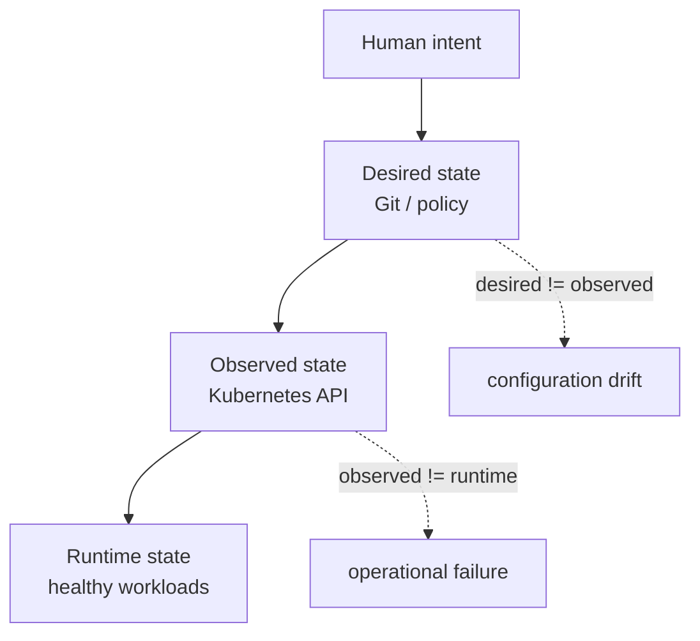
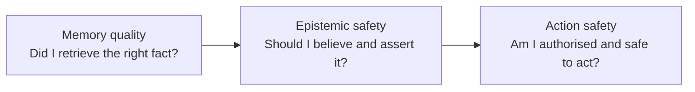
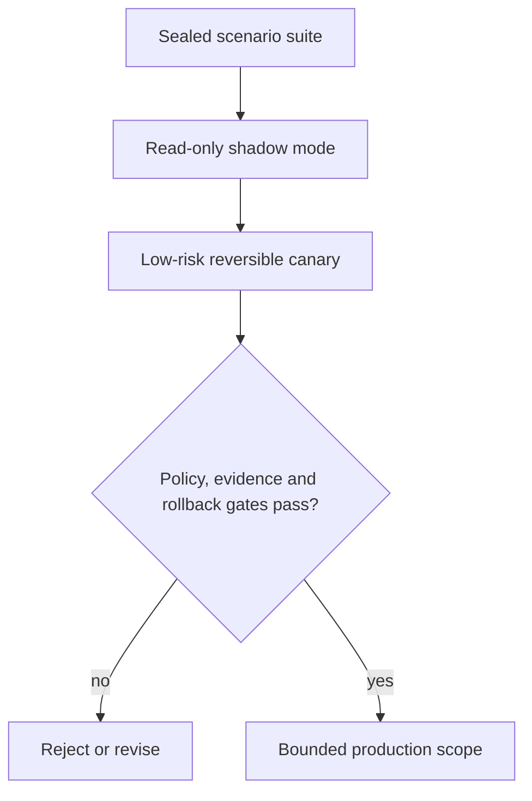

I won an award. Just not the one a rushed LinkedIn headline might imply.

My [Qwen Memory Agent](https://devpost.com/software/qwen-memory-agent) won a **Blog Post Award** in the Global AI Hackathon Series with Qwen Cloud: $500 in cash and $500 in shared cloud credits. [Quên](https://devpost.com/software/quen), built by Thanh Hang Pham, won **Track 1: MemoryAgent**.

First: congratulations to Thanh Hang Pham. Quên is a thoughtful, technically ambitious submission with strong evaluation and unusually honest self-criticism. This is not an argument against the result. It is an account of what their excellent work exposed in mine.

The published judging rubric put 60% of the score on technical depth and innovation. Looking at the two submissions side by side, the outcome makes sense. My project made agent memory measurable. Quên went deeper into whether a memory deserved to be trusted at all.

Then my SRE instincts kicked in, because even a verified belief is not enough to make a production action safe.


## Two builders, two starting points

The [original article that won the writing award](/writing/memory-as-a-measurable-engineering-problem/) treated memory as an engineering system rather than a demo. I wanted to measure recall, staleness, token cost and active use. I built exact and semantic supersession, per-type decay, token-budget packing, a human-approved consolidation loop and eight MCP tools around one memory engine.

I also published the result that hurt: ten active-use scenarios produced `task_success = 0.60`. The store was correct more often than the agent used it. Three decisions skipped recall entirely. One generic subject collision silently retired an unrelated fact. Another contradiction survived because its similarity score fell below the threshold.

That was the honest boundary of my design.

Quên started from a sharper claim:

> Trust is a runtime decision, not a stored property.

Its [repository](https://github.com/phamthanhhang208/quen) uses FSRS retention state, bitemporal validity, tombstones, deterministic supersession for functional relationships, an NLI fallback that distinguishes contradiction from augmentation, and a trust gate that can verify a low-trust memory against a live source before answering.

That is a more developed computer-science treatment of the problem. The creator's public portfolio lists React and TypeScript and contains several deployed applications. I cannot infer their occupation or education from a Devpost profile, but the application-development fluency is visible in the work.

My route into this is different. I am an SRE learning the computer-science theory needed to formalise operational instincts. I do not pretend that I hand-wrote every line of these systems unaided. I use coding agents heavily, while owning the problem selection, architecture, controls, acceptance criteria, blast-radius judgement, evaluation and operation.

That difference in starting point matters, because we noticed different failure boundaries.


## What Quên did better

My first system asked:

> Did the agent retrieve the current memory within its token budget?

Quên asked:

> Should the agent believe and assert this memory now?

That second question forced stronger mechanisms.

### Contradiction was not reduced to similarity

My write path retired every different fact with the same `(subject, type)`, then used cosine similarity as a second route for facts filed under different subjects. The active-use evaluation demonstrated both sides of the failure: vague subjects caused false supersession, while semantically different wording allowed a real replacement to survive.

Quên makes a useful distinction between functional relationships and augmentations. A default branch normally has one current value; a service can use several technologies. A new object in the first relationship may replace the old one. A new object in the second may simply add information. Embeddings can identify related text, but they do not establish contradiction.

### Verification changed the memory

In my system, retrieval reinforced a memory by increasing its access count and refreshing `last_accessed`. That keeps useful memories warm, but it also creates an uncomfortable loop: repeated retrieval can strengthen a repeatedly retrieved falsehood.

Quên connects reinforcement to outcomes. A confirmation can increase confidence and become an FSRS review. A refutation tombstones the memory. An unverifiable result forces a hedge rather than an invented certainty.

The important move is not the exact formula. It is closing the loop between evidence, answer and retained state.

### The evaluation was harder to dismiss

My small synthetic retrieval benchmark saturated: my B3 configuration scored 1.0 recall and zero staleness at every tested token budget. That showed the mechanism worked on those cases, but a perfect score stopped telling me where it would fail.

Quên's Devpost submission reports a 30-case code-staleness probe with FAMA of 0.933, compared with 0.40 for append-only RAG and 0.43 for its full-context baseline. It reports confidence intervals, a paired McNemar test, an ablation without verification, and results on LongMemEval where forgetting sometimes cost recall. Reporting where a system loses makes the wins more credible.

Its repository also records an adversarial audit of its own algorithms: over-forgetting multivalued facts, recency bias, authority mistakes, scorer bugs, provenance laundering and a memory-poisoning surface. That is the kind of self-attack I want more agent projects to show.

## Where my pattern failed

Quên did not merely have more features. It exposed assumptions in my model.

### Age is not invalidity

I assigned half-lives to memory types:

```text
effective_salience = salience × 0.5^(age / half_life)
```

That is useful as a retrieval heuristic, but it is not a truth model.

A Git commit is immutable. The claim that commit `abc123` contained a particular change does not become less true after 30 days. The claim that production is currently running `abc123` can become false in minutes. The entity is the same; the relationship has different mutation semantics.

Pinned preferences reveal the same problem in reverse. Protecting a preference from eviction does not make it permanently correct.


### Retrieval frequency is not evidence

Reinforcement-on-recall rewards use. It does not establish truth. A popular misconception can become more durable precisely because the system keeps retrieving it.

Reinforcement should depend on verification, successful outcomes or an authoritative mutation event—not access alone.

### A correct memory can still cause an unsafe action

Neither my retrieval score nor Quên's trust score answers whether the agent should be allowed to mutate production. Confidence is epistemic. Permission is administrative. Risk is operational.

Those are separate axes.

## Where Quên still stops

Quên is substantially stronger at answering, “Should the agent believe and repeat this?” It does not fully answer, “May the agent change production because of it?”

Its trust calculation still begins with confidence and freshness, tempered by earned stability. Its demo verifier searches a repository for identifier presence; the project explicitly acknowledges that this does not prove the associated claim is true. FSRS models retention, not every mutation process in an external system. The repository also describes prompt-based memory-poisoning controls as mitigation, not a fix.

Those are good disclosures. They also point to the next layer.

Kubernetes already distinguishes a resource's `spec`, which expresses desired state, from `status`, which reports current state. Its controllers continuously reconcile the two. If Git says a Deployment should have three replicas while the Kubernetes API reports ten, neither value is automatically false. One can represent declared intent while the other represents an observation.

The difference itself is information.



Now consider an incident commander manually scaling from three replicas to ten while GitOps reconciliation is suspended. The observed value is intentional, temporary and authorised—but it should not silently become the new normal.

An agent looking only at desired versus observed state could “repair” the emergency mitigation out of existence.


## State without causal provenance is incomplete

For an engineering agent, `replicas = 10` is not enough. I increasingly want the knowledge record to preserve:

- which state role the value represents: intent, desired, observed, runtime, historical or derived;
- which source is authoritative for that particular predicate;
- what can mutate or invalidate it;
- who caused the current state and through which authenticated session;
- whether an incident, ticket or approved override explains the divergence;
- when the exception expires and who must resolve it;
- whether the proposed action is reversible and within the agent's authority.

Source IP belongs in that context, but not as proof of identity. NIST's zero-trust guidance explicitly rejects implicit trust based only on network location. Identity, device, session, network zone and behaviour can inform policy together.

Current agent guidance is moving in the same direction. AWS's Agentic AI Lens recommends externally authorising every tool invocation, propagating both agent and user context, keeping agent and human identities distinct, and pausing high-risk mutations for a reviewer with enough context to make a real decision.

That produces three separate questions:



My submission concentrated on the first. Quên advances the second. The research question I want to test in Rootweaver is the third.

## How I would test it

I do not want to declare the state-and-authority model safer because it sounds sensible. I want a sealed scenario suite where competing policies face the same events.

The minimum comparison would be:

| Config | Additional mechanism | Primary boundary tested |
|---|---|---|
| A | Retrieval and decay | Memory quality |
| B | Trust and live verification | Epistemic safety |
| C | Desired, observed and runtime roles | State consistency |
| D | Identity, risk, approval and override lifecycle | Action safety |

Each configuration would encounter the same cases:

1. An old but immutable Git fact.
2. A branch head that changed after the memory was written.
3. Git desired state disagreeing with the Kubernetes API.
4. A runtime failure even though desired and observed replicas match.
5. An intentional manual scale during an active incident.
6. A privileged mutation from an unexpected device or network context.
7. An expired override that still leaves production diverged from Git.
8. A poisoned memory proposing a high-blast-radius action.

Recall accuracy is only one metric. The production-oriented scorecard needs stale-assertion rate, unsafe-action rate, authority violations, false automatic remediation, intentional overrides wrongly reverted, escalation precision, time to safe resolution, provenance completeness and successful rollback.

A promotion gate should be deliberately severe on a sealed suite: no unauthorised production mutation, no automatic reversal of an active approved override, and complete approval evidence for every high-risk action. Passing that suite still would not prove enterprise safety. It would justify a read-only shadow run, followed by a low-risk reversible canary with rollback and human admission.




## A note on the demos

Quên's two-minute video communicates one argument extremely well: stale fact, falling trust, live verification, feedback, benchmark. Mine is just over three minutes and tries to show more of the product—supersession, token budgeting, metering, MCP and human-approved consolidation. Their focus is stronger. My own narration gives the demo a personal connection, but the script and visual editing needed to be tighter.

There is also a noticeable narration change between Quên and the creator's earlier ForgeOS and Lume videos. The Quên delivery sounds synthetic to me: unusually uniform pacing and pronunciation compared with the natural accent, pauses and repetitions in the earlier demos. Public metadata cannot prove that, so I will not present it as fact. Synthetic narration may have helped compress the story. Personally, I would rather hear the builder's own voice; the small imperfections make ownership feel more immediate.

The lesson for my next demo is not to replace my voice. It is to keep the human delivery and adopt Quên's discipline: 90–120 seconds, one failure story, readable call-outs, clean captions and one honest limitation at the end.

## The result changed the question

I am proud that the writing won an award. I am also glad another project went further technically, because comparing the two gave me a better research direction.

I started with: how long should an agent remember this?

Quên pushed the question toward: what should the agent trust right now?

The SRE version is broader:

> What are the consistency semantics of this fact, who has authority over the resulting action, and how does the system fail safely when intent cannot be established?

That is not a victory claim. It is a hypothesis—and now it needs an experiment.

## References

- [Quên — winning Track 1 Devpost submission](https://devpost.com/software/quen)
- [Quên source repository](https://github.com/phamthanhhang208/quen)
- [Quên demonstration video](https://www.youtube.com/watch?v=K7xOIIkfPKg)
- [Thanh Hang Pham's Devpost portfolio](https://devpost.com/phamthanhhang208)
- [Qwen Memory Agent — my Devpost submission](https://devpost.com/software/qwen-memory-agent)
- [Qwen Memory Agent source repository](https://github.com/rduffyuk/qwen-memory-agent)
- [My demonstration video](https://www.youtube.com/watch?v=TOMjFJ4ayYg)
- [Global AI Hackathon Series with Qwen Cloud — rules, prizes and judging criteria](https://qwencloud-hackathon.devpost.com/)
- [Kubernetes objects: desired state, spec and status](https://kubernetes.io/docs/concepts/overview/working-with-objects/)
- [Kubernetes controllers and reconciliation](https://kubernetes.io/docs/concepts/architecture/controller/)
- [NIST SP 800-207: Zero Trust Architecture](https://csrc.nist.gov/pubs/sp/800/207/final)
- [AWS Agentic AI Lens: tool authorisation](https://docs.aws.amazon.com/wellarchitected/latest/agentic-ai-lens/agentsec02-bp01.html)
- [AWS Agentic AI Lens: separate agent and human permissions](https://docs.aws.amazon.com/wellarchitected/latest/agentic-ai-lens/agentsec03-bp02.html)
- [AWS Agentic AI Lens: human review for critical decisions](https://docs.aws.amazon.com/wellarchitected/latest/agentic-ai-lens/agentsec04-bp02.html)
