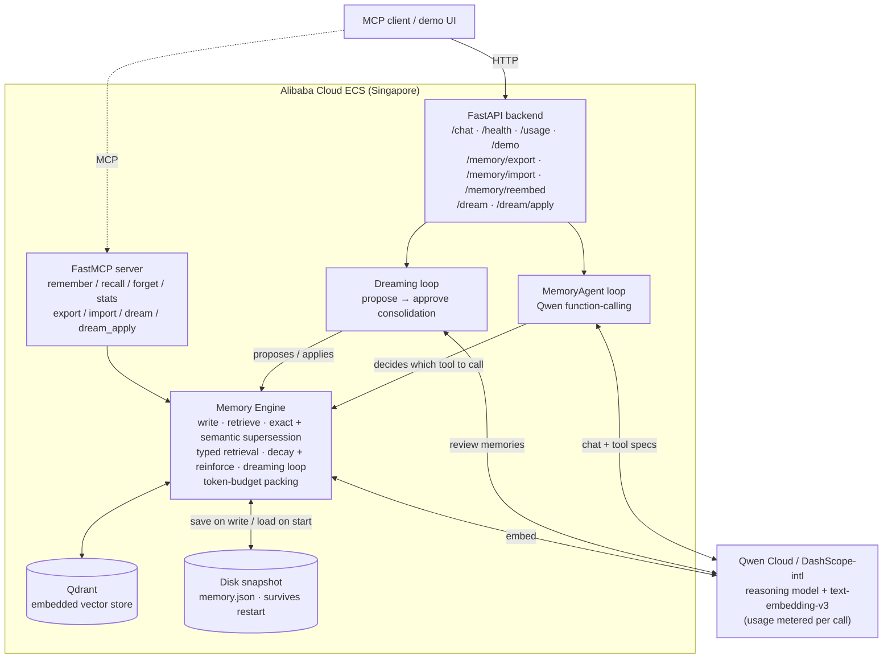
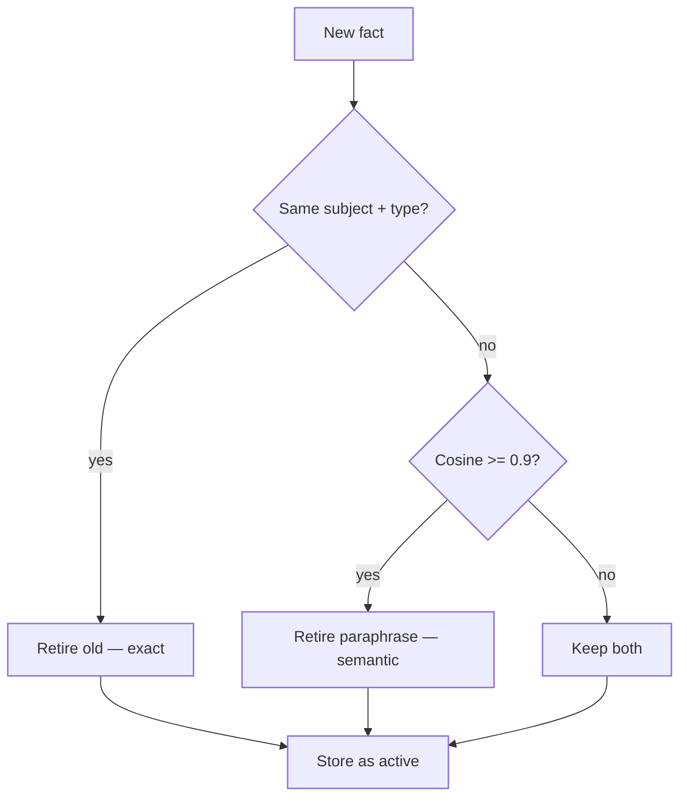
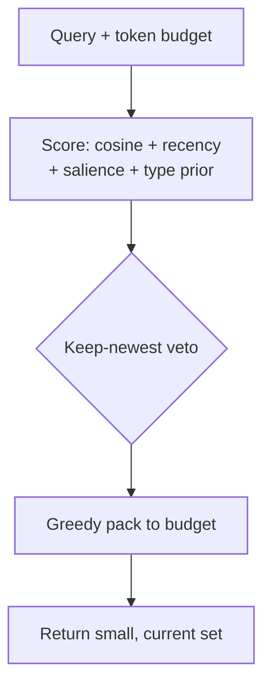
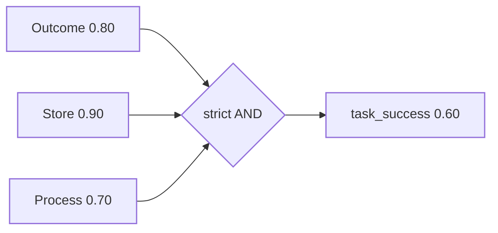

Every agent that talks to a person more than once hits the same wall. Where do memories live? When should a stale one be dropped? And when the context window is tight, how do you get the *right* memories into the prompt instead of all of them?

Most demos answer the first question and ignore the other two. They stuff the whole conversation history back into the prompt — which is expensive and drags outdated facts along with it — or they do naive top-k retrieval, which has no notion of "this preference was replaced last week." Both look fine in a thirty-second clip. Neither survives a second session.

I wanted to treat memory as something you can *measure*, not assert. So I built [qwen-memory-agent](https://github.com/rduffyuk/qwen-memory-agent): a persistent-memory agent on [Qwen Cloud](https://www.alibabacloud.com/en/product/modelstudio), deployed on an Alibaba Cloud ECS box, with two benchmarks attached to it. This is what the numbers say — including the parts that aren't flattering.

## How it fits together

The whole thing runs on a single, modest 2 vCPU / 3.4 GiB Ubuntu ECS instance. A FastAPI backend and a FastMCP server both sit in front of *one* memory engine — so a plain `curl`, the demo UI, and an MCP-native agent all drive the same logic rather than three divergent code paths. The engine reasons and embeds through Qwen Cloud's OpenAI-compatible endpoint (`qwen-plus` for reasoning, `text-embedding-v3` for vectors), stores vectors in [Qdrant](https://qdrant.tech/), and writes an atomic JSON snapshot on every change so memories survive a restart. Everything below is a component inside that green Memory Engine box.

## Forgetting is the hard part

Remembering is easy. You embed a fact, store the vector, and retrieve by cosine similarity. The interesting problem is the opposite: when a new fact *contradicts* an old one, the old one has to go — or at least stop being retrieved.

The agent handles this with two paths. The first is exact: if a new memory shares the same `(subject, type)` as an existing one, the old record is retired and marked `superseded_by` the new one. Clean, deterministic, cheap.

The second path is the one that matters in a real agent loop. When I tell the agent "I prefer coffee in the morning" and later "actually, I prefer tea now," the model doesn't always file the second fact under the same subject — it filed tea under `prefers_tea_as_morning_drink`, not `user`. Exact matching would miss that entirely and leave both facts active. So there's a second pass that embeds the new fact and retires the closest existing memory above a cosine threshold, regardless of how the subject string was labelled. On live DashScope embeddings, genuine supersession pairs scored between 0.879 and 0.908, while unrelated distractors sat at 0.683 to 0.743 — so a threshold of 0.9 retires the contradictions without catching the noise. It's conservative by design; one real pair landed just under it, which I've documented rather than tuned away.

Here's the decision every incoming fact runs through:

The left branch is the clean, deterministic case. The right branch — the cosine pass — is what makes it robust in a real agent loop, where the model rarely labels the contradiction with a matching subject. Anything below the threshold is treated as a genuinely new fact, not a contradiction, which is why the store can hold "likes coffee" and "allergic to nuts" side by side without one retiring the other.

That's the difference between a memory store and a memory *agent*: the store keeps what you give it, the agent decides what's no longer true.

## The context-efficiency benchmark

The claim "we forget stale facts" is worth nothing without a measurement, so here's the one I built. Synthetic multi-session personas state preferences, update some of them (the supersession test), and inject distractors. A held-out query set then asks for the *current* preference. Four systems compete under an identical, shrinking token budget:

- **B0** — no memory at all (the floor)
- **B1** — full-history stuffing
- **B2** — naive top-k RAG
- **B3** — mine: salience + recency + supersession

Two metrics. **Context recall** is retrieval-level and model-free: did the retrieved context contain the fact needed to answer? **Staleness rate** is the one people skip: does the retrieved context contain a *superseded* fact? Lower is better, and it's where naive retrieval quietly fails.

| Budget (tokens) | 8 | 16 | 32 | 64 |
|---|:--:|:--:|:--:|:--:|
| B1 full-history — recall / stale | 0.00 / 0.25 | 0.375 / 0.25 | 0.958 / 0.25 | 1.00 / 0.25 |
| B2 naive top-k — recall / stale | 0.875 / 0.125 | 1.00 / 0.25 | 1.00 / 0.25 | 1.00 / 0.25 |
| **B3 ours — recall / stale** | **1.00 / 0.00** | **1.00 / 0.00** | **1.00 / 0.00** | **1.00 / 0.00** |

Two things stand out. B3 holds perfect recall and zero staleness at *every* budget, including the brutal 8-token one where full-history recalls nothing. And look at B2's staleness column: it *rises* as the budget grows. With no supersession, a bigger context window just pulls more retired facts back in. More room makes it worse. Only the system that actively forgets stays both current and small.

The retrieval itself scores each memory as `α·cosine + β·recency + γ·effective_salience + δ·type_prior`, then greedily packs the highest-scoring memories until the budget is hit. Salience decays over time — `effective_salience = salience · 0.5^(age / half_life)` — with per-type half-lives, and preferences are pinned so they don't fade. Hot memories persist, cold ones fall away.

The veto step is the quiet workhorse: even if a stale sibling slipped through the write path — say, via an import — retrieval refuses to surface two active records for the same `(subject, type)` and keeps the newest. It's a second, independent line of defence against staleness, sitting on the *read* side rather than the write side.

## Recall saturates — so I measured something harder

Here's the honest problem with the table above: recall benchmarks saturate. Once B3 hits 1.0 everywhere, the metric stops discriminating. And a higher-order question goes unanswered: it's one thing for the *right memory to be retrievable*, and another for the agent to actually *use* it to make a decision later.

So there's a second eval, and it's the one I'd point a judge at. Ten multi-session scenarios each seed a constraint — sometimes a superseded one — and then demand a decision in a *later* session. Each run is graded by three independent oracles: the decision outcome, the store state (via `/memory/export`), and whether the agent actually recalled before deciding (from the tool-call trace). A lucky guess that never consulted memory scores zero on the third.

Run live on the ECS deployment against real Qwen, the composite `task_success` was **0.60**. But the composite hides the shape:

| Oracle | Pass rate |
|---|:--:|
| Outcome (right decision) | 0.80 |
| Store (correct memory state) | 0.90 |
| Process (recalled before deciding) | 0.70 |
| Constraint violations | 0.00 |

The store is almost always right — the *memory* works. `task_success` sits lower because it's a strict AND across all three oracles, and the weakest link is process: the agent sometimes reaches the right answer without visibly recalling first. That gap between 0.90 store and 0.60 composite *is* the finding. For context, the [MemoryArena](https://arxiv.org/abs/2602.16313) benchmark reports that agents which ace passive recall still land in a 40–60% band on active use — so 0.60 is where the field currently sits, not an outlier. The three failure modes are named in the repo with designed fixes. Measuring the misses is the point; a demo that only shows the wins isn't a measurement.

## The rest of the machinery

Two more pieces are worth naming. **Typed retrieval** adds a second self-correcting layer: a durable `preference` outranks a throwaway `episodic` note of equal cosine, and a retrieval-time "one-active-per-`(subject, type)`, keep-newest" veto catches stale contradictions the write path can miss — the kind that sneak in through imports. In the capability probes, only B3 scored 1.0 on abstention (knowing when it *shouldn't* answer) and temporal recall; the naive baselines scored zero on abstention.

And the **dreaming loop**: an out-of-band Qwen pass reviews the store and *proposes* consolidations — merge, forget, re-salience — but nothing is applied until a human approves, and it validates every proposal against live record ids so it refuses to act on its own hallucinations. Autonomous accumulation of experience, with a human gate on the irreversible parts.

The whole engine is exposed as eight [FastMCP](https://github.com/jlowin/fastmcp) tools (`remember`, `recall`, `forget`, `stats`, `export`, `import`, `dream`, `dream_apply`) alongside the matching HTTP routes, so any [MCP](https://modelcontextprotocol.io/) client drives the exact same memory — it's an MCP-native agent, not an HTTP demo with a protocol bolted on. It runs on a modest 2 vCPU / 3.4 GiB Ubuntu ECS instance, uses `qwen-plus` for reasoning and `text-embedding-v3` for vectors, and the entire test suite runs offline against a mocked model so development costs zero API credits.

## What I'd take from it

The lesson isn't "my system won." It's that once you attach real metrics to memory, the interesting behaviour shows up in the columns people don't usually print — staleness that rises with budget, a process oracle that lags the store oracle. Those are the numbers that tell you whether an agent is genuinely reasoning over its memory or just getting lucky. Everything here is [MIT-licensed](https://github.com/rduffyuk/qwen-memory-agent/blob/main/LICENSE) and reproducible; the benchmark is one command.

If you're building agents that need to remember: measure the forgetting, not just the remembering.
