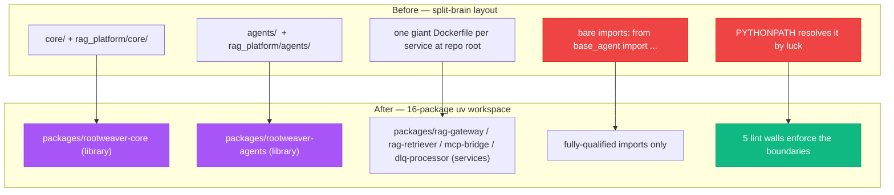
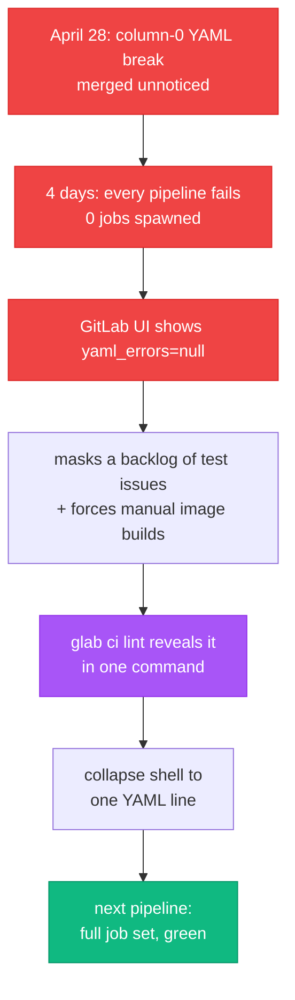
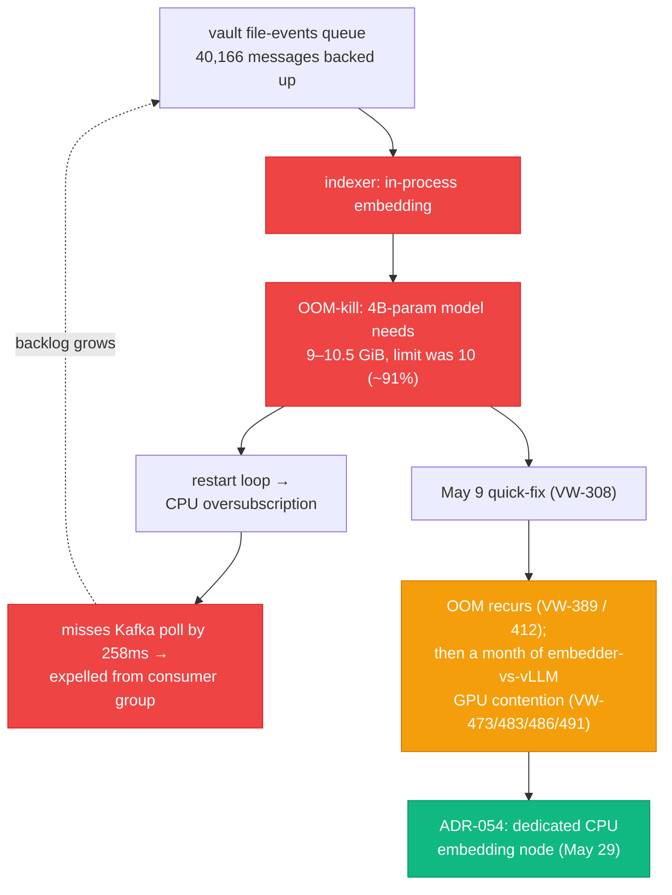

## The episode that can't be a Monday


Every episode of this season so far has been a day. Episode 8 was a single Monday in March that converted the whole RAG pipeline to async and watched the platform find a path traversal in its own code — an episode partly written from a backup journal, because an upstream bug had eaten the day's transcripts. Episodes 7 and 8 between them covered four days, told minute by minute.

This one can't work like that. The window is May 1 to June 8 — five and a half weeks. Across it the ticket numbers ran from VW-248 to VW-659 — on the order of four hundred — and I wrote dozens of implementation reports along the way. There is no honest way to narrate that ticket by ticket. If I tried, you'd get a changelog, not a story, and I'd be lying about what the month was actually *about*.

So this is the one episode of the season told at the level of arcs instead of days. Four threads ran through May, and they were not independent — each one kept tripping over the others. The spine is a repository restructure I'd been putting off for months: tearing the codebase down to the studs and rebuilding it as a sixteen-package workspace, one stage at a time, without ever letting `main` break. Wrapped around that: a continuous-integration pipeline that had been dead for four days without telling anyone; a measurement habit that finally got rigorous; and the slow, unglamorous work of teaching the platform to remember and grade its own past.

Up front, the honest part. To tell those four arcs I'm **deliberately leaving things out**. The vault-Postgres index epic that ran in parallel is its own future story and barely appears here. The GPU "two-body problem" — vLLM and the embedder fighting over one graphics card — gets a cameo, not the deep dive it earned. Dozens of daily CI-and-Flux babysitting tickets, the cost-tracking work, the Syncthing hygiene saga: all real, all skipped. This is the shape of the month, not its census.

And the closing fact that frames everything: this window ends June 8. On June 9, a new model — Fable 5 — became my daily driver, and the platform stopped being a thing I direct one conversation at a time and started becoming a thing that audits itself with fleets of agents overnight. **Season 3 ends the day before the agent era begins.** Hold that thought; it's the last beat.

## The spine: tearing down the skeleton without stopping the heart


The honest reason I finally tore the repo apart wasn't aesthetics — it was that the mess had started *costing* me, measurably, every session. The week before, an audit had grepped for `from scripts.tools.chromadb_embeddings_v2` and come back with zero importers, because the real code used a bare `from chromadb_embeddings_v2` resolved by `PYTHONPATH` luck — and that false-negative nearly deleted a production-load-bearing file. A separate audit predicted ~50 dead files in `scripts/` and found 68, because there was no convention for "where new code goes," so three near-distinct generations of code had silted up in the same folder with no way to tell them apart short of `git log`. The structural state was five Python trees with unclear boundaries, four uncoordinated `pyproject.toml` files, three different test homes, and bare imports that only ran because pod `PYTHONPATH` happened to be set. None of it was *broken*. It was just an archaeology tax on every change — and the thing paying that tax most was an AI agent (or me) trying to answer "where does this live and what depends on it."

For most of Season 3 the codebase had a split-brain problem. There were two `core/` directories — one at the repo root, one under `rag_platform/` — and two `agents/` directories, and bare imports like `from base_agent import` that resolved by luck and `PYTHONPATH` rather than design.

What I want to be honest about is that this wasn't a grand plan I executed top-down. It started, the night before Stage 1, as research — I kept asking for the academic and industry evidence before committing to anything: *"do some depe reasech online in acadiama space that show results in thei space for monorepos"*, then *"how does that work with my tooling though like the pdg and rag-gateway for example?"* I wanted the monorepo decision grounded in something other than my own taste, because the whole point was to stop making undocumented decisions on vibes. And when it came to the actual restructure, it unfolded as careful, loss-averse, folder-by-folder questioning, not a sweep. My actual prompts, typos and all:

> *"are we able to look at the nameing of the folder to and find out what need to go where also?"*
>
> *"so i dont really use inbox quick ref and capture anymore since most files goes to system journal or personal like"*
>
> *"lets not delete but moved to archieve maybe dont want to loss data or md files might have to review them and re-order per clasifcations"*

That last one is the migration philosophy in miniature, said before I'd read it back in any ADR: don't delete, move to archive, you might want to review it later. Only once I'd confirmed nothing referenced a folder did I let it go — *"u can delete the folder once all the context is out ok."* The grand-sounding "uv workspace of sixteen packages" was the destination; the road to it was me poking each folder and asking whether anything still lived there.

ADR-030 was the decision to fix that properly: collapse the whole thing into a **uv workspace of sixteen packages**, with a hard line drawn between *library* packages (shared code, imported by everything, importing nothing downstream) and *service* packages (the four things actually deployed to the cluster). Around that line, a set of lint walls — five of them — that would eventually make the structure self-enforcing: no service importing another service, no bare imports, no stray files at the repo root, no two ADRs with the same number.

The thing I'm proudest of isn't the destination. It's the migration philosophy, which I wrote down before touching a single file: **always-deployable**. Six stages, each one its own ticket (VW-334 through VW-339, under parent VW-333), each one a single pull request that was mergeable and deployable in isolation. `main` never breaks between stages. If you cut the project off at any stage boundary, the platform still runs.



Stage 1 went first, and it went somewhere I didn't expect: the vault, not the code. The new lint rules would reference folder names, so the vault's own folder structure had to be final before the rules landed — eight folder operations, **no deletions**, every retired folder moved wholesale into the archive with a `-archived-2026-05-11` date suffix so nothing was lost and everything stayed recoverable. The same stage forced a reckoning I'd been dodging: thirteen code files still referenced stale vault paths, several of them hardcoded to `/home/rduffy/Documents/Leveling-Life`, a directory that hasn't existed since I migrated to the Mac. A conversation-summary hook had been silently writing to nowhere for months because of it. The restructure was a forcing function — touch every file, fix the base path and the folder name in one pass.

The middle stages did the actual surgery. Library packages got created with `src/` layouts, and every old import path got a **backward-compatibility shim** — a tiny module that re-exported from the new canonical package and emitted a deprecation warning. That's the trick that keeps `main` deployable: during the transition, code can import either the old path or the new one, and both resolve to the same place. Production never notices. The shims get deleted in Stage 6, once every caller has moved.

And then Stage 6 taught me the lesson that's worth the whole arc.

## The forty landmines Stage 6 couldn't see


The restructure passed every gate. `uv sync` resolved every import cleanly. The import-linter contracts were green. `pytest --collect-only` collected everything. The shims came out. Done.

Except a session a day later opened with **seven firing alerts**. Two vault-indexing workloads were dying with `ModuleNotFoundError`, pointing at the `rag_platform.*` namespace that Stage 6 had just deleted.

The grep that followed found the real scope: **roughly forty deferred imports**, the kind written *inside function bodies* rather than at the top of a module, still pointing at the deleted namespace — scattered across 28 files in 8 packages. Every one of the four gates that signed off on Stage 6 has the same blind spot:

- `uv sync` resolves module-level imports.
- `import-linter` checks module-level imports.
- `pytest --collect-only` imports modules to discover tests.
- **None of them ever executes a function body.**

So forty imports sat there as latent landmines, each one fine until the exact moment its containing function ran. The fix was a single mass `sed` sweep — 28 files, 59 line edits, zero new regressions, 101 unit tests still green — plus one genuinely architectural correction: a `circuit_breaker.py` that had ended up in a *service* package got moved into the *library* package where it belonged, resolving a real boundary violation the lint wall had been quietly flagging. Four service images rebuilt, pushed to the registry under the tag `vw-362-clean`, six pods rolled to it with zero restarts, and an end-to-end `/v1/rag/search` call returning real results to prove it.

The lesson, written down so the next migration inherits it: the one grep line that would have caught all forty at review time was

```bash
grep -rn "^[[:space:]]*from rag_platform\b\|^[[:space:]]*import rag_platform\b" packages/
```

Verification is only as good as the code paths it exercises. A green test suite that never runs a function body is telling you something narrower than you think it is. That's the same shape as Episode 7's "put the filter at the boundary" and Episode 8's eight async bugs — every new code path is a new place for an old assumption to hide. A restructure creates a *lot* of new paths.

## The pipeline that died without telling anyone


While all that was happening, a second arc was running underneath it — and it started with a discovery that everything I'd been doing by hand for days had been unnecessary.

Early in May I sat down to find out why the GitLab CI pipeline kept "failing." Every pipeline since late April had been failing *immediately*, with zero jobs spawned. The cause was a single YAML syntax error — a shell snippet inside a CI job whose continuation lines started at column zero, which silently broke the literal-block indentation contract and made the whole file unparseable. It had ridden in unnoticed on an unrelated merge a few days earlier.

The cruel part: **GitLab's UI never surfaced it.** The web interface reported no YAML error at all, even though every pipeline was dying at parse time. The only thing that revealed it was running `glab ci lint` locally, which said, plainly, what GitLab's web interface would not:

```
.gitlab-ci.yml is invalid.
could not find expected ':' while scanning a simple key
```

The fix was to collapse the multi-line shell into one YAML line — same shell semantics, no column-zero break — and the very next pipeline spawned its full set of jobs and went green.

But the four-day blackout had done damage out of proportion to its cause. It had been masking a backlog of pre-existing test problems — collection errors from modules that earlier refactors had renamed out from under their test files, plus genuine failures — all invisible because no pipeline had run their stages in days. And it had quietly forced manual `docker build && docker push` for several other shipped tickets, because with CI down there was no automated path to publish an image. One YAML typo had been taxing the entire engineering tempo, not just one workflow.



The same arc kept finding things that had been quietly broken for absurd lengths of time. A `perplexity-gateway` pod had been in CrashLoopBackOff for **82 days** — 437 restarts — and the corrective-RAG fallback that depended on it had been silently returning empty results that entire time, caught by an exception handler and logged at a level nobody watched. The "102-day Flux failure" I'd been telling myself a story about turned out to be a misread: Flux had been reconciling on schedule every fifteen minutes; what was 102 days old was the dead Deployment object it kept tripping over. The recurring theme of the month: **silent degradation hides for months, because graceful exception handling plus no metric on the degraded path is a stealth quality-regression vector.**

Then, with CI alive again, the second half of this arc made it *fast*. The deploy chain — build image, push to registry, get it pullable by the cluster — went from north of twenty minutes to a steady-state cache hit of a couple of minutes, several times faster. Two changes did most of it: decoupling the multi-gigabyte embedding model out of the gateway image (which shrank it by roughly an order of magnitude and, as a bonus, fixed a registry that rejects very large blobs), and restoring proper build-layer caching. Getting images into the private registry meant routing around an open upstream BuildKit bug where the build container silently ignores the "insecure registry" config — the workaround was a two-phase push through a daemon that *does* honour it.

## The measurement era


The third arc is the quietest and, I think, the most important for what comes next. For most of the season I'd been making retrieval decisions on vibes — does this answer *feel* better — which is exactly the failure mode this whole platform is supposed to cure.

The turning point was a study at the end of May (VW-438) that asked a boring, answerable question: when an AI agent needs to answer an engineering question about this platform — a past decision, an architecture, something that went wrong — what retrieval strategy actually produces correct grounding? The pilot was deliberately small — **five architecture decision records, three conditions** — but the result was clear enough to change how I worked:

| Retrieval strategy (VW-438 pilot, 5 ADRs) | Quality score |
|---|---:|
| No memory (model alone) | 0.545 |
| Semantic vault search | 0.703 |
| **Grep + read source** | **0.883** |

Grep won, and by a wide margin — which was not what I expected from a platform whose whole pitch is semantic search. Reading the actual source beat retrieving things that were merely *similar* to the answer. That single finding is what changed the method: stop trusting a similar-looking hit, go verify against the file.

The pilot didn't stay a number; it became a protocol. A later, fuller pass turned the three conditions into a layered one — **discover** (typed memory: what decisions exist), then **contextualise** (semantic search: what's related), then **verify** (grep + read: do the facts actually hold) — run in that order, every engineering session, because each layer catches the errors the others introduce. Typed memory can confidently return a fact that's structured and wrong; semantic search returns things adjacent to the answer; grep is precise but only finds keywords you already know to search for. The order is the point. (This very episode was researched that way, and its evidence ledger is the verify step made visible — it's the reason a couple of this draft's numbers got rewritten when the ledger couldn't source the originals.)

But the quietest evidence that May was the measurement era isn't a benchmark — it's the count of decisions I bothered to write down. May produced roughly **sixteen Architecture Decision Records** — ADR-030 for the repo structure on May 11; ADR-037 and ADR-038 for the journal consolidator; ADR-043 through ADR-046 for the memory system; ADR-047 and ADR-048 for the LLM trust boundary and egress control; ADR-049 and ADR-050 for the radar pipeline; ADR-051 through ADR-055 for feed acquisition, benchmark metrics, observability routing, the dedicated embedding node, and the backup strategy. For comparison: April had **five**, and before that the count rounds to roughly zero. The platform spent most of its life making architectural decisions in the moment and never recording why. May is the month that habit changed — and the ADR registry that indexes all of them, `ADR-Index.md`, didn't exist before May 11 either. It was *generated by* the restructure (ADR-030 §6 mandated a single canonical numbering authority precisely because two ADRs had already drifted into sharing a number). The index is a child of the spine. The platform didn't just start writing decisions down; it built itself the filing cabinet to keep them in, in the same week, for the same reason.

## The platform learns to remember its work


The fourth arc I'll be honest about up front: my notes for it are thinner than the other three, so I'll keep it to what I can actually stand behind rather than dress it up.

The through-line is that the platform spent May getting better at *remembering its own history* in a way a machine can use. And this arc has a decision trail of its own — the same ADR habit, pointed inward. Four records in three days drew the memory system's boundaries: ADR-043 fixed its GDPR position, ADR-044 and ADR-045 wrote down the eval methodology (a v1 and then a v2 the same day, because the first version wasn't rigorous enough to trust), and ADR-046 settled the embedder architecture underneath it. Before you can teach a system to grade how well it remembers, you have to decide what it's allowed to remember, how you'll measure recall, and what actually does the embedding — and I made myself write each of those down rather than carry them in my head.

Two smaller pieces of the same arc deserve a line each. Commits gained a `Session-Id` trailer, so any commit can be traced back to the exact conversation that produced it — a small thing that turns "who changed this and why" from archaeology into a `git log --grep`. And the sprawling rule files that used to load into every single session got pushed behind on-demand skills, so the context budget stops getting spent on instructions a given task doesn't need.

The piece that matters most for what comes next got found by telemetry, and it was embarrassing: **the overwhelming majority of agent work was running on the expensive model and almost none on the cheap one**, despite several correctly-defined cheap agents sitting unused. The fix rebuilt the sub-agent harness around a creator-verifier pattern — every builder paired with a separate, fresh-context verifier carrying the opposite cost bias. In its first live test, that verifier reviewed the very change that created it and found real issues in it. An agent auditing the work of the agent that built it. Hold onto that image; it is the seed of everything Season 4 is about.

## The embedding fight that didn't have a clean ending


The honest counterweight to all of that is the one arc that refused to resolve in a single clean move — and it ran the whole length of the month underneath everything else.

A routine check at the start of one day in early May found **40,166 messages** backed up on the vault file-events queue. The indexer that was supposed to be draining it was being OOM-killed in a loop: the four-billion-parameter embedding model needs **9 to 10.5 GiB** resident and the memory limit was 10, so it ran at roughly **91% steady**, tipped over, and the restart loop caused CPU oversubscription that made it miss its Kafka poll deadline — by 258 milliseconds — and get expelled from the consumer group. Backlog in, nothing out.



Here's the part I want to tell honestly, because the clean version of this story is one I caught myself drafting. The first fix, on May 9 (VW-308), looked like a win — but it was a quick-fix, and it didn't hold. The OOM came back (VW-389, VW-412). Then the embedder and vLLM spent most of the month fighting over a single graphics card, and I papered over it with band-aids that left throughput hovering somewhere in the **40-to-80-seconds-per-chunk** band — better than dead, nowhere near solved. As late as the May 30 handover the real decision was still open. What actually ended the fight wasn't a clever switch; it was architecture: **ADR-054**, on May 29, stood up a dedicated CPU embedding node so the embedder stopped competing with the language model for the GPU at all.

I keep coming back to this arc precisely because it's the one that *didn't* hand me a tidy number to brag about. The dramatic single-fix stories in this season are real — but this is the corrective to them. Some of the month's most important work wasn't a stupid thing switched back on; it was a structural problem that took weeks of wrong turns before the right shape showed up. The throughput wasn't sitting there waiting for a flag. It had to be *built somewhere it could survive*.

## What I'd do differently

**Verify at the layer that actually executes.** If this season has one recurring law, it's this one — Episode 7 met it as "put the filter at the boundary," Episode 8 as eight bugs hiding in paths the sync code never ran, Episode 9 as a feature flag gating unreachable code, and May restated it three more times: the forty Stage-6 landmines, the four-day CI blackout that GitLab's own UI wouldn't show me, the 82-day silent fallback. A green check is a claim about the specific paths it exercised, not a guarantee about the ones it skipped. Next migration, the pre-commit grep checks function-body imports too. The thing I keep relearning is that *absence of an error is not evidence of correctness* unless the check could have produced the error.

**Measure before you decide, and let the measurement change the method, not just the answer.** The VW-438 study didn't just tell me which retrieval strategy was best — it changed how every session works from then on. The wins that stuck this season were the ones grounded in a trace or a benchmark I could point at. The fixes that didn't survive contact with production were the ones that "looked reasonable."

## Closing the season


So that's Season 3. It opened in October with a vault and a vague ambition to build something that remembers. It closes with a platform whose skeleton I rebuilt without ever stopping its heart, whose CI tells the truth again, that measures — rather than guesses — how well it retrieves its own past, and that has started keeping a usable memory of the work that made it.

And it closes on a date. This window ends June 8. The next day, June 9, Fable 5 became my daily driver, and within hours the platform stopped being something I steer one conversation at a time. **Season 4 opens with the agent era** — and it opens loud. The first episode is the night a 49-agent, multi-model sweep audited the entire platform while I slept and surfaced 173 confirmed bugs. After that: the rails I had to build so an expensive brain couldn't quietly burn money, and provenance for the AI's own configuration — git history for the agent's brain.

The defenses you build protect you from the bugs you've already seen. Season 4 is what happened when I pointed the platform at itself and asked it to find the rest.

For the production code, blog.rduffy.uk. For the work-in-progress version with the texture, labs.rduffy.uk.

## References & links

**Workspace & build tooling**

- [uv](https://docs.astral.sh/uv/) — the Python workspace and packaging tool the 16-package layout is built on.
- [import-linter](https://import-linter.readthedocs.io/) — enforces the library/service boundary contracts.
- [hatchling](https://hatch.pypa.io/latest/) — the build backend for each workspace package.
- [moby/buildkit#4458](https://github.com/moby/buildkit/issues/4458) — the open bug where the build container ignores insecure-registry config.

**CI / deploy chain**

- [GitLab CI/CD YAML](https://docs.gitlab.com/ee/ci/yaml/) — the pipeline syntax whose column-0 break caused the blackout.
- [glab](https://gitlab.com/gitlab-org/cli) — the CLI whose `ci lint` surfaced what the web UI hid.
- [FluxCD](https://fluxcd.io/) — the GitOps reconciler behind the deploy chain.
- [Harbor](https://goharbor.io/) — the private container registry images are pushed to.

**Retrieval & measurement**

- [Qdrant](https://qdrant.tech/) — the vector database the semantic layer queries.
- [Corrective RAG](https://arxiv.org/abs/2401.15884) — the CRAG pattern behind the web-search fallback.
- [Text Embeddings Inference](https://github.com/huggingface/text-embeddings-inference) — the GPU embedding server the indexer switched to.
- [Apache Kafka](https://kafka.apache.org/) — the event backbone whose 40K-message backlog kicked off the migration.
