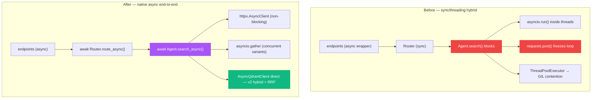
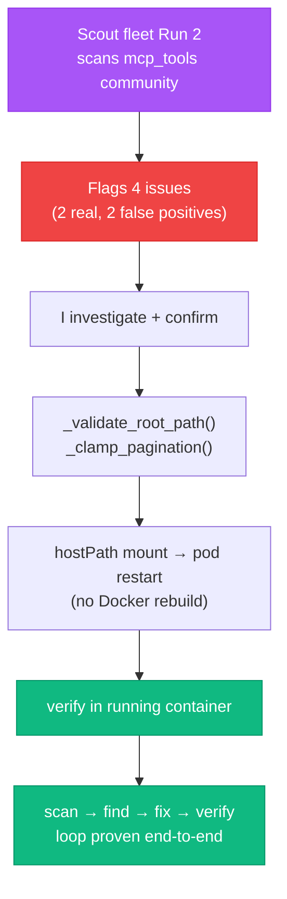

## The bug that ate the evidence


This series is written from a paper trail: git commits, vault implementation reports, Jira tickets, and the raw conversation transcripts Claude Code writes to disk as `.jsonl` files. Those transcripts are the texture — the actual order things happened in, the dead ends, the exact error messages.

While drafting this stretch of Season 3, I went looking for the transcripts from early in the year and found a hole. Two months of them — roughly January through the start of March — were simply gone.

The cause turned out to be [Claude Code issue #41591](https://github.com/anthropics/claude-code/issues/41591), titled, verbatim: *"Auto-update deletes session .jsonl files, wiping token usage history and conversation data."* An auto-update around version 2.1.87 deleted old session files with no warning, no backup, no consent — **520 of 520 sessions** lost their transcripts; 282 session directories were left holding only their `subagents/` folders, the main conversation gone. The `sessions-index.json` files still listed the deleted paths, pointing confidently at files that no longer existed. The issue was opened, and closed as *not planned*.

The irony is the point. A tool I use to build a system that *remembers things* quietly deleted two months of its own memory — and I only found out because I was writing about the era it erased. That is the whole theme of this episode: **the defenses you build protect you from the bugs you've already seen. The damage comes from the ones you haven't.** Three times over, that Monday.

And here's the twist that makes this episode possible at all. Monday March 30 is *inside* the erased window — I have no raw transcript of the day I'm about to describe. What I do have is the daily journal my own pipeline wrote that night, before the auto-update ran: a consolidator job that runs every evening, reads the day's sessions, and distils them into a reflection log and a technical log. It generated both at 22:55 that night, from thirteen sessions whose raw `.jsonl` files no longer exist. So this episode is partly written from a backup layer I built and then half-forgot about — a defense that happened to be standing in exactly the spot the bug hit.

That's not luck I get to take credit for. I didn't design the consolidator as a hedge against Claude Code deleting my transcripts; I built it to summarise my days. It just turned out that a same-night digest, written to a different directory by a different process, survived the thing that ate the source. Which is the title from the other direction: the defense that saves you is rarely the one you built on purpose. A note in this episode marked *"from the journal"* means it comes from that consolidator's first-person digest — Haiku's same-night paraphrase of what I did — not from a verbatim transcript of me typing. I'll be careful about the difference, because the difference is the whole point.

## How you make search fast without making it wrong

The day's real work started with a number that had been embarrassing me since Episode 7's benchmark suite went live: fast search took **9 to 10 seconds**. For a thing called "fast search," that's a lie.

The cause wasn't the search — it was the *plumbing*. The pipeline was a sync/threading hybrid pretending to be concurrent: it called `asyncio.run()` from inside threads, made blocking `requests.post()` calls to the LLM that froze the event loop, and used a `ThreadPoolExecutor` to run query variants that then fought each other for Python's [GIL](https://docs.python.org/3/glossary.html#term-global-interpreter-lock). Every "parallel" path was actually serial, with overhead on top.

The fix the literature points at is native async end-to-end. [LlamaIndex](https://www.llamaindex.ai/) went async-first for exactly this reason; the [Adaptive RAG](https://arxiv.org/abs/2403.14403) and [Speculative RAG](https://arxiv.org/abs/2407.08223) lines of work both assume you can fan out retrieval and generation concurrently. None of that is possible if your I/O blocks the event loop. So VW-179 converted the entire pipeline — 25 files, +3,059/−332 lines — from sync to native `async`/`await`.

The journal from that night is blunt about the cost: *"I spent 15+ hours converting a sync RAG pipeline to async, and it was messier than expected."* Thirteen sessions, 626 events, 326 Bash calls, 68 file edits — most of that not the conversion itself but the diagnostics around it, the long stretches of running something, watching it fail in a way that made no sense, and chasing the why. An async migration sounds like a translation job — sprinkle `await`, swap a client, done. It is not. It's a series of small archaeological digs into assumptions the sync code never had to state out loud.

Two of those digs are worth dwelling on, because they're where the deliberation actually happened. The first was an abstraction I built and then killed the same day. I started by writing an `AsyncQdrantAdapter` — a wrapper layer to mediate every async call to the vector store. By the time I'd wired it up I could see it was over-engineered: the agents only ever needed async scroll and search, and they already carried their own OpenTelemetry tracing. So I ripped it out and called `AsyncQdrantClient` directly from each agent, reusing the tracing that was already there. The journal's verdict is the kind of line I want to remember: *"Less code. Same result."* The instinct to wrap everything in an adapter is usually the wrong one in a refactor — you're adding a layer to manage complexity you could have just deleted.


The second was BM25, and it's the one I'm least proud of and most sure was right. The Python BM25 path — `shared_bm25.py`, plus fusion logic in `deep_research_agent.py` that expected its results — was pure blocking overhead in an async world, and Qdrant v2's native hybrid mode already does the sparse-vector half in the database. The clean fix would have been a careful rewrite of the fusion logic to fold the two cleanly. At hour twelve of fifteen, the clean fix is a trap. I deleted `shared_bm25.py` outright, updated the fusion to handle empty inputs, and moved on — the journal's framing was *"No time for partial refactors,"* which is a polite way of saying a half-migrated fusion path is more dangerous than a deleted one. A partial refactor leaves a blocking call hiding in a critical path, waiting to surface the next time someone profiles deep search. A deletion leaves a hole you can see.

And underneath all of it, the dependency layer kept reminding me how thin the floor was. The first blocker of the day wasn't even my code — `redis.asyncio` wasn't installed, `qdrant-client` needed a version bump. A `pip install` fixed both in seconds, which is exactly the problem: there was no lock file, no CI check, nothing stopping the same gap from reappearing on the next clean checkout. The async work was the headline; the fact that I could be stopped cold by an unpinned transitive dependency was the quieter lesson, and it went straight onto the next-day list.

The single most frustrating hour wasn't in the Python at all — it was Kubernetes. A wall of RBAC "Forbidden" errors, the kind that tell you nothing: permission denied, but to what, by what, why. I burned a chunk of those 326 Bash calls flailing at it before I changed the question. Re-running `kubectl describe pod` with verbose logging — `--v=4` — finally surfaced the real cause: a service-account binding misconfiguration, not a code problem at all. The line I wrote that night is one I keep coming back to: *"The diagnostic output was noise until I asked the right question."* That's most of debugging, really. The information was on screen the whole time; what changed was the verbosity flag and the framing of what I was looking for.



The blocking HTTP call was the worst offender — swapping `requests` for [httpx](https://www.python-httpx.org/)'s async client is what let the event loop actually do other work while waiting on the LLM:

```python
# before: blocks the event loop for the whole LLM round-trip
resp = requests.post(backend["url"], json=backend["payload"])
# after: the loop stays free while this awaits
async with httpx.AsyncClient(timeout=5.0) as client:
    resp = await client.post(backend["url"], json=backend["payload"])
```

## Monday: the numbers

| Path | Before | After | Change |
|---|---|---|---|
| Fast search | 9–10 s | **47–144 ms** | 60–200× |
| Temporal | 2–5 s | **70–100 ms** | ~50× |
| Code intelligence | 0.5–2 s | **40 ms** | ~25× |
| Deep search | 9–10 s | **5–8 s** | 1.5–2× |
| Cross-domain (deep) | 10–15 s | **14–31 s** | **regression** |

These are **warm P50** figures — median latency once the models are loaded, the half-faster-half-slower middle, not a cherry-picked best case. Two honest notes:

- **The fast paths got 25–200× faster** because they were never CPU-bound — they were waiting, badly. Removing the blocking-and-serial overhead is most of the win.
- **Cross-domain deep search got *worse*** — 10–15 s up to 14–31 s. The reranker's cold-start and the graph-enrichment timeout now stack on the one path that triggers both. That's a real regression, written down so the next episode (the "async ceiling") has somewhere to start.

Quality held flat across the change (benchmark Run 31 → Run 38: overall 0.68 → 0.67, MRR 0.72 → 0.70 — all inside the noise band). Same retrieval, same answers, delivered up to two hundred times faster on the path people actually use.

## The eight things async exposed


Here's the lesson that doesn't fit in a metric: *an async refactor doesn't convert sync code to async — it exposes every assumption your sync code was quietly making about execution order.* Eight bugs surfaced during deploy. Seven had code; one was me reverting the filesystem by hand. The instructive ones:

**The OTel spans assumed every agent had an `agent_type`.** Most did; the graph agent didn't, and the new tracing wrapper crashed on it:

```python
# every agent instance does NOT carry .agent_type
- with tracer.start_as_current_span(f"rootweaver.search.{self.agent_type}.qdrant"):
+ with tracer.start_as_current_span(f"rootweaver.search.{getattr(self, 'agent_type', 'unknown')}.qdrant"):
```

**The sparse vector had a different name than the code believed.** Qdrant v2's collection exposes the BM25 sparse vector as `bm25`, not `sparse-bm25` — so hybrid search silently fell back to dense-only:

```python
# the collection's sparse vector is named "bm25" (condensed)
if "bm25" in vector_names:
    prefetch.append(models.Prefetch(query=sparse, using="bm25", limit=top_k * 3))
```

**The async embedding path hardcoded its own URL** instead of reading the config the sync path used — so it pointed at the wrong service and had no CPU fallback:

```python
# before: env-var host, no fallback
host = os.getenv("EMBEDDING_HOST", os.getenv("QDRANT_HOST", "rag-retriever"))
# after: use self._config.embedding_service_url (same as the sync path), with CPU fallback
```

**DeepSeek-R1 left unclosed `<think>` tags.** When the model hit `max_tokens` mid-thought, the reasoning tag never closed and leaked into the answer. Disabling thinking mode wasn't enough — the truncated tag still had to be stripped:

```python
"chat_template_kwargs": {"enable_thinking": False},
# ... and defensively strip an unclosed <think> left by truncation:
if "<think>" in response:
    response = response.split("<think>")[0].strip()
```

**Five `search_async` signatures didn't accept `**kwargs`** — so the moment the router passed an extra parameter down a path that didn't expect it, that path threw:

```python
- async def search_async(self, query, n_results=5, verbose=False) -> SearchResult:
+ async def search_async(self, query, n_results=5, verbose=False, **kwargs) -> SearchResult:
```

**Reranking on a `ProcessPoolExecutor` hung for 20+ seconds in K3s.** A fresh spawned process re-downloads the cross-encoder model every time — fine on a laptop, fatal in a container:

```python
# ProcessPoolExecutor(spawn) re-downloads the model per process → 20s+ hangs in K3s
- return await loop.run_in_executor(_RERANK_POOL, rerank_results, query, results, top_k)
+ return rerank_results(query, results, top_k)   # inline until a dedicated rerank service exists
```

**And the benchmark exclusion filter — the one from Episode 7 — wasn't applied on the new async paths.** The exact same class of bug as last episode, in the exact place the refactor created a new code path:

```python
- return results
+ return self._filter_benchmark_results(results)   # the async paths skipped the filter too
```

That last one is Episode 7's "put the filter at the boundary" lesson billing me a second time. Every new path through the pipeline is a new place to forget the filter — and an async refactor creates a lot of new paths.

## The scout fleet finds a hole in its own house


The same Monday, a different kind of bug surfaced — and this one I didn't find. The platform's Scout fleet (the autonomous consumers that scan the code-knowledge graph for quality and risk) had run over the `mcp_tools` community nine days earlier — its second autonomous run, on March 21 — and flagged two real vulnerabilities in the platform's own PDG generator. Monday was the day I sat down with the findings (VW-181):



The two real issues were textbook:

1. **Path traversal** ([CWE-22](https://cwe.mitre.org/data/definitions/22.html)) — twelve PDG functions accepted an unvalidated `root_path`. Anyone with access to the MCP interface could point it at `/etc/passwd` and read arbitrary files off the host.
2. **Pagination DoS** — four functions took an unbounded `limit`/`offset`. A `limit=999999999` turns into an O(n·m) computation that pins the pod.

The fix was two small guards, applied across the twelve and four functions respectively:

```python
# path validation — applied to 12 functions
def _validate_root_path(root_path):
    if not root_path:
        return DEFAULT_ROOT_PATH
    resolved = Path(root_path).resolve()
    try:
        resolved.relative_to(DEFAULT_ROOT_PATH.resolve())
    except ValueError:
        raise ValueError(f"root_path must be within {DEFAULT_ROOT_PATH}")
    return resolved

# pagination clamping — applied to 4 functions
MAX_PAGINATION_LIMIT = 500
def _clamp_pagination(limit, offset):
    return min(max(limit, 0), MAX_PAGINATION_LIMIT), max(offset, 0)
```

Verified in the running container: `/etc/passwd` → rejected, `clamp(999999, -5)` → `(500, 0)`.

Here's the honest part. Today the risk is **low** — the MCP bridge is localhost-only on port 30002, so there's no remote attacker. But the bridge pod mounts the whole `/mnt/2tb/rootweaver-platform` tree via `hostPath`, so the *capability* to read the host was real; `_validate_root_path()` constrains the tool interface, not the mount underneath it. The defense I built (validate the input) is narrower than the exposure that exists (the broad mount). That's the thesis again: I hardened against the attack the scout fleet showed me, which is not the same as hardening against every attack the architecture permits.

The part worth celebrating: the scout→find→fix→verify loop ran end to end, on the platform's own code, and caught something I'd written and never thought twice about. The automation found a defense I hadn't built — which is exactly what it's for.

Except — and this is the part I only saw when I went back to the journal to write this episode — *I had brushed the same surface myself, that same night.* Buried in the technical log from March 30, under "Key Learnings," is this: *"Parameter validation is critical — `DEFAULT_ROOT_PATH` in `mcp_tools.py` uses `ROOTWEAVER_HOME` environment variable with no validation, creating security surface."* The reflection log puts it more starkly: *"Parameter validation was the dark discovery. `DEFAULT_ROOT_PATH` in `mcp_tools.py` reads from `ROOTWEAVER_HOME` with zero validation. Environmental. Untrusted. That's a security surface that shouldn't exist."*

Same file. Same `root_path`. Same unvalidated environment variable feeding a path the MCP tools trust. Written by me, in my own end-of-day notes, on the exact Monday I sat down to triage the scout fleet's finding.

I want to be honest about what that does and doesn't mean. The scout fleet found the path-traversal *independently*, nine days earlier, on March 21 — its run pre-dates my journal note by over a week, so this isn't a case of the automation echoing something I'd already flagged. What actually happened is closer to two flashlights landing on the same dark corner from different directions: the autonomous scanner found it by walking the code-knowledge graph; I half-found it by hand while I was elbow-deep in `mcp_tools.py` for an unrelated reason. The difference is that the scanner *filed a ticket* and the scanner *forced a fix*. My note just sat in a journal as a "dark discovery" — a thing I'd noticed, written down, and would very plausibly have let drift into the backlog if VW-181 hadn't already been open with the scout fleet's name on it. The automation didn't see something I was blind to. It made sure the thing neither of us should have ignored actually got closed.

## What I'd do differently


**Treat an async migration as an audit, not a translation.** The eight bugs weren't *caused* by async — they were assumptions the sync code got away with because nothing ran concurrently. Hardcoded URLs, missing `**kwargs`, a tracing field that wasn't universal, a filter applied in only some paths: all latent, all exposed the moment execution order stopped being guaranteed. Next time I'll read a sync→async diff the way I'd read a security diff — assuming every implicit ordering is a bug until proven otherwise.

**Constrain the capability, not just the input.** The path-traversal fix validates what the MCP tool can ask for, but the pod can still read the whole tree. Defense-in-depth would tighten the `hostPath` mount itself. I filed that thought; I haven't built it. Which is, once more, the title.

## Same as every episode

Every piece of this is tracked: VW-179 (async refactor), VW-180 (scout-fleet quality), VW-181 (PDG security), across Monday March 30 and into Tuesday March 31, 2026. The async work was 19 commits on a feature branch plus a same-day fix on main; the security fixes deployed via a pod restart against the `hostPath` mount, no image rebuild. Benchmark Runs 37 and 38 bracket the refactor.

A note on the paper trail this time, because this episode's is unusual. Most episodes are written from the raw `.jsonl` transcripts — the verbatim record of what I typed and what came back. This one can't be: March 30 sits inside the window the auto-update bug erased. So the texture here — the 15-hour grind, the adapter I built and killed, the "no time for partial refactors" call, the "dark discovery" about `root_path` — comes from the consolidator's same-night journal, not from a transcript. That's a slightly different kind of source: it's Haiku's first-person paraphrase of my day, generated at 22:55 that night, not my exact words. I've leaned on it because it's the only first-hand record that survived, and I've flagged where I'm quoting it so you can weight it accordingly. The closing line from that night's reflection has stuck with me as the truest one-sentence summary of the whole Monday: *"The async refactor is done. Now comes the proving."* Which is the thread the next episode picks up.

On the design trail: no Architecture Decision Record came out of this work directly — it was an incident-driven Monday, not a design one. The closest ADR is **ADR-026** ("Agent Lifecycle Patterns — Lessons from Claude Code Source Leak"), opened a couple of days later — the same Claude-Code-as-dependency theme this episode opens on, formalised once the lesson was clear. That's the recurring pattern of this series: the ADR gets written when a tactical scramble turns out to have been load-bearing.

Next episode: the async ceiling. The fast paths went 100× faster, but deep search barely moved and cross-domain *regressed* — and that's the thread April pulls on, alongside the scout fleet's own scaling problems.

For the production code, blog.rduffy.uk. For the work-in-progress version with the texture, labs.rduffy.uk.

## References & links

**Async + RAG research**

- [LlamaIndex](https://www.llamaindex.ai/) — async-first RAG framework; the pattern this refactor follows.
- [Adaptive RAG](https://arxiv.org/abs/2403.14403) — query-complexity-aware retrieval; assumes concurrent fan-out.
- [Speculative RAG](https://arxiv.org/abs/2407.08223) — parallel draft-and-verify generation.
- [Python asyncio](https://docs.python.org/3/library/asyncio.html) · [the GIL](https://docs.python.org/3/glossary.html#term-global-interpreter-lock) — why threading wasn't buying concurrency.
- [httpx](https://www.python-httpx.org/) — the async HTTP client that replaced blocking `requests`.
- [OpenTelemetry](https://opentelemetry.io/) — component-level tracing added during the refactor.

**Security**

- [CWE-22: Path Traversal](https://cwe.mitre.org/data/definitions/22.html) — the vulnerability class the scout fleet flagged.

**Platform & runtime**

- [Qdrant](https://qdrant.tech/) — vector DB; v2 native hybrid (dense + BM25 sparse) replaced the Python BM25.
- [Claude Code issue #41591](https://github.com/anthropics/claude-code/issues/41591) — the auto-update bug that deleted the session transcripts.
