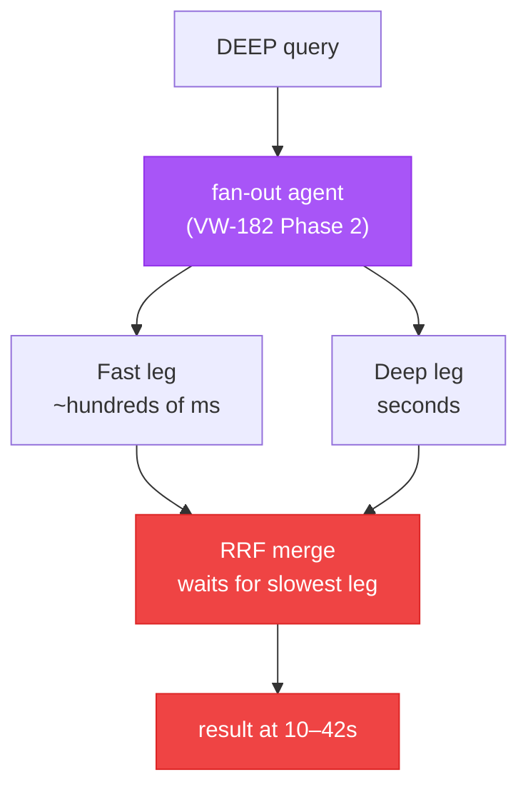
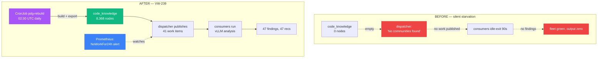
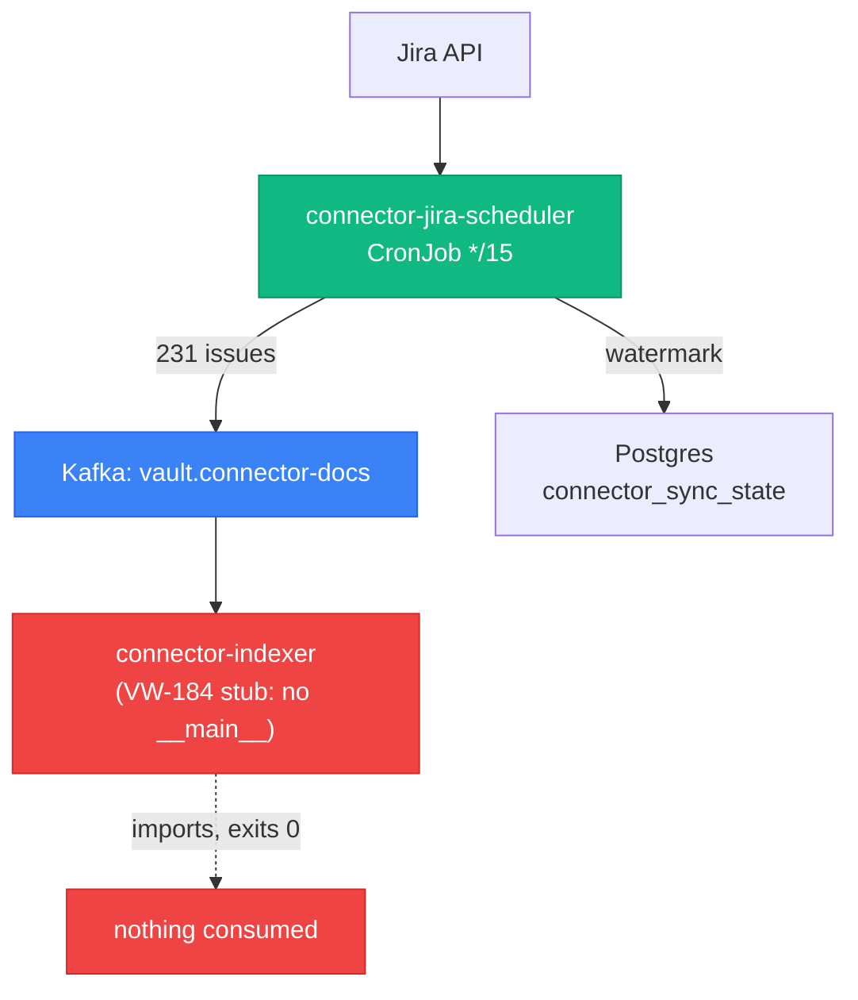

## The ceiling the last episode walked into


Episode 8 ended on a number I didn't like. The async refactor had taken fast search from nine seconds to under 150 milliseconds — a real, satisfying win on the path people actually use. But the same table had a row at the bottom that went the wrong way: cross-domain deep search, **10–15 seconds before, 14–31 seconds after.** A regression, written down on purpose so the next episode would have somewhere to start.

This is the next episode. April is where I pulled that thread, and the thread turned out to be attached to almost everything: the deep-search path, the knowledge graph that two of my features quietly depended on, the autonomous fleet that was supposed to be patrolling that graph, and the connector pipeline I'd spent a fortnight feeling smug about.

The honest shape of the month is this: **an async refactor doesn't make a system fast. It makes a system *uneven*, and then it shows you exactly which parts you never actually finished.** The fast paths flew. Everything that touched the graph, the reranker, or a second LLM call hit a ceiling — and chasing that ceiling kept turning up things that had been broken, silently, for weeks.

There is a lot of April. Sixty-six tickets, VW-182 through VW-247. I'm not covering all of it — the vault-postgres backup epic, the GPU two-body problem, a week of CI and Flux housekeeping, and a supply-chain audit big enough to deserve its own episode are all deliberately left on the cutting-room floor. What's here is the spine: speed, the graph, the fleet, the third Kafka consumer.

But before the spine, the *why*. None of this started as an engineering month. It started as a what-am-I-even-doing month. The mid-April session that kicked everything off opens with me asking the platform to explain itself back to me — *"explain what my system does to somebody who doesn't know what it does"* — and then, a few minutes later, the question underneath that one: *"what the point of it all"*, immediately followed by *"could it be truned into a product or app similar to chatgpt claude or kimi for example ?"* (my actual prompts that evening, typos and all). That's the shape of the month in two lines. I wasn't chasing a benchmark regression yet. I was standing back from a year of work asking whether it was a *thing* or just a pile of clever parts.

The answer to "could this be a product" turned out to be "not until it can ingest more than one source," which is how the whole connector arc got born — not from a roadmap, but from comparing my single-source vault against Onyx and Airbyte and not liking what I saw. And the answer to "is it even healthy" came from a single prompt the next evening — *"review my whole arch and system and find improvments in the code base or the arch serach the vault todo go"* — which opened the floodgates. That review is what surfaced the empty graph, the starving fleet, the never-built consumer. The reasoning ran curiosity → distrust of black boxes → a top-to-bottom audit, and the audit is where everything broke. The rest of this episode is me riding that reasoning downhill.

## Two benchmarks, two weeks apart, telling opposite stories


The cleanest way to see the ceiling is to put two benchmark runs side by side. (A note on the numbers: Episode 8's table measured the search *paths* — fast, temporal, deep. The benchmark suite slices by *query category* — analytical, factual, cross-domain — each of which may route through any path. Same system, different lens; that's why these figures don't line up one-to-one with last episode's.)

**Run 39**, on the 4th of April, looked like a triumph. The async work had landed and the latency column was a wall of green: analytical queries down from 22.6s to **3.8s** (−83%), cross-domain from 31.1s to **15.7s** (−50%), factual queries effectively instant. Quality drifted down a hair — overall 0.67 to roughly 0.65, inside the noise — but the speed story was unambiguous. Forty-five thousand documents indexed, everything faster. If I'd stopped writing benchmarks there, I'd have told you the refactor was a clean success.

**Run 40**, on the evening of the 18th, told a different story on the same hardware. Freshness had genuinely improved — P50 down to **0.3 seconds** (more on why below). But three latency rows had gone red:

| Category | Run 39 P50 | Run 40 P50 | Signal |
|---|---|---|---|
| Analytical | 3.8s | **27.7s** | major regression |
| Factual | 0.09s | **4.8s** | major regression |
| Temporal | 0.03s | **6.2s** | regression |
| Freshness | 4.9s | **0.3s** | fixed (VW-194) |

Analytical had gone from 3.8 seconds back up to 27.7. That's not noise. That's the ceiling.



The cause was a feature I'd added for *quality*. A fan-out agent runs the fast and deep search legs in parallel and merges them with [reciprocal rank fusion](https://qdrant.tech/documentation/concepts/hybrid-queries/). On paper that's pure upside — you get the best of both. In practice the merge waits for the slower leg, which is always the deep one, so every fan-out query inherits deep search's worst-case latency. The benchmark caught analytical queries landing at 27.7s P50 and individual cross-domain queries at 41.6 seconds.

And then there was the genuinely strange one. A single `fast_search` query — *"What architecture decisions were made about the connector framework?"* — took **32.2 seconds**. Fast search does no LLM inference at all; it's Qdrant plus keyword search. Thirty-two seconds is physically inexplicable for that path. I filed it as VW-208 and, being honest, it's **still in the backlog**. Same with the broader fan-out regression. The ceiling won some rounds in April; I'm not going to pretend otherwise.

## Chasing it: four fixes, three of them "this was never finished"


### The last blocking HTTP call

Episode 8's async migration was supposed to have killed every blocking `requests.post()` in the search path. A code review flagged one survivor in `BaseAgent` — and when I went to look, the line number the review pointed at had already moved. The real duplicated sync calls were two near-identical fifteen-line blocks doing embedding HTTP by hand.

VW-192 collapsed them into one `_embed_query_sync()` helper on `httpx`, dropped `requests` from the hot path, and added seven unit tests to a hub that had zero. Here's the honest part, which I wrote at the top of the report so I wouldn't kid myself: **user-visible impact, none.** The methods involved run in FastAPI's threadpool, not on the event loop, so the original "event-loop blocker" framing was wrong. This was legacy cleanup and test coverage, not a speedup. The live check confirmed it landed — `requests.post()` call sites went from 2 to 0 — and that's all it confirmed. Not every ticket gets to be a hero.

### Freshness: a feature that was never being called

This one is the cleanest illustration of the month's theme. I had four "freshness" retrieval strategies deployed, behind a feature flag, supposedly being A/B tested. VW-193 finally ran the A/B properly and found **no winner** — the spread across all five strategies was 0.017, against a gate that wanted at least 0.2. Worse: four of the five benchmark queries returned *byte-identical* results regardless of which strategy was selected. The strategies were, functionally, dead code.

VW-193 also shipped the one thing worth shipping that day — a seventeen-line startup hook that pre-warms the cross-encoder reranker so the first deep query doesn't pay the model-load tax. You can see it fire in the pod logs, the `BertForSequenceClassification` weights loading right where the lifespan hook sits. But it punted the real mystery to VW-194: why, with over a thousand recent documents indexed, did *no* strategy return anything newer than a month stale?

The answer was the theme of the month in one sentence. Episode 8's async refactor had added a new `search_async` method — and **never ported the freshness dispatch into it.** The strategies lived in the old sync `search()` method, which nothing on the live path called anymore. The feature flag had no effect because the code it gated was unreachable. I'd spent a benchmark cycle A/B-testing strategies that were never invoked.

The fix was to port the dispatch across, wrapping the strategies' blocking Qdrant calls in `asyncio.to_thread` so they don't stall the event loop:

```python
is_freshness = self._detect_freshness_intent(query)
freshness_results = None
if is_freshness:
    freshness_results = await asyncio.to_thread(
        self._dispatch_freshness_strategy, query, query, n_results, verbose,
    )
if freshness_results is not None:
    results = freshness_results            # strategy owns the ordering
else:
    results = await self._execute_hybrid_search_v2_async(query, n_results * 8)
```

Re-run the A/B with the dispatch actually reachable and the picture inverts: `vector_date_filter` and `dual_pass` both hit a perfect **1.000** freshness score against a control of 0.298. I shipped `vector_date_filter` as the default. Run 40's freshness row — 4.9s down to 0.3s — is that fix showing up in the benchmark. A real win, sitting one column over from three real regressions.

The lesson I wrote down: **ask "does this code path even run?" before you ask "why does this code path return the wrong thing?"** It's the cheaper question, and I'd skipped it for a whole benchmark cycle.

### Deep search was spending 24 seconds on nothing

VW-200 started as "investigate deep search's 13-second cold start" and turned into the most instructive bug of the month. Per-phase timing showed the cold start wasn't a cold start at all — warm queries were *also* spending 22 to 27 seconds, all of it in a graph-enrichment phase. Drill in one more level and the entire cost was a single embedding call: 24 seconds to encode the query with Qwen3-Embedding-4B on CPU, because the main GPU embedder was scaled to zero and this path fell back to local.

Then the surprise. I checked what was actually *in* the graph this enrichment was searching:

```
document_knowledge: count(n) = 0
code_knowledge:     count(n) = 0
graphiti:           count(n) = 0
```

All three [FalkorDB](https://www.falkordb.com/) graphs empty. Every deep query was paying 24 CPU-seconds to embed a query, to similarity-search **nothing**, to get zero results back. I'd been weighing real infrastructure options — fit a GPU embedder alongside vLLM, partition the GPU — to speed up a computation whose output was worthless because there was no graph.

The fix was nine lines: an env flag, `GRAPHITI_ENRICH_ENABLED`, defaulting to off, that short-circuits the whole enrich phase before the embedder ever runs. Deep search dropped to **7.4s cold and 1.4s warm.** The bigger issue — *why are the graphs empty?* — became VW-202, and that's where the fleet comes in.

## The graph was empty, and the fleet had been starving on it


Two things depended on that knowledge graph, and both had been quietly broken for weeks because of it.

The first was [Graphiti](https://github.com/getzep/graphiti) enrichment — the deep-search feature I'd just gated off. VW-202 set out to answer whether the feature was even worth fixing. I restored the graph (badly — the FalkorDB backups turned out to be 186KB *empty* snapshots, weeks of dutifully backing up nothing), got it to 25 nodes, and ran the enrichment A/B for real. The verdict was decisive: enrichment was **9.5× slower with zero quality benefit.** Four deep queries took 64.7 seconds with enrichment on versus 6.8 seconds off, and returned *identical* results. Injecting graph entity names into the query didn't change Qdrant's ranking, because those entity names were already in the indexed text. The env gate's default of "off" wasn't a workaround; it was correct. I wrote down the three conditions under which it's worth revisiting — a RediSearch bug fixed, the graph past a thousand nodes, and per-call latency under 100ms — and moved on.

The second dependency was the one that actually stung. The Scout fleet — the autonomous consumers from Episode 8's hero arc, the ones that found a path traversal in my own code — patrols that same `code_knowledge` graph. With the graph empty, the dispatcher had been logging the same line over and over:

```
WARNING: No PDG communities found. Is the graph built?
```

No communities, no work items, so the downstream consumers spun up, found nothing, and idle-exited after 90 seconds. Every layer I normally watch was green: the KEDA jobs were ready, the pods were healthy, the Kafka topics existed, consumer lag was zero. The fleet was *up*. It just wasn't *doing anything*, and had been that way for what was probably weeks.



VW-239 was a three-layer fix. First, rebuild the graph by hand to prove the pipeline still worked — `build_pdg` in 64 seconds, **8,368 nodes and 13,297 edges** exported into FalkorDB, 440 production modules suddenly visible to the dispatcher again. A manual dispatcher run published 41 work items, and within a minute the whole cascade fired: work-items 63 → 104, findings 0 → 47, recommendations 0 → 47. The fleet was alive end to end.

Second, the reason it died in the first place: there was no scheduled job to rebuild the graph. It was on-demand only, so once the graph was lost, nothing repopulated it. I added a nightly CronJob at 02:30 UTC. (And found a third layer underneath: the on-demand rebuild tool was *itself* broken at import, because a source file it needed was missing from my local checkout, which was 42 commits behind. The CronJob deliberately routes around it.)

Third — and this is the part I actually care about — three Prometheus alerts. The headline one fires when `scout.work-items` produces **zero new work for 24 hours.** Because the real bug here wasn't the empty graph. It was that every dashboard I had measured *infrastructure* health — is the pod up, is lag zero — and none of them measured *outcome* health. A pipeline that no-ops gracefully looks identical to a healthy one until you alert on "did any work actually get done." Health on the plumbing is not health on the result.

## The third Kafka consumer, and the producer shouting into a void


The last thread is the one the season's been building toward: the platform's data layer has now had its shape chosen three separate times, and April is where the third choice — *connectors, as Kafka streams* — got built, broke in an instructive way, and revealed how much of "done" I'd been taking on faith.

This is the thread that didn't start as engineering at all. It started the evening I asked whether the platform could be a product, looked at what Onyx and Airbyte actually do, and came away unimpressed in a specific way. My note to myself at the time: *"all they're really doing is taken different file format and then putting them into adjacent former which is probably more easily ingested by LLM's"* — and then the part that actually drove the decision: *"I don't like the idea that these are just a black boxes that we don't even know what they're doing"*. So I made the call out loud the same evening: *"okay let's plan this out. I want you to clone Ox's reel investigate everything in the and then see what we can use to integrate into existing platform"* — clone Onyx, read it, take the MIT-licensed parts in-house rather than run someone else's container and trust it.

That decision became **ADR-034 (Data Source Connector Architecture)** — proposed the very same day, 15 April, the connector arc's own decision record. Its core ruling is exactly the black-box objection turned into architecture: *don't* adopt Onyx wholesale (it drags in Vespa, loses my Kafka/KEDA pipeline, has no temporal search, no benchmark suite), and *do* build a Kafka-native framework that borrows Onyx's `BaseConnector` interface and normalised document model while keeping every line of ingestion code mine to read. The ADR is blunt about the trade I was buying — more SealedSecrets to manage, 2–5× Qdrant storage, a connector-maintenance burden — and explicit that connectors *complement* the MCP tools rather than replace them: MCP for writing, connectors for reading at scale. The whole productisation question I'd opened the month with resolved into that one document.

VW-184 was the framework ADR-034 specified: nine open-source connectors from [Onyx](https://www.onyx.app/), normalised into a single document model, flowing through a Kafka topic into Qdrant with a `source` facet so one search query could span the vault, Jira, Confluence, and the rest. It came with 34 tests, a thousand-error lint cleanup as a bonus, and that real architectural decision behind it — an auditable code fork over Airbyte's Docker black boxes, specifically so I could read every line that touched my data. I was proud of it.

Then VW-188 tried to actually turn on the Jira connector, and the framework's seams showed.



The producer side worked beautifully. **231 Jira issues** synced to Kafka in one cycle, the watermark advancing correctly in a new Postgres table, every manifest deployed through GitOps. End to end on the producer, verified in the logs and the database.

The consumer side **had never existed.** `indexer.py` defined a perfectly good `ConnectorIndexer` class — chunk, embed, upsert — and had no `__main__` block and no consumer loop. The KEDA job that was supposed to run it had been spawning pods for months that imported the module, did nothing, and exited cleanly with status `Completed`. A green job that consumed nothing. The producer had been shouting 231 issues into a topic with no listener. That became VW-232, and along the way VW-188 also turned up five separate plumbing failures that had silently broken the build pipeline for roughly four months — including the discovery that my image-deploy automation had been broken for 113 days and I'd been manually pushing images to the registry without quite realising it was the only thing keeping deploys alive.

VW-232 wrote the missing consumer — 282 lines wiring Kafka consumption to a parse-or-retry-or-dead-letter pipeline, with idempotent point IDs so redelivery can't double-index. The consumer group registered and processed **600 messages** across three partitions with zero lag. And then it hit the wall the whole platform keeps hitting: the embedding service it needed for indexing was scaled to zero, because the single GPU was busy serving the LLM. So every one of those 600 messages failed its embedding call, exhausted its retries, and landed — cleanly, with a perfectly-formed envelope — on the dead-letter queue. The consumer works. The proof that it works is 600 correctly-shaped failures waiting in a DLQ for the next window where the embedder gets the GPU. *Draining that backlog back through is follow-up work, not something I'll claim April finished.*

It's a fitting end to the connector arc: the framework was real, the producer was real, the consumer logic was real — and the thing standing between all of it and a working feature was the same GPU contention that's been the platform's running constraint all season.

## The morning I drew the map


April closed on a Sunday morning that was less about code than about admitting the platform had outgrown ad-hoc tickets. The morning itself started with another what-am-I-doing question — this time about storage: *"how are we currently using it in our system and if I was to use it or use it even more how how would it be best for the AI model to use postgres alongside of vector DB?"* — the same standing-back instinct that opened the month, now pointed at Postgres. But once I'd answered that, I turned the whole month's loose threads into something tracked. I sat down and founded a proper program: VW-209, an umbrella epic with four tracks.

This wasn't just an epic — it was written up as **ADR-035 (Q2 2026 Retrieval, Inference & Evaluation Enhancement Program)**, the second architecture decision to come directly out of the connector arc's month. The ADR records the thing that justifies the whole program: a paired internal/external review on 19 April that cross-checked twelve weeks of my own shipping against a live web sweep of what academia and industry were doing — *"do some resaerch online about thes solutions check what acadmias and industry are doing please,"* as I'd put it a few days earlier. That sweep produced the program's load-bearing fact: external evidence (Databricks, Anthropic) converges on **70–80% of RAG failures being retrieval-attributed, not generation-attributed** — which is *why* the tracks are ordered the way they are, eval and retrieval before any LLM swapping.

- **Track A — Eval trust.** First, always, because nothing downstream is trustworthy until the benchmark is. The whole month's worth of "is this number real or a scoring artefact?" pointed straight at this. Its first ticket adopts [Ragas](https://docs.ragas.io/)' [judge-alignment metric](https://docs.ragas.io/en/stable/howtos/applications/align-llm-as-judge/) to calibrate my LLM-as-judge against human labels.
- **Track B — Retrieval quality.** The highest-ROI track, gated behind A so I only chase quality once I can measure it honestly.
- **Track C — Inference speed.** Clean deltas that don't touch quality — including a time-boxed A/B of [SGLang](https://docs.sglang.io/)'s RadixAttention against vLLM on the slow Oracle path.
- **Track D — MCP bridge efficiency.**

The rule I wrote into the epic is the lesson of the whole month, formalised: **every pattern ships behind a feature flag, and no pattern ships without benchmark trust — A1 first.** April taught me three times over what happens when you can't see whether a thing is actually running: a freshness feature that was never called, a graph that was silently empty, a consumer that never existed. The Q2 program is, more than anything, a structure for never being blind like that again.

## What I'd do differently

**An async refactor is an audit you didn't schedule.** Half the month's bugs were things the sync code had gotten away with because nothing ran concurrently — a feature whose dispatch never got ported, an enrichment phase nobody noticed was searching an empty graph. The refactor didn't cause them. It exposed them, the way moving furniture exposes what's been under it.

**Measure outcomes, not just liveness.** The fleet starving for weeks behind a wall of green dashboards is the cleanest infrastructure lesson I've learned all year. "The pod is up" and "the work is getting done" are different questions, and only one of them was on a dashboard. Now both are.

**"Producer works" is not "the feature works."** I had a producer, a topic, a consumer *class*, and 34 passing tests — and a feature that indexed exactly zero documents, because the one piece that turns the class into a running process was never written. End-to-end means end to end.

## Same as every episode

Everything here is tracked. The speed work: VW-192, VW-193, VW-194, VW-200, across the 17th and 18th of April. The graph and the fleet: VW-202 and VW-239. The connector arc: VW-184, VW-188, VW-232. The honest regressions still open: VW-207 and VW-208, both in the backlog where they belong until I can reproduce them. The Q2 program: VW-209 and its tracks, founded on the 19th. Benchmark Runs 39 and 40 bracket the month and disagree with each other on purpose.

April produced five Architecture Decision Records, which is the part I got wrong the first time I told this story — I'd remembered it as a month of pulling threads, not drawing blueprints, and the threads were loud enough to drown out the blueprints I drew alongside them. ADR-026 (Agent Lifecycle Patterns, 1 April) captured the leak-and-lifecycle handling from the prior arc. ADR-034 (Data Source Connector Architecture, 15 April) is the connector decision this episode is built around — clone Onyx, keep the ingestion code auditable, build Kafka-native. ADR-035 (the Q2 Enhancement Program, 19 April) turned the month's loose threads into the tracked, flag-gated program above. And the same 19th produced two more: ADR-036 (Vault Structured Index in Postgres, Accepted), the answer to that Sunday-morning Postgres question, and ADR-029 (KEDA GPU Swap Controller, Accepted), the first real plan for the one-GPU two-body problem that strangled the connector consumer at the end. The blueprints were there. I just spent the month staring at what was broken. **Season 3's finale is May, and May is when the whole repository gets torn apart and put back together** — the great restructure that turns a sprawl of modules into a real workspace, the CI restoration that finally makes the gates mean something, and the beginning of the measurement era this Q2 program was the down payment on. The platform stops being a pile of features and starts being a thing with a shape. That's the season close.

For the production code, blog.rduffy.uk. For the work-in-progress version with the texture, labs.rduffy.uk.

## References & links

**Connectors & streaming**

- [Onyx](https://www.onyx.app/) — the open-source connector platform the framework forked from.
- [Apache Kafka](https://kafka.apache.org/) — the event-streaming backbone for connector documents.
- [KEDA](https://keda.sh/) — Kubernetes event-driven autoscaling; spawns the consumer jobs on Kafka lag.

**Graph & retrieval**

- [FalkorDB](https://www.falkordb.com/) — the graph database the Scout fleet and Graphiti enrichment both depend on.
- [Graphiti](https://github.com/getzep/graphiti) — temporal knowledge-graph framework behind the deep-search enrichment phase.
- [Qdrant](https://qdrant.tech/) — vector DB; native hybrid search and reciprocal rank fusion.
- [httpx](https://www.python-httpx.org/) — the async HTTP client that replaced the last blocking `requests` calls.
- [Adaptive RAG](https://arxiv.org/abs/2403.14403) — query-complexity-aware retrieval; the pattern the fan-out agent reaches for.

**Evaluation & inference**

- [Ragas](https://docs.ragas.io/) — RAG evaluation framework; the [judge-alignment metric](https://docs.ragas.io/en/stable/howtos/applications/align-llm-as-judge/) anchors Track A.
- [SGLang](https://docs.sglang.io/) — high-performance LLM serving with RadixAttention prefix caching; the Track C Oracle-path A/B candidate.
