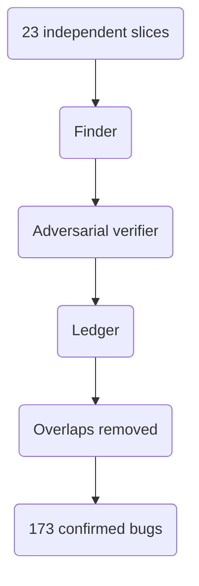

## The first thing the fleet did was stop


Season 3 ended with the platform rebuilt into a shape an agent could reason about: cleaner packages, a CI pipeline that told the truth again, a memory protocol that made retrieval less vibes-based, and enough decision records that the system had a history it could search.

Season 4 starts the next evening, with a different question.

What happens if I stop driving the review one conversation at a time and point the platform at itself?

The change that made that question practical was not a commit. It was the model. On June 9, Fable 5 became my daily driver, and the jump in multi-step reasoning changed the scale of the work I was willing to attempt. I had already spent May cleaning up the package layout, tightening the retrieval protocol, and proving that grep plus source reads beat similar-looking semantic hits when the question was architectural. The platform was ready for a real audit. I just did not yet know what "real" meant at this scale.

The shape I chose now looks both obvious and reckless: 23 independent slices of the codebase, each slice assigned a finder and then an adversarial verifier. The finder would look for a specific bug class. The verifier would come in with fresh context and try to prove each finding wrong before it became part of the ledger. In the locked shorthand for this episode: 23 slices / ~46 agent roles. The point was not to make the number large. The point was to make each slice narrow enough that the agent could hold the relevant code and the failure mode in context.

I ran it as a dynamic workflow.

That detail matters because dynamic workflows are now banned in this project. They were useful enough to make this first experiment happen, and expensive enough to become a lesson immediately. The workflow hit usage limits, paused, and had to be resumed. The honest opening beat of the agent era is not "the fleet woke up and saved me." It is: I launched the fleet, went to sleep, and the first thing it did was run out of capacity.

That is not a throwaway detail. It is the difference between a clean demo and a real engineering note. The audit worked. The machinery that ran it was brittle, expensive, and too implicit about state. Both facts are part of the story.

By the next morning, the work had resumed. The ledger came back with 173 confirmed bugs.

Not 173 raw lines in a spreadsheet. A de-duplicated total. The per-theme raw counts were closer to 182, because the themes overlapped. Nine findings surfaced by the falsy-zero sweep had already been caught and fixed in the retrieval-quality sweep. Two singleton/global-state findings overlapped the same way. The number that matters is 173, after removing those collisions.

That distinction became important immediately, because the audit did not produce a tidy taxonomy where every row adds up. It produced what real audits usually produce: overlapping failure modes, duplicated symptoms, and one big pattern hiding under several labels.



## Seven ways to be quietly wrong

The seven themes were:

| Theme | Ticket | Raw scale | What it meant |
|---|---:|---:|---|
| Security hardening | VW-684 | 21 | Guards unwired, injection and SSRF exposure, path traversal risk, and hardcoded credentials |
| Path-contract and index drift | VW-681 | 20 | Repo-root paths, vault-relative paths, Qdrant keys, and Postgres keys disagreeing silently |
| Kafka durability | VW-680 | 15 | Consumers committing offsets before durable processing and producers treating queue drain as delivery |
| Silent retrieval-quality degradation | VW-685 | 80 | The largest theme: plausible answers when filters, flags, or rewrites had gone wrong |
| Falsy-zero and wrong defaults | VW-683 | 16 raw, net about 6 new | Zero used both as a real value and as an error/default sentinel |
| Singleton and global-state bleed | VW-682 | about 10 raw, net 7 new | Per-call settings written onto shared client instances |
| PDG and graph correctness | VW-686 | 20 | Dirty exports, stale chunk hashes, and verifier-caught graph gaps |

The table is useful, but it slightly hides the point. This was not a codebase that looked broken from the outside. It answered queries. It passed normal CI. The cluster was not on fire. Most of the 173 findings were the kind of bugs that sit patiently until the exact wrong input arrives: a transient Kafka failure, a feature-flag outage, a score of zero that means "backend error" in one layer and "real item" in another, a path that is valid in the repo but not in the vault.

The largest theme, VW-685, is the one that changed how I think about the whole system.


The audit found retrieval results bypassing the VW-203 exclusion filter, meaning content that should have been screened out could still come back as if nothing had happened. It found feature flags around search behavior that failed open: if the flag service was unreachable, the gate defaulted to enabled, so a control could disappear without the caller knowing. It found persona and query-rewrite paths that changed the user's query without surfacing the rewrite.

Nothing threw. Nothing screamed in the logs. The system returned plausible-but-wrong results.

That is the real thesis bug of the night. Graceful degradation is a virtue when it keeps a service available during an outage. It is a defect when the caller thinks the full safety and quality contract still holds. A retrieval platform can be worse than broken if it is confidently close enough to look right.

The fix for VW-685 was not "try harder." It was fail closed. Feature flags that cannot reach their service should default to the behavior that makes absence visible, not invisible. Filters that cannot run should return an error or increment a warning counter, not quietly pass. Query rewrites should be traceable. If the platform changes what was asked, or weakens a guard, that fact has to become part of the observable state.

This is one of the reasons the 173 count feels different from a normal backlog. The important finding was not that a lot of code had bugs. It was that the platform had developed several ways to keep operating while losing honesty about what it was doing.

## The singleton that bled


VW-682 is the cleanest small example.

The platform has shared client objects for things like Qdrant and LLM access. That is normal. Opening a new client for every request is wasteful, so the code used singleton-style instances: create one object, cache it, return it again next time.

The bug was that per-call model selection could mutate the shared instance. One holder would set a default model for its request. The next holder would inherit that setting without asking for it. There was no stack trace, no type error, no obvious wrongness. The second request simply used the wrong model.

The broken shape was familiar:

```python
_instance: Optional["OllamaLLMClient"] = None

def __new__(cls, *args, **kwargs):
    if cls._instance is None:
        cls._instance = super().__new__(cls)
    return cls._instance

# A later per-call assignment to _default_model mutated the shared instance.
```

The repair was to stop pretending there was one universal client. Equal configuration can share an instance. Different configuration needs a different key.

```python
_instances: ClassVar[Dict[Tuple[str, int, str], "QdrantVectorClient"]] = {}

@staticmethod
def _resolve_config(host=None, port=None, collection=None) -> Tuple[str, int, str]:
    return (
        host or os.getenv("QDRANT_HOST", "localhost"),
        int(port or os.getenv("QDRANT_PORT", "30633")),
        collection or os.getenv("QDRANT_COLLECTION", "rootweaver_vault"),
    )

def __new__(cls, *args, **kwargs):
    if use_singleton:
        key = cls._resolve_config(*args, **kwargs)
        if key not in cls._instances:
            cls._instances[key] = super().__new__(cls)
        return cls._instances[key]
```

That fixed two invisible bugs at once. The model override stopped bleeding across holders, and constructor arguments like a non-default host stopped being ignored after the first construction. The old code had a second subtle failure: once `_initialized` was true, the constructor returned before processing new arguments. A caller could ask for a different host and still get the first host, because the singleton had already decided it knew best.

The reason I like this bug as an example is that it was not exotic. It was ordinary Python, ordinary caching, ordinary "avoid opening too many connections" engineering. The failure mode came from taking a performance pattern and forgetting that configuration is part of identity.

## The Kafka bug that loses work politely


VW-680 had more production blast radius.

[Apache Kafka](https://kafka.apache.org/) consumers commit offsets to tell the broker that a message has been processed. Commit too late and you may reprocess. Commit too early and you lose work. The audit found consumers committing on failures that should have been treated as transient infrastructure problems. A poll timeout during a CPU spike is not the same as a malformed poison message. The first should remain pending for redelivery. The second can be committed and skipped after being recorded.

The original code blurred that distinction. If processing hit certain exceptions, the consumer committed anyway. That is the dangerous kind of quiet: the message is gone, the pipeline advances, and the missing work becomes somebody else's mystery later.

The producer side had a matching problem. Several paths treated `flush()` draining the local queue as proof that the broker had accepted the message.

```python
self.producer.produce(
    topic=topic,
    key=key.encode("utf-8"),
    value=json.dumps(value).encode("utf-8"),
)
self.producer.flush(timeout=30)
```

That looks reasonable until you remember what `flush()` can actually prove. It can tell you the local queue is empty. A failed delivery also leaves the local queue empty. The signal you need is a delivery callback, per message, that distinguishes broker acknowledgement from loss.

The fix introduced a delivery tracker and made failure explicit:

```python
def produce(self, topic: str, key: str, value: dict) -> bool:
    ok = safe_produce(
        self.producer,
        topic,
        json.dumps(value).encode("utf-8"),
        key=key.encode("utf-8"),
        timeout=30.0,
    )
    if not ok:
        raise RuntimeError(f"produce to {topic} not broker-acked")
    return ok
```

VW-680 ended with 71 new tests and ADR-065, but the durable lesson is shorter: queue drain is not delivery, and a transient failure is not a poison pill. If the platform cannot tell those two apart, it will occasionally delete its own work and call that progress.

## The token the verifier found


The security sweep, VW-684, had 21 findings: four high-severity, eleven medium, six low. The expected classes were there: injection gaps, SSRF exposure, path traversal hazards, hardcoded credentials.

The one that stuck with me came from the verifier, not the finder.

The finder had caught a plaintext [Unleash](https://www.getunleash.io/) development API token in one feature-flag file. The first fix removed it there. The verifier then came in with fresh context and found a second copy in a helper script that printed usage hints. It was not enough to fix the place the first agent happened to inspect. The same secret-shaped mistake existed in another surface.

I am not reprinting the token literal here. The source note records that it was in git history and vault backups, and that operational rotation was required. The important part for this episode is the process: the independent verifier found a real miss in the first remediation pass. It looked for the class of problem, not just the file the finder had already named.

That is why the finder-verifier structure mattered. A normal code review often inherits the first reviewer's map of the problem. This verifier did not. It had the same goal and fresh context, which made it more likely to search the edges instead of admiring the center.

The audit even turned up VW-693, a flaw in my own safety tooling, the PDG impact analyzer, but proving that one out belonged to the morning after.

## What it cost

It would be easy to end this episode as a clean win: 23 slices / ~46 agent roles, 173 de-duplicated bugs, seven themes, fixes moving through the following day. That version is technically true and not honest enough.

The fleet was fragile. The handover notes from the audit recorded subagents dying every roughly 14 tool calls from context exhaustion, not application errors. One dispatch that tried to consolidate too many findings into a single agent call burned roughly 130,000 tokens and produced zero code. The dynamic workflow paused for usage limits and had to be resumed. The very mechanism that made the audit possible also proved why I should not make that mechanism the long-term operating model.

So the rule changed. Dynamic workflows are banned for this project now. The right shape is batched dispatch with explicit context forwarding, narrower scopes, and review points where I can see what has been produced before spending the next slab of context and money.

That is not a retreat from agents. It is the first real constraint the agent era taught me. A fleet is not useful because it is large. It is useful when its work is bounded, inspectable, and independently verified.

## The platform knew more by morning


The part I keep returning to is not the count. It is the age of the bugs.

The exclusion-filter bypass in VW-685 was not some brand-new regression from the previous night. The singleton bleed was older. The Kafka offset pattern came from code I had written months earlier. The platform had been carrying these defects while looking stable enough to trust. They were not obvious because nothing had been asking the right questions in the right places.

That is what changed on June 9 and June 10. The platform did not become better because an agent wrote magical code. It became better because I finally aimed a structured, adversarial review at the code paths where "works" had been standing in for "verified."

The audit found 173 de-duplicated bugs. It also found the boundary of my process. I had a platform that could search its own memory, but not yet a durable way to make its own review machinery cheap, repeatable, and safe. I had retrieval that could answer questions, but not enough alarms for when it answered the wrong question. I had Kafka consumers that ran, but not enough proof that running meant work had survived.

Season 4 starts there: not with a victory lap, but with a platform seeing itself more clearly than it did the night before.

Next time: the morning after the audit, when the work stopped being "fix the bugs" and became "prove the fixes were real."
