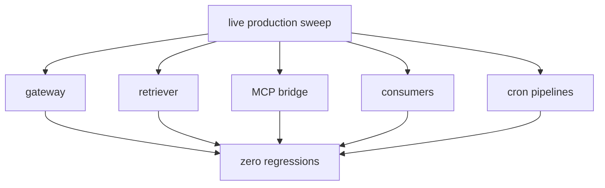

## The audit was not the proof

The previous episode was the loud part: 23 slices / ~46 agent roles, a dynamic workflow that hit usage limits, resumed, and came back with 173 de-duplicated bugs across seven themes.

That is a good opening number. It is not proof that the platform got better.

The morning after an audit is where the story gets less cinematic and more important. Finding bugs is one claim. Fixing them is another. Proving that the running system still behaves correctly after the fixes is a third, and it is the one I trust least if I have not forced myself to measure it.

That was the work after the overnight sweep. The fixes were moving through the system, but the question changed from "what did the agents find?" to "what can I prove about the platform now?" The answer had to come from live probes, benchmarks, documentation, and a few uncomfortable follow-up discoveries that made the 173 look less like a finish line and more like a floor.

This is the less glamorous half of the first Season 4 story. It is also the half I most needed.

Before I go on: references such as VW-702 are my internal tracking IDs. I will use them only where they anchor a specific piece of work. The important part of the story is what was checked, found, or changed.

I had just spent a night learning that the platform could be plausibly wrong without throwing an error. Retrieval could bypass an exclusion filter and still return polished answers. Feature flags could fail open. Query rewrites could happen without surfacing that the user had effectively asked a different question. Kafka consumers could advance offsets in ways that made missing work look processed.

> Once you give AI agents enough autonomy to code and build, you do not get to trust a green check simply because it is green.

## Proving the running system worked

I tracked the next step internally as VW-702: a full, end-to-end production sweep after the audit. Rather than checking only the code or CI, I sent real requests through the services people and agents actually use.

The distinction that mattered was live. Not just unit tests. Not just CI. The deployed surfaces got functionally probed against the running cluster: gateway, retriever, MCP bridge, consumers, cron pipelines. Real requests went through real services, and the responses were checked against expected behavior.

The result was the one I wanted and did not quite trust until I saw it: zero regressions.

That sounds small compared with 173 findings, but it is the first important outcome of the aftermath. The platform did not just have patches that looked coherent in merge requests. The fixes held in production. The parts that users and agents actually touch still answered after the remediation work landed.

This is the layer I keep relearning to verify. A test suite can tell me the code path represented by the test still works. A build can tell me the artifact compiles. Jira can tell me a ticket moved. None of those prove the service boundary still behaves correctly under the real wiring of the cluster.

That sweep did not make for a dramatic screenshot. It was a sweep across deployed surfaces, and the main thing it returned was absence: no new breakage found. After the previous night, absence had to be earned. "Nothing failed" only matters when the probe could have caught failure.

## When the benchmark cried wolf

The next check, which I tracked as VW-707, reran the regression-prevention benchmark against the live platform to make sure the remediation work had not damaged retrieval quality. That sounds like exactly the right thing to do: run the gate, compare it with a baseline, and decide whether the changes hurt anything.

The gate appeared to collapse from 100% to 31%.

For about ten minutes I believed I had broken something badly.

I had not. The judge was a qwen model scoring its own platform's answers, and hand review showed the "failures" were false negatives. The answers were fine. The self-judge was swinging wildly. The 31% was the measurement degrading, not the system.

That is the important direction of the lie. The benchmark did not pass a bad system. It cried wolf. It showed a fake collapse, and for a few minutes I treated that collapse as evidence because it came in the shape of a benchmark result.

The benchmark was the panic. The missing raw evidence became a separate follow-up, VW-708: a benchmark-hygiene task to preserve responses and judgments so later comparisons can be replayed. That follow-up remains open.

The baseline I was comparing against had never had its raw outputs persisted, so the comparison was unfalsifiable. Without the raw outputs, I could not go back and ask the simple question: what exactly did the system answer before, and what exactly did it answer now? A benchmark you can't reproduce is a story, not evidence.

The remedy is not just "write a better judge prompt." It is custody: save the inputs, outputs, scoring, and corpus identity. Make the comparison falsifiable by someone who does not already trust the conclusion.

## The symmetry with the audit

The benchmark changed how I read the previous night's audit. The audit showed that the product can answer the wrong question quietly. The benchmark showed that an evaluation can grade the answer wrong confidently.

The first makes users trust bad output. The second makes me trust bad proof. They are different bugs, but they fail in the same way: both let a plausible-looking artifact stand in for evidence. The answer looks like an answer. The score looks like a score. The dashboard looks like a decision.

That is why this aftermath needed to be its own episode instead of a paragraph at the end of the audit story. The audit found failures in the product. The morning after found failures in the way I proved the product was good.

It would be easy to leave the benchmark beat as "LLM judges are flaky." That is too shallow. The judge was unstable, but the deeper failure was that I had let the benchmark become non-replayable. The raw baseline was missing, so the system had no memory of the thing it claimed to compare against. That is an engineering failure, not a model quirk.

## The benchmark I could replay

The counterexample was VW-709: a re-run of Eng-Memory-Bench, my deterministic test for whether the engineering-memory tools still return the expected information. It matters because otherwise the lesson becomes too broad.

The deterministic memory benchmark, Eng-Memory-Bench, came back clean: zero regressions, latencies flat, and this time the raw outputs were persisted. It used exact tuple matching, not an LLM judge. The corpus hash was `b08678fb...`, which means the test had a concrete identity instead of a vague "same-ish dataset" shape.

That does not make deterministic benchmarks universally better. It makes them better for this kind of claim. If I want to know whether a specific memory retrieval behavior still returns the same expected tuple, I do not need a model to opine. I need the tuple, the output, the hash, and a diff I can inspect.

The contrast between VW-707 and VW-709 became the whole evaluation rule:

| Check | Evaluation path | Result |
|---|---|---|
| Benchmark comparison (VW-707) | qwen model scoring its own platform's answers | fake collapse from 100% to 31% |
| Evidence-custody follow-up (VW-708, open) | missing raw outputs from the baseline | comparison was unfalsifiable |
| Engineering-memory re-run (VW-709) | Eng-Memory-Bench exact tuple matching | zero regressions, latencies flat, and raw outputs persisted |

> If the claim is deterministic, make the evaluation deterministic.

If a model judge is genuinely needed, save the raw material so the judgment can be challenged later.

The judge-based gate panicked. The tuple-match gate told the truth. That distinction will matter for the rest of Season 4, because the platform is moving further into agentic work: more dispatch, more self-review, more tools producing plans, more memory systems summarizing history. The more the system reasons, the more tempting it is to let another model judge whether the reasoning looks good. Sometimes that will be necessary. It still needs custody.

## Writing the change down

I tracked the next aftermath task as VW-700, a documentation pass to record the architectural changes the audit had made.

Two new decision records, ADR-070 and ADR-071, captured the before and after of the remediation. The HLD got updated lifecycle and client-pattern sections. The LLD got a concurrency note. A consolidated report tied the seven audit themes together.

This is the part of the work that can feel bureaucratic if I describe it badly. It was not. It was how the platform learned what had changed.

The audit had found that several bugs were old. They had been sitting in the codebase under stable-looking behavior. If the fix only lives as a set of merge requests, the next agent inherits code without context. If the fix also lives as a decision record and an updated architecture page, the next agent can ask why the code is shaped that way and get an answer that is not reconstructed from commit archaeology.

That has been one of the slow arcs of the whole project: moving important decisions out of my head and into artifacts the system can retrieve. May built the habit with ADRs and a canonical index. Season 4 starts using that habit under pressure. The documentation pass was not a garnish after the real work. It was part of the remediation.

The platform knows itself better only if the knowing is written down.

## When the safety tool produced unsafe advice

I logged this investigation as VW-693. It belongs in the aftermath because it is a proof problem wearing a tooling costume.

The PDG MR-impact analyzer is meant to make changes safer. It looks at a merge request and produces a blast-radius view: what changed, what depends on it, what to test, how to deploy. In theory, that is exactly the kind of tool an agent-heavy workflow needs. If an AI assistant is going to suggest or review changes, it needs a way to reason about impact without guessing.

In practice, the analyzer produced a Method of Procedure that was quietly dangerous.

It reported a risk score of `0.00` after traversing 309 modules. It claimed no test coverage where coverage existed. It misattributed the affected service. And then it suggested a direct `kubectl set-image` deployment step, which violates the platform's GitOps rule. Running workloads are supposed to change through git and Flux reconciliation, not through ad hoc mutation.

Again, the output looked authoritative. That is the dangerous part. A bad plan in a polished MOP format is not merely wrong. It gives bad advice in a format I am used to treating as operational procedure.

The fix was part of the same sweep, but the lesson is broader than the ticket. Safety tooling does not get an exemption from verification because it is safety tooling. If a tool can generate a deploy plan, it can generate a bad deploy plan. If it can generate a risk score, it can generate a meaningless one. The more formal the output looks, the more I need to know where its claims came from.

This is why I keep pairing creator and verifier agents instead of letting one agent both build and certify its own work. The verifier is not magic. It is a friction point. It is a second path through the evidence.

## The work left after the sweep

The extended tool check, tracked as VW-706, made the 173 feel like a floor rather than a ceiling. It remains an open follow-up.

After the headline remediation, a probe of the MCP tool surface found 13 of 36 bridge tools degraded in some way. That does not erase the audit number. It contextualizes it. The 173 bugs were the count for the bug classes I thought to sweep, after de-duplication, across those seven themes. They were not proof that all bug classes had been exhausted.

This is another place where the aftermath matters. A big number can create the illusion of completeness. It feels like a census. It is usually a sample.

That result forced the more honest interpretation: the fleet had found a lot because the search space was real, not because the search space was finished. The right response was not to declare the platform clean. It was to improve the way the platform exposes degradation, and to keep expanding the surfaces that get probed.

For MCP specifically, that means the tool bridge has to be treated like a product surface, not a plumbing detail. A broken or partial bridge does not just fail a feature. It changes what the agent can see and do.

That is the kind of failure Season 4 is going to keep running into. Once the platform starts acting through tools, the tool layer becomes part of the reasoning layer.

## What I would do differently

The first change is benchmark custody. Every benchmark that might be used as evidence needs to save the raw inputs, raw outputs, scoring artifacts, corpus identity, and enough metadata to replay or challenge the result later. "No regression" is not a vibe. It is a statement about a comparison.

The second change is to separate "live" from "tested" in my own language. The live sweep mattered because it checked the running surfaces, not because it added another green status. I need to keep that distinction visible. Unit tests, CI, live probes, and production telemetry answer different questions. Collapsing them into "validated" is how gaps hide.

The third change is to treat generated plans as claims, not instructions. The PDG analyzer did not fail because it emitted text. It failed because the text was formatted like something I should follow. Any generated MOP needs evidence links or checks beside it, especially if it says how to deploy.

## The morning after is the system

The audit gave me a number: 173 de-duplicated bugs.

The morning after gave me a method: live probe the surfaces, distrust benchmark scores without raws, prefer deterministic checks where the claim is deterministic, write down the contract changes, and keep probing the tool layer after the headline story is done.

I am glad the fleet found the bugs. I am more glad the aftermath caught the proof problems, because those are the ones that would have let me tell myself a cleaner story.

There is a version of this project where I stop at "the agents found 173 issues" and turn that into a victory post. That version is less useful to me. The useful version is messier: the dynamic workflow worked and is now banned; the judge-based benchmark panicked and was wrong; the deterministic benchmark passed and kept the raw outputs; the safety tool produced unsafe advice; the MCP surface still had degraded tools after the big sweep.

That is the agent era I actually live in. Not autonomous perfection. More machines making more claims, and a growing responsibility to decide which claims get to count as evidence.

Season 4 starts with the platform auditing itself. It continues with me learning how to audit the audit.

Next time: Episode 3, "Git History for the Agent's Brain," is about giving the agent's own configuration, prompts, and model-tier rules the same custody and provenance as application code.
