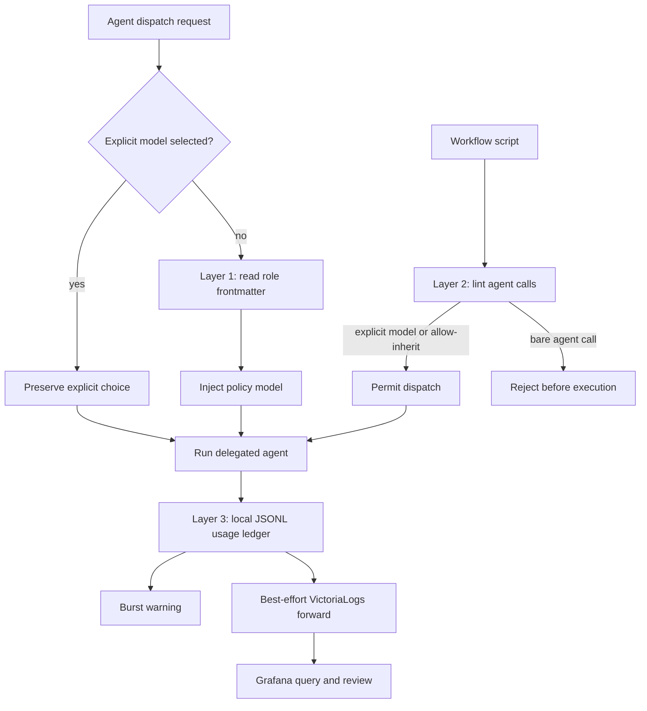
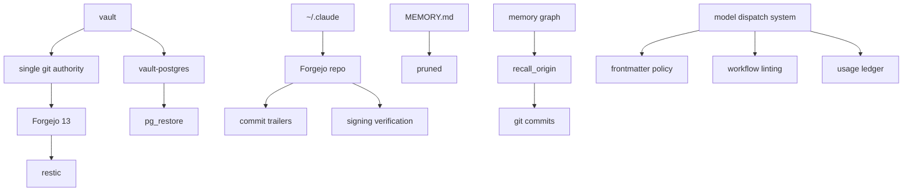

## The custody problem

The previous episode ended with the morning after the audit: live probes, benchmark custody, and the uncomfortable discovery that a polished score can lie just as confidently as a product answer can.

This one starts with the same problem in a different place.

The platform had just crossed into the agent era. Fable 5 was the model driving this two-day run: the signed Jira record attributes the custody work, the overnight audit, and its remediation tickets to that model. That is narrower, and more defensible, than calling it my universal daily driver. The first overnight audit had shown what happened when I pointed a structured agent workflow at the codebase. Before I could keep scaling that pattern, I needed to check the things that shaped every agent session: the vault the agent reads, the configuration that tells it how to behave, and the model-tier rules that decide how expensive each delegated job is allowed to be.

Those pieces did not have the custody I thought they had.


The vault had a [Git][git] directory on both machines. Both were corrupt husks: zero objects, refs pointing at nothing, partial-sync damage from [Syncthing][syncthing] that predated the `.stignore` fix. HLD-10 — the platform's high-level design for scalability, backups, disaster recovery, and recovery procedures — still claimed the vault had a ten-minute GitLab-backed history. That row was fiction by the time I checked it. The agent had been operating on a knowledge base with no working version history.

That knowledge base and a vendor harness are different things. The vault is shared business and system context: the architecture, decisions, operating history, and evidence that any authorised agent harness can consult. The separate configuration repository later in this episode was specific to Claude Code in this June window. The same custody pattern can be applied to Codex and other harnesses, but I do not want to blur a shared memory failure into a claim that every vendor configuration was already version-controlled.

The agent configuration was subtler. `~/.claude` was synced between the Mac and the desktop, which was deliberate. But a prior session had run `git init` inside it and stopped before the first commit. The repository existed, tracked nothing, and had a live `env.sh` sitting in the candidate set. At the time, that file carried real service credentials. One careless commit would have put them into the history of a repository I was about to push.

The current picture is more layered. More credential handling has since moved into macOS Keychain and sealed Kubernetes Secrets, while Secretive and Touch ID protect human signing operations. The bootstrap environment files still exist, so the honest lesson is not that environment files vanished. It is that a bootstrap file should not double as a plaintext credential store, and signing-key protection is only one part of secret management.

So Tuesday evening and Wednesday became custody work. Not a cleanup pass. The same treatment the application code gets: version control, backup, restore drills, provenance trailers, guardrails, and enough documentation that the next agent can ask why the system is shaped this way and get a real answer.

> This is the story of giving the agent's own operating context a history.

## Four layers for the vault

The vault work landed first, because the failure was the most direct. In this homelab it is the platform's external memory. In an enterprise, the equivalent would be the business and system context an agent is allowed to use: architecture, policy, operating procedures, decisions, and the logic that explains why the organisation works the way it does. That context cannot be a folder that only survives as long as Syncthing and luck agree.

Versioning the context and harness configuration also creates a later opportunity: regression testing across harness upgrades. Hooks, skills, steering rules, model-routing policy, and signed model identity can be compared before and after a version bump instead of relying on somebody noticing that a capability quietly disappeared. The governed harness-evolution work came later; these two days created part of the evidence base it would need.

The broken `.git` directories were renamed on both machines rather than deleted. The history they pretended to contain was unrecoverable, but I still wanted the decision to be visible: this was not a sweep under the rug, it was a dated quarantine.


The desktop became the single git authority. That detail matters. Two machines both treating a Syncthing-shared folder as a live git repo is a corruption pattern, not a backup strategy. The Mac keeps the working files. The desktop owns the repository. The vault `.git` directory is excluded from sync so the mistake cannot quietly reappear.

A `vault-autocommit.timer` now commits and pushes changes on a ten-minute interval with a small jitter. The commits use an explicit bot identity. The remote is a private, sign-in-required [Forgejo][forgejo] instance on my home network, deployed through GitOps with no public SSH endpoint. The specific address, port, and repository URL do not belong in a public post; inventing a replacement would be misleading, so the useful architectural boundary is simply **private Forgejo, not public infrastructure**.

The bootstrap left one useful scar in the notes: creating a repo through the Forgejo API needed both `write:user` and `write:repository`. The narrower repository scope returned 403. That is the kind of detail that does not belong in prose because it is dramatic. It belongs because it saves the next debugging pass.

The first recovery drill was intentionally small: create a file, let it commit, delete it, let that commit too, then recover the old content through `git show`. That is exactly the failure mode live sync handles badly. A deletion that propagates everywhere is not a deletion in git history. It is a commit you can inspect and reverse.

Git solved one layer. It did not solve backup.

So [restic][restic] went in next, with encrypted snapshots to two separate machines over private network paths. The first snapshot IDs were captured in the internal ledger, and a restore test compared `ADR-Index.md` byte-for-byte against the live file. The backup includes the vault's `.git`, giving the new history its own copy outside the working tree. It excludes the broken husks, trash, Obsidian workspace state, and cache.

That work found a monitoring problem by accident. The desktop's node-exporter target still pointed at an old internal DHCP address. The same dead address had spread into blackbox probes and three NetworkPolicy allow-lists. Seven of twelve pre-existing alerts, including both critical ones, traced back to that one drift. This was not a missing static public broadband address; it was the more ordinary homelab trade-off of running affordable equipment with DHCP-managed internal addresses. Fixing the backup exposed the fact that the monitoring target for the machine doing the backup had gone stale.

That is the pattern Season 3 kept finding: silent degradation does not have to be clever. Sometimes it is just one dead address, copied into enough places that nobody can see the shape of it.

The third vault layer was the one I had delayed the longest: vault-postgres. The database behind the memory system now has a Kubernetes CronJob that runs [`pg_dump -Fc`][pg-dump], writes atomically through a `.part` file, verifies the dump table of contents, and keeps a retention window on a separate persistent volume. The first dump was 270 MB.

Then came the first restore drill in the platform's history. A scratch [pgvector][pgvector] server on a separate machine took a full `pg_restore` with zero errors. `memory.facts` came back 6,725 out of 6,725, including vector embeddings. `file_snapshots` came back 95,107 out of 95,107. The `rounds` table had a small delta because live writes happened after the dump, not because the restore lost rows.

That detail matters because a backup that has never restored is only a hope with a schedule.

The restore drill also wrote down the things that had actually gone wrong while building it. The Kubernetes Secret field was named `password`, not the field name the first script expected. That word names the field, not the strength or value of the credential; the value is separately protected and has since been strengthened. The platform's default-deny [NetworkPolicy][network-policy] meant the dump job needed explicit egress, not just an ingress exception on the database. The job needed to wait for `pg_isready`, because network policy programming can lag the pod. Embedded heredocs — shell syntax for putting a multi-line block of text directly inside a script — made nested SQL quoting fragile enough that literal-free SQL was safer. None of those are grand design points. They are the small facts that make a runbook usable six months later.

HLD-10 changed in the same session. The fictional backup rows were removed and replaced with the real mechanisms, each marked tested or untested with dates in the source document. The rule is plain: a row may only claim tested if a drill has proved it.

The task **"Codify the vault git flow and block agent git mutations"** (VW-667) then turned the lesson into an operating rule: agents do not mutate git inside `obsidian-vault`. The vault git layer is automatic. The desktop timer commits and pushes. Read-only history inspection is fine, but `init`, `add`, `commit`, and `push` from an agent session are blocked by hook policy. That is not ceremony. It prevents the Mac from recreating a second authority and prevents manual commits from racing the timer.

| Vault layer    | What changed                                                            | Proof named in the episode                                  |
| -------------- | ----------------------------------------------------------------------- | ----------------------------------------------------------- |
| git authority  | desktop became the single git authority                                 | create, delete, then recover through `git show`             |
| restic         | encrypted snapshots to two separate machines over private network paths | `ADR-Index.md` compared byte-for-byte against the live file |
| vault-postgres | Kubernetes CronJob runs `pg_dump -Fc` to a Pi-backed PVC                | scratch pgvector `pg_restore` with zero errors              |
| operating rule | the VW-667 hook blocks agents from mutating git inside `obsidian-vault` | read-only history inspection stays fine                     |


## Fable needed a name

A smaller provenance bug sat beside the vault work.

This run was using the Fable 5 model, but the ADR-061 model registry did not know how to canonicalise Fable's raw identifiers. That is the same class of bug as the earlier Codex provenance issue: the work is real, the commit trailers are stamped, but the model label is not one the system recognises.

Three entries went into the registry: `claude-fable-5`, `claude-fable-5[1m]`, and `fable`, all normalising to `claude-fable-5`. The hook was tested against the live TOML, and the first Fable-authored vault stamp carried the correct attribution.

It is a small fix, but it belongs in this episode because the theme is custody. If an AI-assisted system is going to leave a trail, the trail has to name the actor consistently. Otherwise every later analysis starts with a translation exercise.

## One commit away

Wednesday's larger job was putting `~/.claude` under version control.

Forgejo was the right home for it, not GitLab. The repository sits next to sensitive untracked material: session memory, OAuth credentials, transcripts, state. A gitignore regression on a LAN-only Forgejo remote has a different blast radius from the same regression on a public cloud service. The platform code goes to GitLab. Personal and knowledge-layer custody stays local.

The initial commit was clean after the sweep. The important part is what almost happened before it.

`env.sh` was in the tracked candidate set of a half-finished prior repository. In that historical state it carried live service tokens. The session was one ordinary `git commit -a` away from putting those secrets into history. Naming every service would add attack-surface detail without improving the lesson.

The fix was not subtle: ignore the file, add a warning comment, exclude credentials, runtime state, plugin caches, projects, memory, and third-party clone internals. A secret-pattern sweep over the final tracked set came back clean. The agent permission boundary also did its job. It blocked the agent from pushing an unreviewed tree to a freshly created remote, so Ryan ran the prepared push script directly, with credentials flowing through the Mac keychain instead of through the transcript.

> That is a good boundary. The agent can prepare the work. The human owns the first push of a sensitive-adjacent repository.

Then the provenance chain got wired in. The same `prepare-commit-msg` hook that stamps platform commits with Session-Id, message IDs, AI-Agent, AI-Model, provider, invocation, account, and Human-Owner was installed inside `~/.claude`. A dirty-tree Stop hook warned once per session if tracked config files were left uncommitted. The hook immediately tested itself by firing on its own uncommitted files while signing was blocked.

The historical hook was deliberately small. It checked that the shared trailer injector and Python were available, then delegated the commit-message update:

```bash
# Historical VW-690 hook, condensed
TRAILER_SCRIPT="$HOME/.claude/scripts/inject-commit-trailers.py"

[ -x "$TRAILER_SCRIPT" ] || exit 0
command -v python3 >/dev/null 2>&1 || exit 0
exec python3 "$TRAILER_SCRIPT" "$@"
```

The fail-open exits matter. A collaborator without my local provenance tooling can still commit; my configured environment adds the trace when the supporting script exists.

That signing failure exposed another gap: the global signing helper falls back to a file key when key selection fails, but not when the signing operation itself is refused by a locked Secretive session. For this repo, the fix was local: point `user.signingkey` at the file-backed ed25519 key. The broader fail-open hole was documented so it did not remain folklore.

Forgejo verification closed the loop. All four provenance keys were registered on the account and validated through signed challenge tokens: the claude-bot enclave key, the claude-bot file key, the ryan-human file key, and the ryan-human enclave key. Existing commits flipped to verified once the keys were present, because Forgejo evaluates signature badges on push and display rather than only at registration time.

The config now had history. Then the sync hazard appeared.

Because `~/.claude` had been Syncthing-synced since April, the new `.git` directory was being mirrored to the desktop as ordinary files. That is the exact vault hazard again: git internals copied mid-commit to another machine that is not treating them as a coherent repository.

The fix order mattered. First, `.stignore` on both machines excluded `.git` and embedded `.git` directories. Then the desktop's mirrored `.git` was deleted. Then `git fsck` proved the Mac repo was intact. After that, the desktop got a read-only clone for inspection, while Syncthing continued to carry the live working files.

The drift audit found stale desktop-only agent definitions and old rules files that had moved to skills weeks earlier. They had still been loading into desktop sessions. They were deleted. The result mirrors the vault pattern: live file sync for convenience, one git authority for history, and a read-only clone where the other machine needs visibility.


## The memory pressure

The title of this episode would be incomplete if the story stopped at config custody.

While the vault and `~/.claude` were getting version histories, the agent's actual memory index had its own problem. `MEMORY.md` had bloated to 58.6 KB and was truncating at session start. That is a quiet failure, but not a harmless one. The file is supposed to give a session enough remembered context to start well. If it silently overgrows the startup budget, the agent begins by losing part of the map.

The task **"Prune the MEMORY.md index to fit the session load budget"** (VW-675) fixed the immediate leak. It belongs here because it is the same custody problem at a smaller scale. A memory system is not only the database and the backups. It is also the piece of context the agent actually receives when a session begins. If that surface grows until it truncates, the history exists somewhere but does not reach the worker that needs it.

The larger missing piece was **"Code ancestry: link git-derived vault history into memory"** (VW-701).

The memory system already had a dormant `recall_origin` path: it knew how to look up a commit artifact, but the writer was not producing the `git_commit` rows that query needed. VW-701 changed the ingestion path so session logs could emit those artifacts, populated Jira references on sessions and rounds, and normalised repository and vault paths.

The historical [Model Context Protocol][mcp] call was intentionally simple:

```python
recall_origin(jira_key="VW-683")
```

Before the VW-701 backfill, that acceptance probe returned `no_results`. Afterwards it returned the originating audit session followed by its remediation sessions in timestamp order. The database record that enables the commit form has this simplified shape:

| `memory.artifacts` field | Example shape        | Meaning                                           |
| ------------------------ | -------------------- | ------------------------------------------------- |
| `session_id`             | UUID                 | session that produced the artifact                |
| `round_id`               | integer              | originating conversation round                    |
| `artifact_type`          | `git_commit`         | selects the commit-ancestry path                  |
| `artifact_ref`           | shortened commit SHA | value supplied to `recall_origin(commit_sha=...)` |
| `relationship`           | `created_by`         | relationship between round and artifact           |
| `repo`, `branch`         | strings              | repository context when available                 |

The evidence level matters. The Jira-key path passed against production that night. The commit-SHA mechanism was deployed and unit-proven, but the implementation report explicitly left the first real post-ingest commit lookup as the next-session check. That is narrower than claiming every ancestry route had already been live-proven.

That is the literal fulfilment of "git history for the agent's brain." The vault had git history. The config had git history. VW-701 added the missing data path needed for memory retrieval to point back through that history instead of treating a retrieved note as context with no parentage.

This is not about making the graph decorative. It is about being able to ask a sharper question later: not just "what does the platform remember?" but "what work created this memory, and what code or config state was true when it was written?" That distinction is the difference between retrieval and custody.

## The model tier problem

The final thread was cost and routing.

The first big Fable-era audit had run 32 Fable subagents in a single Claude Code session and produced 315,735 output tokens. That count came from the local session usage ledger — the same underlying class of subscription-session data that tools such as ccusage analyse. Because I was using a Claude Code subscription, it was not a separate $15.80 API invoice. At the then-published list price of $50 per million output tokens, **$15.79 was the list-price equivalent**: a useful way to normalise the size of the burst, not a claim about an extra charge on my card.

That is not catastrophic. It is also not a habit I want to automate blindly.

The design question was where the policy should live. A hook-local tier map was rejected because it created three policy locations and a bad fallback: if the hook disappeared, the verifier could silently degrade to Sonnet. The better answer was the agent frontmatter as the single source of truth. In the policy adopted during this window, the platform-verifier mapped to Fable, the platform-engineer mapped to Opus, and most other roles defaulted to Sonnet unless explicitly escalated. Those were historical routing choices, not permanent identities for the roles.

The design review made four explicit choices. Fable on a non-verifier role was allowed when requested, but logged rather than silently normalised away. The `model-lint: allow-inherit` escape hatch stayed, because an exception that is greppable and persisted is better than an exception hidden in someone's head. Plan agents defaulted to Sonnet and escalated only when the dispatch said so. The usage ledger started as local JSONL so the record remained durable even if forwarding failed.

Three layers shipped.

Layer 1 intercepts built-in agent dispatches without an explicit model and injects the policy tier. Explicit model choices pass through untouched.

Layer 2 lints orchestration scripts and rejects bare `agent()` calls unless they carry an explicit model or a greppable `model-lint: allow-inherit` escape hatch. That matters because a workflow script can otherwise inherit the expensive session model without anyone noticing.

Layer 3 recorded the model mix and output-token totals into a local JSONL ledger, warned on Fable bursts, and forwarded log-shaped aggregates to [VictoriaLogs][victorialogs] on a best-effort basis for review in [Grafana][grafana]. It was warn-only, but durable.



The live smoke test proved the point: a bare Explore dispatch ran at Sonnet instead of inheriting Fable. The audit ledger then quantified the previous burst from a real session. The system was not guessing at a risk. It measured the pattern it was built to prevent.


This is the same custody shape again. The point is not that Fable is bad or Sonnet is good. The point is that model choice is operational state. If it can affect cost, quality, and review confidence, it needs a policy surface, a log, and a way to catch inheritance before it becomes a bill.

## What two days built

The symmetry is what I keep coming back to.

The vault had no working history, so it got a single git authority, a local Forgejo remote, encrypted restic backups, and a drill-tested database restore path.

The agent config had an incomplete repository and a secret sitting too close to history, so it got a private Forgejo repo, commit trailers, signing verification, a dirty-tree guard, and a sync pattern that does not copy `.git` between machines.

The memory index was too large for its own startup surface, so it got pruned. The ancestry path lacked the artifact rows it needed, so VW-701 added the ingestion and backfill work required for `recall_origin` to connect retrieved history to originating sessions and commits.

The model dispatch system had already shown it could burn Fable across a fleet by inheritance, so it got frontmatter policy, workflow linting, and a usage ledger.



None of this is glamorous agent work. It is not the part where a model finds 173 bugs overnight. It is the part where I decide the agent's own brain deserves the same custody as the code it edits.

There is a simpler version of the project where the vault is just files, the config is just dotfiles, the memory index is just startup context, and the model choice is just whatever the current session happens to be using. That version works until the day I need to know what the agent knew, why it knew it, which prompt shaped the answer, which model paid for the review, and whether the source of the memory can still be recovered.

This version is heavier. It has timers, remotes, hooks, ledgers, restore drills, and a few more ways for a session to complain before I drift too far.

I prefer that. Not because process is the point, but because an agentic platform makes more claims than a normal toolchain. More claims need better custody.

Next time: Episode 4, "Building the Cockpit — Thursday Chaos to Console-Born," where the platform starts building the command centre it needed to watch the fleet work.

## References and terms

- **Git** — distributed version control used for the vault and harness-configuration histories.
- **Syncthing** — peer-to-peer file synchronisation; useful for working copies, but not a safe transport for a live `.git` directory.
- **Forgejo** — self-hosted software forge used here as the private remote and history viewer.
- **restic** — encrypted, content-addressed backup tool used for point-in-time vault recovery.
- **PostgreSQL `pg_dump` / `pg_restore`** — logical backup and restore tools used for the structured memory database drill.
- **pgvector** — PostgreSQL extension that stores the memory system's vector embeddings.
- **Kubernetes NetworkPolicy** — pod-level traffic rules that required the backup job's database path to be allowed explicitly.
- **Model Context Protocol** — the tool interface through which `recall_origin` is exposed to an authorised agent.
- **VictoriaLogs and Grafana** — log storage and review surfaces used by the historical model-usage ledger.

[git]: https://git-scm.com/
[syncthing]: https://syncthing.net/
[forgejo]: https://forgejo.org/
[restic]: https://restic.net/
[pg-dump]: https://www.postgresql.org/docs/current/app-pgdump.html
[pgvector]: https://github.com/pgvector/pgvector
[network-policy]: https://kubernetes.io/docs/concepts/services-networking/network-policies/
[mcp]: https://modelcontextprotocol.io/
[victorialogs]: https://victoriametrics.com/products/victorialogs/
[grafana]: https://grafana.com/
