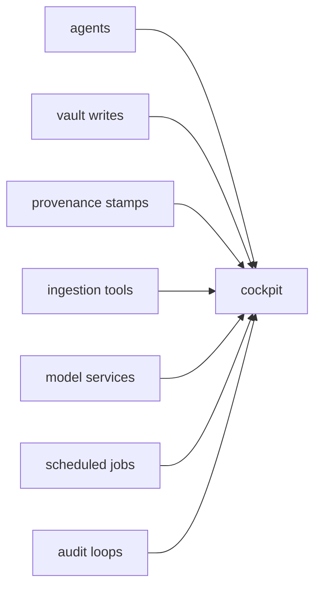

*An ocean of external data converges on one cockpit: the operating problem this episode is about.*

## The Thursday the platform was already shouting

The first two episodes of this season were about the agent era arriving loudly: an overnight audit, then the next day's proof work. By Thursday 11 June, the lesson had already changed shape. The platform did not just need more agents. It needed somewhere for me to stand while they were working.

That sounds like a UI problem. It was not only that.

That is why this episode exists as its own part. I had been treating the console build as the center of the story, but Thursday morning had its own population: roughly 65 tickets across 11-13 June, around 40 of them Done, and a much stronger boundary than the previous episode. Thursday had its own arc before the first console slice landed.

The Thursday spine looked like this:

| Thread | Tickets | What changed |
|---|---|---|
| Audit aftermath | VW-709 | Eng-Memory-Bench rerun after the code-ancestry work |
| vLLM incident | VW-711, VW-713, VW-714 | NVML staleness, recurrence, and flood/blindness hardening |
| Indexer and arch-review cleanup | VW-715, VW-716, VW-718 | Delta-indexer livelock, poison-message loop, and retirement of a dead pipeline |
| YouTube ingestion | VW-710, VW-712, VW-717 | Transcript ingest built, Contextual Insights added, 19 videos ingested |
| Config custody follow-on | VW-724 | Scheduled claude-config self-audit with Alertmanager wiring |
| Frontmatter corruption | VW-720, VW-721, VW-722 | YAML ordering and invalid Obsidian tags fixed |
| Console birth | VW-725, VW-726, VW-727 | Review tracker, canvas tab, provenance badges, thought-leaves |

That is not one feature. It is a platform day: benchmark proof, incident response, ingestion, metadata repair, configuration drift detection, and the first usable surface to watch the work from. The story only makes sense if the console is treated as the response to that operating load, not as a standalone app I happened to build after lunch.

Thursday began with operational noise before the console story had properly started. One thread was still closing out the audit aftermath: VW-709 reran Eng-Memory-Bench against the May baseline after the code-ancestry work from VW-701. That belonged to the proof arc from the morning-after episode, but it was still landing in the same window.

At the same time, the cluster was misbehaving in ways that made a cockpit feel less like a luxury. VW-711 recorded vLLM NVML staleness: 12,450 UnexpectedAdmissionError pods and crash-cycling. VW-713 followed because the staleness recurred even after the device-plugin health-check flag had been changed. VW-714 was the hardening response: failed-pod TTL, Prometheus cardinality protection, and a meta-alert so the next flood did not make the platform blind while it was already failing.

This is the part I had underweighted. The console was not born into a quiet platform. It was born into a platform where the thing meant to run the model was producing a pod storm, and the monitoring layer needed protection from the failure mode it was trying to report.

The adjacent incidents were not cleaner. VW-715 found the vault-delta-indexer in a livelock where a 300s timeout was shorter than TEI latency under contention. VW-716 found an arch-review-extractor poison message: 16,385 tokens against a 16,384 max_tokens limit, looping into one Job every 30 seconds. VW-718 retired that arch-review pipeline outright, removing five ScaledJobs and a ConfigMap after 93 days with zero output.

That is not glamorous engineering. It is the kind of work that stops background automation from creating fake motion. A pipeline can look alive because Kubernetes keeps launching Jobs. If the loop produces no useful output for 93 days, it is not a pipeline. It is noise with a schedule.

The shape of Thursday was already visible there: too many moving parts, too many places where "running" did not mean "helpful", and no single surface that told me what mattered.


*Failed work multiplied faster than the useful signals. Before the cockpit, operational noise occupied the whole field of view.*

## The YouTube thread started here

The other major Thursday thread was not a console feature at all, but it matters because it became part of the same operating picture.

VW-710 built the YouTube transcript ingestion tool: on-demand URL or channel input, with transcript output into the vault. VW-712 added an always-on Contextual Insights section. VW-717 used the new path for a real bulk ingest: 19 Tina Huang videos through `/yt-ingest`.

That thread becomes a later Season 4 story, but the origin is here. The same morning the platform was dealing with vLLM admission failures, indexer livelock, and a retired arch-review path, it also gained a new intake surface for external learning material.

I am deliberately keeping the YouTube thread narrow here. The later saga gets to cover what the ingested material became. This episode only needs the origin: the tool existed, the Contextual Insights section was added, and the first bulk run pulled 19 videos into the vault. That is enough to show the widening surface area. Inputs were no longer only my notes, Jira issues, ADRs, and code. The platform was starting to pull long-form external material into the same memory substrate the agents already queried.

This is one of the reasons the console could not just be a status dashboard. The platform was no longer one queue and one retriever. It had agents, vault writes, provenance stamps, ingestion tools, model services, scheduled jobs, and audit loops. The work was spreading across surfaces faster than my ability to keep it all in my head.



VW-724 was a smaller but important follow-on from the previous episode: the config that had just been versioned now got a scheduled self-audit, a launchd timer, and Alertmanager wiring. That is the same pattern again. A thing that mattered enough to put under custody now needed a way to tell me when it drifted.

By Thursday evening, the question was not whether I wanted a cockpit. The question was which problem it should make visible first.

## The agents had been damaging their own records

The first problem the new visibility made hard to ignore was in the vault frontmatter.

VW-720 was one line of Python with a large blast radius. The NER pipeline was using `yaml.dump(sort_keys=True)`, which alphabetized frontmatter keys as it wrote tags back to vault files. The default behavior looks harmless until the frontmatter contains ordered provenance. `provenance.chain` is not just a bag of keys. It is the sequence of producers that touched a document. Re-serializing it casually means the agent can corrupt the record of how the agent produced the file.

The fix was also one line in principle: preserve ordering with `sort_keys=False`. The important part was not the size of the patch. It was that the bug lived in the background process that was supposed to enrich the vault, not in the code I was actively staring at.

VW-721 was worse and easier to see once you knew where to look. The NER extractor was writing raw entity strings directly into Obsidian tags. Some were fine. Others were markdown-link fragments, Unicode arrows, or newline-contaminated spans. Roughly 1,700 files were affected.

The repair was to put a strict gate in front of tag writes: `sanitize_tag_component`, allowing only lowercase letters, numbers, underscores, and hyphens. Anything else gets filtered before it reaches frontmatter. The NER consumer image moved to the `vw-721` tag and redeployed.

VW-722 was the alert side of the same cluster. The frontmatter lint alert fired because the vault had invalid tags. The alert was real, the bad tags were real, and the fix landed alongside VW-720 and VW-721.

This is the kind of bug that made the cockpit feel necessary. The platform had started writing more of its own metadata. That is powerful, but it also means a background agent can damage the source of truth at scale if nobody is watching the shape of what it writes.


*Unsafe fragments are removed at the gate while the ordered provenance chain continues intact.*

## The first review tracker

The first console slice was VW-725.

The scope was concrete: a PostgreSQL-backed review queue, a Kafka consumer for vault file-change events, a one-shot baseline to seed state from the live vault, and a React/Vite console shell served by nginx. Codex built this slice. The point was to stop treating "has an agent read this file?" as a guess.

The baseline gave the first useful numbers:

```text
files: 12194
inferred: 2870
seen: 2861
stale-seen: 5
unseen: 9712
```

Nine thousand seven hundred and twelve unseen files is a lot, but it was not a surprise. The vault contains years of journal entries, reference material, archived work, and project notes. The useful part was not shock. It was replacing a vague sense of coverage with a count I could act on.

The deployment found two NetworkPolicy gaps immediately. The vault Postgres path did not allow ingress from `review-tracker`, so the API crashed on startup. The namespace default-deny policy also blocked the console from reaching review-tracker, so API requests failed from the browser side. Both gaps were fixed through GitOps. The pod had eight restarts from the pre-fix crash loop before it stabilized.

That is the right failure mode. A NetworkPolicy gap should make a deployment fail loudly. The wrong outcome would have been a console that appeared to work while silently skipping the data source it was meant to expose.

The verification detail is worth keeping because it shows the scale of the first slice: 42 tests and 89.43 percent coverage for the review-tracker work. The Markdown reader follow-up used `react-markdown` and `remark-gfm`, so the console was not just dumping raw text. It could render the vault files in a shape close enough to the underlying files that review work did not require opening another editor.

The follow-up added the Markdown reader. Selecting a vault file in the queue rendered it properly, including a collapsible frontmatter Properties section and GitHub-flavored Markdown in the body. The reader could dock right or bottom, with the size persisted in localStorage. That sounds like UI detail, but it changed the review queue from a list of paths into a place where I could actually inspect the work without changing context.

The first version of the cockpit was not broad. It did one thing: show the vault review queue and let me inspect documents. That was enough to make the rest of the day legible.


*Current Rootweaver Console Review Coverage, captured 20 August 2026. This shows the later interface, not the June baseline or historical episode state.*

## The canvas joins the console

The second VW-725 slice added the Idea Map canvas tab.

The first version was intentionally static. It rendered an Obsidian canvas snapshot as an interactive web UI, with a thought-root graph, four leaf zones, and a right-hand inspector. The canvas data was compiled into the JavaScript bundle. That would not survive long, but it was enough to prove the interaction model inside the console shell.

VW-726 added provenance badges to the review queue. The UI could show `codex · gpt-5-codex` beside files produced by Codex, distinct from Claude-authored files. The backing summary now exposed `last_agent`, `last_model`, and `last_run_id`.

That small badge mattered more than I expected. Season 4 is full of agents producing artifacts, and not all agents have the same budget, tool access, or failure modes. Seeing the producer inline turns provenance from a compliance footer into part of the working surface.

VW-727 shipped the idea-map model itself: daily thought-leaves with chained days. The important point for this episode is ownership. The console was no longer only a review queue. It had started to become the place where the platform's own ideas, agent outputs, and provenance signals met.

That is why "cockpit" is the right word for this part of the season. I did not need another isolated tool. I needed a working position with visibility across the things that were already moving.

There is also a boundary to draw here. Several Codex-lane tickets opened in the same larger window: config parity, hook parity, model pinning, and budget governance. I am leaving those for the later Codex Lane episode. That matters because otherwise this story becomes a bag of every ticket created near the same date. The Thursday cockpit story owns the operational mess, the ingestion origin, the frontmatter repair, and the console birth. The Codex-lane story owns the second-AI operating model.


*Ideas, day-chain nodes and origin signals meet in one working surface.*

## What Thursday built

By the end of Thursday, the console was still early. The live canvas was not yet reading arbitrary vault canvases. The coverage heatmap, vault explorer, Runner v2, voice dictation, Jira board, ops module, terminal, and UX audit were still ahead. Friday would turn the shell into a real instrument panel.

But Thursday changed the posture.

The platform had started the day with vLLM admission noise, indexer livelock, a poison-message loop, a retired arch-review pipeline, YouTube ingestion work, config self-audit wiring, and frontmatter corruption. It ended with a review tracker, a console shell, a Markdown reader, a canvas tab, provenance badges, and the thought-leaves model that would become part of the Ideas surface. That is a small console compared with what arrived the next day, but it was already enough to stop treating the vault and agent work as separate terminal chores.

That is not a clean before-and-after. The operational mess did not vanish because a React shell existed. What changed was that the work gained a place to surface. I could see which vault files the agents had not read. I could inspect what they had written. I could see which agent produced a file. I could start turning background automation into something visible enough to manage.

That was the first version of the cockpit: not finished, not polished, but finally a place to look.

Next time: Episode 5, "The Instrument Panel", is the Friday and Saturday build where the cockpit gains voice, Runner v2, terminal access, and the idea-to-session loop.
