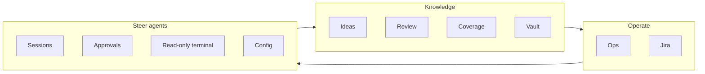
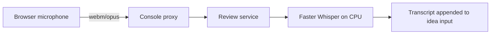
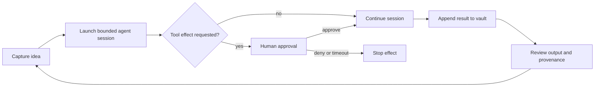
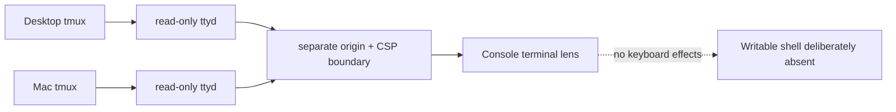

## The shell was not enough

Thursday gave me the first cockpit: a review tracker, a Markdown reader, a canvas tab, and provenance badges. Friday turned it into an instrument panel.

If you have not read the earlier episodes, three terms will help:

- **Rootweaver** is my home-lab research platform for working with agents, code, and a large personal knowledge base.
- **The vault** is that knowledge base: Markdown files and canvases organised in Obsidian.
- **The Console** is the browser interface I use to see and steer the system without reconstructing its state from terminals.

You will also see references such as `VW-731`. Those are Jira issue keys: the durable trail from a claim in this story back to a named piece of work. I have kept them for evidence, but the title and purpose come first.

The problem was not a lack of data. It was having operational alerts, ideas, agent output, approvals, files, and work tracking spread across different tools. I needed one surface that answered four ordinary questions:

1. What needs my attention?
2. What are the agents doing?
3. What changed in the vault?
4. What am I allowed to do next?

That is what “instrument panel” means here. Not a decorative dashboard: a set of controls and indicators arranged around a real working loop.

## From a mock-up to the live vault

The first step was making the map honest.

The issue **“Live Idea Map from vault canvas files” (`VW-731`)** replaced a baked-in demo graph with reads from the real vault. The Console could list canvas files, load a selected canvas, and apply its private-path exclusions after resolving the requested path. A smoke test loaded the 60KB idea canvas with 37 nodes and 28 edges.

That distinction matters. A static graph proves that a visual design can render. A vault-backed graph proves that the Console is looking at the same working material I am.

The next two issues gave the map context:

- **“Coverage map: seen, reviewed, and stale by vault area” (`VW-732`)** made review debt visible.
- **“Vault explorer: browse folders and read files” (`VW-737`)** added a lazy folder tree, breadcrumbs, and a reader pane, with a 2MB cap, a text-file allowlist, and excluded prefixes.

“Coverage” is easy to misunderstand. It is not test coverage and it is not an AI quality score. It asks whether a human has looked at agent-originated material. Red means agent output that nobody has reviewed; the other states distinguish material that has been seen, reviewed, or has gone stale.

*Console today, captured 24 August 2026. The values have moved since the June build window; the screenshot shows the current behaviour of the same Coverage surface, not a reconstructed historical state.*

The Console could now answer: which map am I viewing, where is unreviewed agent output accumulating, and what is actually inside a file?

## One command centre, not eight unrelated pages

The planning issue was literally titled **“Command center: module roadmap” (`VW-730`)**. It grouped the work into live maps, coverage, operations, Jira, and agent operations.

Three follow-on issues made those labels concrete:

- **“Ops and alerts module” (`VW-733`)** brought Alertmanager firing state and workload health into the Console.
- **“Jira board module” (`VW-734`)** added a kanban of VW work with provenance badges.
- **“Agent-ops launcher” (`VW-735`)** designed the surface for starting and monitoring coding-agent sessions.

The **“Mission-control shell” (`VW-744`)** then put the modules behind a persistent left rail. Ideas occupied the main pane; session state remained visible; approvals could open in a right rail; URLs could deep-link to a view; and the PWA manifest let the Console run as a standalone browser app.

This was not about squeezing everything onto one screen. It was about keeping related state one click apart. An agent result, the Jira issue that authorised it, the vault file it wrote, and the review queue it entered are different records of the same workflow.

*The instrument-panel idea in one frame: separate operational streams converge into one surface without losing their identity or provenance.*

## Ideas became writable

The **“Idea Tree v2: Markdown-backed editable idea map” (`VW-740`)** changed Ideas from a picture into an input surface.

Each seed became a small Markdown file under the active-work area of the vault. The backend restricted writes to an allowlisted jail, rejected a save if the source had changed since it was opened, and converted deletes into archive moves. The frontend added quick capture, drag-to-arrange layout, and a body editor.

Those constraints are the feature, not boilerplate. A browser connected to an agent-facing knowledge base should not have arbitrary filesystem access. It should know where it may write, detect competing edits, and make deletion recoverable.

The path guard proved its value immediately. The design still named an old capture folder retired in a previous restructure. The vault-write hook blocked that stale destination, and the write was corrected to the active-work area before deployment.

*Writable did not mean unrestricted. An idea could move only through the guarded path to an allowed vault destination; unsafe routes remained closed.*

*Console today, captured 24 August 2026, focused on the 12 June idea group. It shows the day node, captured seeds, archived tests, and the quick-capture control discussed in this episode.*

The surface kept improving after the first write path. **“Import dropped ideas as backdated seeds” (`VW-754`)** recovered ideas from conversation archives. **“Review queue grouped by sub-directory” (`VW-756` and `VW-757`)** made the growing review list navigable and flagged unfiled work. **“Idea-tree layout and rail collision polish” (`VW-750`)** dealt with the visual friction that decides whether a tool stays open all day.

*Console today, captured 24 August 2026. Review debt is grouped by vault area and sub-directory so the operator can choose a bounded queue instead of facing one flat list.*

## Voice input, explained from browser to model

The issue title **“Voice dictation: browser mic capture and Whisper speech-to-text” (`VW-741`)** is a better explanation than “voice shipped,” but the path behind it matters too.

The browser recorded audio and sent it through the Console proxy, which attached authentication before forwarding it to the review service and then the speech-to-text pod. The model was Faster Whisper `small.en`, int8, running on CPU. The GPU already had another job, and dictation did not justify taking that capacity.

The model received an initial prompt containing platform vocabulary such as Qdrant and FluxCD. In the live test it correctly transcribed: “Create an idea seed for the Qdrant migration, and link it to the Kafka consumer.”

There was also a browser constraint. Microphone access requires a secure context. When a Tailscale certificate problem blocked the intended HTTPS route (**“SetDNS failure during certificate provisioning,” `VW-763`**), localhost tunnelling provided the interim secure origin.

Testing needed real Google Chrome too. Playwright's lightweight headless Chromium did not provide the media-capture stack required by `getUserMedia`. That is the sort of apparently minor detail that becomes expensive if it is not recorded.

*Voice followed a controlled route: microphone input crossed authenticated relays before becoming an idea inside the Console.*

## Runner v2: an agent session with a brake pedal

The previous launcher could start an agent. The **“Runner v2: interactive sessions, browser approvals, and hook feed” (`VW-743`)** could hold a conversation with one.

It added follow-up messages, streamed session state, exposed tool-call approvals in the browser, and failed closed after a five-minute approval timeout. If I did not approve an effect, the session did not continue. The rail also displayed per-session cost; the end-to-end test launched a develop-idea flow, accepted a follow-up turn, and reported a $0.59 session.

Per-template model pins (**`VW-738`**) stopped every launch from inheriting the same interactive default. That sounds small, but it turns model choice from a habit into a control over behaviour and spend.

The first full test of the read-only config browser found two bugs worth catching. One denylist pattern missed `env.sh`, allowing a request that returned live API tokens. A second request crashed on a dangling symlink. The fixes broadened the denylist inside the tested core module and made directory listing skip broken entries individually.

Passing a component test would not have exposed either problem. Exercising the live path did.

*The brake pedal was the human boundary: a requested tool effect waited at the amber control instead of silently continuing.*

## The loop finally closed

The issue **“Idea-to-session bridge: develop a seed and append the result” (`VW-751`)** is the hinge of this episode.

Before this bridge, the Console displayed pieces of the workflow. After it, an idea could become a bounded agent session, pause for an approval, return an artefact to the vault, and reappear for human review with provenance attached.

This is not autonomy. It is supervised delegation with a visible return path.

## A terminal view without a browser shell

The terminal story needs one careful distinction.

**“Raw tmux/ttyd terminal lens” (`VW-747`)** shipped a read-only mirror of the Desktop session. **“Mirror the Mac terminal with a Desktop/Mac toggle” (`VW-752`)** added the second machine. Chrome's Private Network Access policy blocked the first loopback design for the Mac iframe, so the final mirror used the Mac's Tailscale address.

Both read-only mirrors were live by Friday evening. The deferred feature was a *writable* web shell.

*Console today, captured 24 August 2026. The automated capture intentionally stops above the embedded session: it documents the read-only label, machine selector, and boundary explanation without exposing terminal content.*

That boundary is intentional. Seeing the raw session is useful for orientation and diagnosis. Turning a browser panel into an unrestricted command surface would be a different security decision.

## Saturday tightened the dials

Saturday's work was less dramatic and more important than it sounds.

The **“Radial layout for the idea-tree map” (`VW-767`)** arranged seeds around their day node. The deployment issue (`VW-771`) put it live. Follow-up fixes stopped new day groups overlapping (`VW-770`), aligned connector lines with card edges (`VW-773`), and routed graph edges around node bubbles (`VW-765`). A separate Syncthing watcher fix (`VW-768`) restored the “live” part of the live view when filesystem permission errors had prevented prompt synchronisation.

These are not headline features. They are trust features. A line that misses its card, a graph that overlaps itself, or a view that lags behind the filesystem all make an operator wonder what else is wrong.

By the end of the window, the persistent rail exposed Ideas, Review, Coverage, Vault, Ops, Jira, Agents, Terminal, and Config. Voice could create idea text. Runner v2 could hold an interactive session and pause for approval. Results could return to the vault. The terminal could mirror both machines without becoming writable.

## What I would change

First, I would not use an empty implementation-report folder as evidence that work was missing. Four issues I initially undercounted were already Done: **idea-tree UI polish (`VW-750`)**, **the idea-to-session bridge (`VW-751`)**, **the Mac terminal mirror (`VW-752`)**, and **the full UX audit (`VW-753`)**. Missing documentation is a reason to investigate, not proof of missing implementation.

Second, I would separate “deferred at one point” from “deferred at the end.” The terminal lens was split out, then shipped later that Friday. Only the writable browser shell stayed deferred.

Third, I would keep testing complete user paths against the real environment. That is how voice capture encountered browser security, how config browse exposed a denylist gap, and how the live map revealed layout and synchronisation problems.

The instrument panel did not remove the platform's complexity. It gave that complexity controls, indicators, and somewhere to report failure.

That does not make Rootweaver autonomous. It makes it operable—and keeps the human decision about what to launch, what to approve, and what evidence counts.

Next time: Episode 6, “The Codex Lane”, is about the second AI on the second budget, and the configuration drift that appeared once Claude and Codex both had to live in the same operating model.
