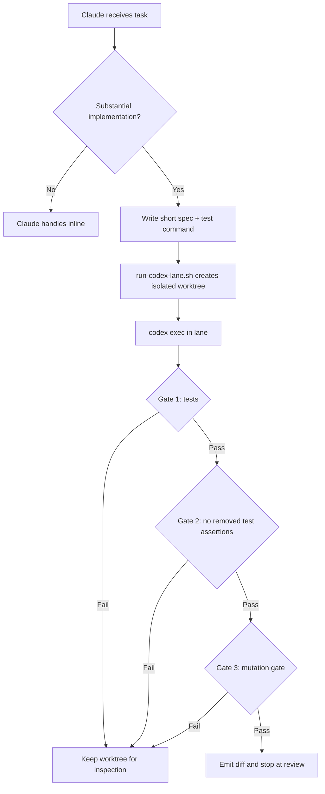

## The second lane had to earn its own rails

One human. Two AIs. Two budgets. That was the premise, and it sounded cleaner than it was.

Rootweaver is Ryan's home-lab platform for working with AI agents, code, and an Obsidian knowledge base. References such as VW-759 are work-tracking keys; the exact ticket titles are included so the work is understandable without access to the tracker.

This episode looks back at 11–18 June 2026, when Ryan was building the workflow with Claude and Codex. We use “we” for the shared work, and name Ryan or a particular agent where the decision or action needs to be clear. The roles and settings described here belong to that June workflow.

[OpenAI Codex](https://openai.com/codex/) runs on a different subscription from Claude. If the heavy implementation work could move onto that budget, then the Claude cap could be reserved for the work Ryan still wanted Claude doing: architecture, direction, review, judgment calls, writing. The interface could stay simple. Ryan talks to Claude. Claude hands substantial coding work to Codex. Codex works in an isolated lane and comes back with a diff.

That was the plan.

The first week was not mostly about the plan. It was about making sure the second tool did not quietly poison the first one's configuration, bypass the guardrails we already depended on, or spend its own budget invisibly. A second AI lane is not just another terminal window. It has its own config loader, its own hook contract, its own MCP discovery behavior, its own rate-limit telemetry, and its own ways to fail without looking dramatic.

The work covered here ran from Thursday 11 June through Thursday 18 June 2026. It started with Codex writing noise into Claude's config and ended with removing a plugin whose hooks repeatedly failed inside Codex. In between, the work turned into a small operating system for handoff: config mirrors, JSON hook wrappers, a budget guard, an integrity gate, a lane runner, mutation testing, and a cross-vendor review step.

This is the Codex lane before it was a habit. Not the idea of using two assistants. The work required before that idea was safe enough to use.

## Thursday: cleaning up the configuration

Thursday the 11th brought the configuration risk into view.

It wrote a blanket curl allow into `~/.claude/settings.json`. That is Claude's config, not Codex's. It also left a stray Playwright scaffold in a directory that had nothing to do with the task. Neither mistake broke the platform. Both were the kind of configuration residue that becomes a mystery later, when a tool behaves differently and nobody remembers which session changed the rules.

We tracked the cleanup under **VW-736 — Clean up Codex CLI pollution of ~/.claude config (blanket curl allow rule, stray Playwright scaffold)**. The aim was straightforward: remove the unrelated changes and restore the expected configuration.

The broader work was **VW-728 — Mirror Claude global config into Codex-specific global config**. Codex needed its own configuration, with a versioned baseline we could inspect and recover. The baseline went into a private Forgejo `codex-config` repo. The first mirror landed at commit `bf1d4da`, and `1a6a5d9` followed later.

The deeper issue was the shared hook infrastructure. We already had Python hooks enforcing the normal project hygiene: vault rules, provenance stamping, Jira tracking, staging cleanup, config dirty checks. They had been written around Claude Code's lifecycle. Codex has a similar shape, but the exact contract differs in places that only show up when you actually run it.

The failures came in layers.

| Layer | What surfaced | Fix or boundary |
|---|---|---|
| Codex agent definitions | `max_turns` metadata field | Removed the field |
| `dashboard-styling` skill | YAML description string Codex's stricter parser did not accept | Quoted one frontmatter field |
| Stop hook output contract | Human-readable warning line was malformed hook output | `stop_hook_json_wrapper.py` |
| `security-guidance@claude-plugins-official` | Two JSON objects in sequence | Zeroed plugin Stop hook lists in the plugin cache |
| Beehiiv | Synthesized disabled MCP entry could not be removed | Explicit disabled override in `config.toml` |


The Codex agent definitions were inherited from a shared `~/.agents/` directory and contained a `max_turns` metadata field. Claude accepted it. Codex rejected it at load time. It was not a hard crash, just a warning you had to know to look for. Removing that field cleared the first layer.

Then a shared `dashboard-styling` skill had a YAML description string that Claude's parser tolerated but Codex's stricter parser did not. One frontmatter field needed quoting. That was the second layer.

The third layer was the Stop hook output contract. Claude-era hooks could print advisory text and use exit codes as warnings. Codex expects valid JSON on stdout when the hook exits cleanly, and its blocking convention expects the reason on stderr for exit 2. A human-readable warning line was not "friendly" to Codex. It was malformed hook output.

The compatibility fix was `stop_hook_json_wrapper.py`, translating Claude-style hook behavior into Codex-valid output. Success paths get the Codex envelope. Blocking paths produce the decision and reason in the shape Codex expects. The subsequent hook/config audit tightened the stderr behavior so blocked actions did not show empty reasons.

The fourth layer was plugin-bundled hooks. The `security-guidance@claude-plugins-official` plugin shipped its own `hooks.json`. Its Stop hooks emitted two JSON objects in sequence: a metrics object and a control object. That was acceptable in the Claude context. Codex treated it as invalid because it expects exactly one JSON object. The immediate Thursday fix was to zero out those plugin Stop hook lists in the plugin cache.

The fifth layer was Beehiiv. Codex had synthesized an MCP server entry for Beehiiv from its app discovery layer. `codex mcp list` showed it as disabled. `codex mcp get beehiiv` said it could be removed. `codex mcp remove beehiiv` reported no removable server block, because the entry was synthesized rather than declared. The real fix was an explicit disabled override in `config.toml`:

```toml
[mcp_servers.beehiiv]
url = "https://mcp.beehiiv.com/mcp"
enabled = false
```

That looks small, but it matters. Codex had two config paths: the runtime path that could list the disabled server, and the stricter write path that later needed the `url` field to trust hooks without rejecting the config.

By the end of Thursday, Codex launched cleanly: no malformed-agent warnings, no hook-schema warnings, no invalid-output errors. The first lesson was not about AI capability. It was about compatibility. A second assistant can share some of the same guardrails, but only after you prove the contracts line up.

## Friday: the residual problems surfaced

Friday the 12th was the day the leftovers showed themselves.

Opening a new Codex session produced a hook trust prompt. Ryan selected "trust all and continue." The trust write failed with the Beehiiv transport error:

```text
Failed to trust hooks: config/batchWrite failed while updating hook trust in TUI:
config/batchWrite failed: Invalid configuration: invalid transport in mcp_servers.beehiiv
(code -32600)
```

The previous override had been good enough for listing. It was not good enough for the config writer. Adding the `url` field made the disabled entry schema-valid, and `codex doctor` came back with 17 ok, 0 warn, 0 fail. We tracked this as **VW-746 — Fix Codex CLI hook trust failure from stale Beehiiv MCP config**. The disabled server entry still needed to be valid when Codex saved another configuration change.

Then `git commit` inside a Codex session triggered invalid PostToolUse JSON from the security-guidance plugin. The plugin had five Bash PostToolUse hooks wired around git-related commands. In Claude, those hooks could emit a metrics object and an `additionalContext` object. Codex accepted a narrower shape and rejected both. That work became **VW-749 — Fix Codex PostToolUse hook JSON failures after git commands**. We patched `security_reminder_hook.py`, `codex_hook_json_wrapper.py`, and the plugin hooks so Codex stayed silent on metrics-only paths instead of emitting JSON it could not accept.

The wider check was **VW-759 — Codex CLI hook/config audit — mirror Claude Code hook matrix, fix recurring hook failures**. It covered which existing checks Codex could reuse and where their behavior differed. We found that the compatibility wrappers were using Codex's exit 2 block signal but putting the reason only on stdout. Ryan wanted that fixed properly: if a check blocks an action, the reason needs to be visible. Codex's contract wants the block reason on stderr. The wrappers were technically blocking, but they were doing it without showing the reason properly. The fix emitted on both paths where needed and produced the full parity audit: what Claude hooks existed, what Codex could mirror, and what had to stay out.


We also needed to decide which hooks belonged in the Codex workflow. Not everything Claude did should be copied into Codex. SessionEnd has no Codex equivalent. Some async hooks would block the turn if mirrored directly. Claude-specific budget governors and model-tier enforcement belonged to Claude, not Codex. The Codex lane needed enough parity to preserve safety, not a blind clone of every hook.

The budget work was **VW-761 — Codex budget governance: rate-limit-aware usage guard mirroring VW-755**. We needed to see how much of Codex's usage allowance remained before routing more work to it. The title refers back to the earlier budget guard; this version used Codex's own rate-limit data.

The usage report measured the preceding seven days: 41 sessions across 5 active days, 970 million tokens total, with 95.6% of them cache reads. The report estimated $718.90 at API list pricing; that was an equivalent-cost estimate, not a subscription charge. But this was a Pro subscription, so the operational question was not list-price cost. It was whether the 5-hour and 7-day rate-limit windows were about to close.

The 5-hour window had moved from 63% to 71% in a single evening. That is the kind of jump that can end a working session before the work is done.

Claude's earlier budget guard had to estimate usage because Claude's subscription cap did not expose the same per-response counter. Codex was cleaner. Every rollout JSONL in `~/.codex/sessions/` already contained a `rate_limits` snapshot from the API response. The Codex guard reads the newest JSONL, finds the last token-count event with non-null `rate_limits`, and reports the server-truth `used_percent` for both windows.

No estimation. No local token math. The server says how much of the window is used, and the guard reports that. The guard also wrote ledger lines to VictoriaLogs, giving us data for comparing the tools' usage in Grafana. The June 12 report verified direct execution and log ingestion, but had not yet observed the context inside a live Codex turn because hook trust was still blocking that path. A June 18 follow-up corrected the prompt hook's output envelope.


That build belongs in this episode because it is part of the lane's foundation. Before we could route more implementation to Codex, we needed to know when Codex itself was running hot.

## Monday: building the handoff

Four days after Thursday's configuration cleanup, the work finally reached the original point: make Claude hand substantial implementation to Codex automatically.

The handoff build was **VW-841 — Claude-drives-Codex autonomous handoff: /codex-handoff skill + budget-aware route nudge hook**. It connected the decision to delegate with a repeatable process for running the work and returning it for review. The implementation plan had been drafted over the weekend and kept the scope deliberately narrow. The lane should pay for itself only on substantial work, not one-line edits. It should isolate Codex in a worktree. It should run tests. It should make test weakening visible. It should stop at review rather than merge its own output.

The first component was the integrity gate, `check_test_integrity.py`. It reads a unified git diff on stdin. If a test file removes a line matching a test definition or assertion pattern, it exits 1. The rule is crude on purpose. It does not prove the tests are good. It catches one common agent failure mode: making the work pass by weakening the checks.

```python
TEST_PATH = re.compile(r"(^|/)(test_|tests?/|.*_test\.)", re.IGNORECASE)
ASSERTION = re.compile(
    r"\b(assert|def\s+test_|pytest\.raises|self\.assert|expect\(|\.should\b)",
    re.IGNORECASE,
)
```

The second component was the route nudge, `codex_route_nudge.py`. It runs on UserPromptSubmit and looks for an implementation verb combined with a breadth signal: implement, refactor, migrate, rewrite, build out; across, all call sites, multiple files, end-to-end, integration tests. The first design only nudged when the Claude cap was elevated. Ryan changed that. Coding goes to Codex by default when it is substantial enough, not only when Claude is already expensive.


The third component was the lane runner, `run-codex-lane.sh`. This is the deterministic part: preflight Codex version, create a [Git worktree](https://git-scm.com/docs/git-worktree) under `.codex-lanes/<slug>`, run `codex exec` with `--sandbox workspace-write --ignore-user-config --ignore-rules --json --cd <lane>`, then run the gates. If a gate fails, the worktree stays on disk for inspection. If the gates pass, the runner emits the diff and stops at review required.

The fourth component was the skill file Claude reads when `/codex-handoff` is invoked. It writes a small structured spec, runs the lane, reads the output, sends the diff to a fresh-context verifier, and asks for confirmation before merge.

The flow looked like this:



Nine unit tests passed. The dry-run smoke test passed. A live nudge fired under the test condition. Commits `d86a804` and `78dc21d` went to the claude-config Forgejo repo, and `85dcee4b` went to the platform repo for the `.gitignore` entry that hides `.codex-lanes/`.

ADR-079 wrote down the routing decision: Claude drives Codex, not the other way around.

That distinction is not branding. It is control flow. Codex is the implementation lane. Claude remains the driver and reviewer. The human still confirms the merge.

## Tuesday: automating the review loop

On Tuesday the 16th, Ryan looked at the handoff workflow and said he wanted the handoff and review automated.

The follow-up was **VW-870 — Automate the Codex handoff: auto-trigger + adversarial auto-review + mutation/shadow gate (VW-841 follow-up)**. We wanted the workflow to start the handoff, test the result, and request an independent review without needing a separate instruction at each step.

The route nudge changed from advisory wording to an imperative directive: invoke `/codex-handoff` now, except when the task is actually architecture, exploration, or a one-liner. That matters because "consider doing the safer thing" is easy for an agent to route around. The hook needed to create a stronger default.

The mutation gate landed next. `mutation_gate.py` takes the diff of changed non-test source lines and applies a small bounded set of cheap mutations: flip a boolean, invert a comparison, swap an arithmetic operator, negate a condition, alter a numeric literal. Then it reruns the test command. If a mutant survives, the tests did not catch that changed behavior. That is a gate failure. The default cap is five mutants, and the script skips non-compiling mutants so syntax errors do not pretend to be killed mutants.


The adversarial review became automatic too. After the gates pass and the diff is emitted, the skill dispatches a `platform-verifier` with fresh context. The verifier sees the spec and the diff, not the implementation conversation. The asymmetry is intentional: Codex authors, Claude reviews.

The merge stayed manual. Ryan explicitly declined auto-merge. He wanted to review the result before deciding whether to merge it. A lane can gather evidence. It can run tests. It can ask an independent reviewer to inspect the diff. It still should not decide on its own that its branch belongs in `main`.

By Tuesday evening, 25 unit tests passed: seven for the route nudge, twelve for the mutation gate, and six for the lane runner. Commits `b42f53f` and `db9b5b0` went to Forgejo.

The unit tests covered parts of the workflow, but an early real handoff exposed another failure: Codex left its edits uncommitted. The old runner could then perform a merge that changed nothing and report a false pass. The runner update added commit-before-merge handling and mandatory pre-merge review. A passing test count had not proved the whole handoff.

By this point the lane had several explicit controls. There was a route decision, a worktree boundary, a test command, an integrity gate, a mutation gate, a verifier, and a human merge confirmation. Each piece covered a specific failure mode. None of them made Codex trustworthy by itself. Together they made Codex inspectable.

## Thursday: resolving the plugin incompatibility

Thursday the 18th closed two loops.

The first was **VW-884 — Bug: Codex security-guidance Stop hook emits invalid Stop JSON**. This addressed the plugin output that Codex rejected when a session reached its Stop hook. Codex worked through the recurring security-guidance hook failures. The final operating decision was to remove the Claude-oriented plugin from Codex. Its own Stop hook still produced incompatible telemetry when invoked directly. We kept the local wrapper and health-check hardening as a backstop.

The follow-up also corrected the budget guard and generic wrapper to put context into the event-specific shape Codex expected. Already-running sessions retained stale plugin commands, so the wrapper needed a narrow compatibility fix for those removed commands too. Generic missing hooks still failed loudly.

The practical lesson was to stop carrying a plugin that did not fit the tool's lifecycle. Removing it, retaining the local checks, and verifying the result was the fix we needed.

The second closeout was **VW-888 — Pin Codex handoff model and align AI model effort policy**. We needed the automated runner to select its model and reasoning effort explicitly, so its behavior did not depend on a separate interactive configuration.

Codex's default model reasoning effort had been set to `xhigh`. That is appropriate for an explicit hard-review or risky multi-file override. It is too expensive as the blanket default. The lane runner also uses `--ignore-user-config`, which means it cannot rely on whatever happens to be in the user's normal config. If the lane needs a model and effort level, the lane should say so.

VW-888 moved the Codex default to high effort and made the runner explicit: `CODEX_LANE_MODEL=gpt-5.5`, `CODEX_LANE_REASONING_EFFORT=high`. Claude stayed on `opus[1m]` with high effort. The policy boundary was written into the local rules: main conversation on Claude, substantial implementation through Codex, xhigh only by deliberate override.

By then Codex CLI was at v0.141.0, and the VW-888 evidence recorded 20 pytest tests passing. The week had started with Codex dirtying Claude's config. It ended with a versioned config mirror, hook parity, budget telemetry, a handoff runner, mutation checks, cross-vendor review, and explicit model-effort policy.

That was the machinery behind delegating implementation to a second tool. A second model does not reduce risk just because it is different. Explicit handoff, execution, review, and merge boundaries made the work inspectable; they did not establish that every failure mode had been caught.


## What we would do differently

The first change is to treat tool compatibility as a product surface from the start. We lost time because we assumed Claude-shaped hooks could become Codex-shaped hooks with small wrappers. Some could. Some could not. Plugin-bundled hooks, synthesized MCP entries, stdout versus stderr conventions, and config write paths all mattered. Next time we would audit the lifecycle contract before expecting the shared guardrails to hold.

The second change is to make "disabled" mean schema-valid disabled. The Beehiiv problem was a good example: the system could show a disabled synthesized server while the write path still rejected the configuration. If a tool has both a read path and a write path, both need to accept the shape.

The third change is to separate budget truth from budget estimates wherever the platform gives us the choice. Claude required estimation. Codex exposed server-truth `rate_limits` snapshots in its rollout JSONL. The guard should use the source closest to the actual limiter, and in this case it could.

The fourth change is to keep the merge boundary human. The lane can do a lot before that point: isolate the worktree, run tests, reject weakened tests, kill cheap mutants, and ask another model to review the diff. Ryan kept the final merge decision.


## What survived the week

The Codex lane did not arrive as a clean productivity trick. It arrived as a week of finding every place where two AI tools almost shared an assumption and then did not.

Claude accepted a field Codex rejected. Claude tolerated advisory hook text Codex treated as invalid output. Claude plugin hooks emitted multiple JSON objects where Codex wanted one. Codex's MCP app discovery synthesized an entry that its own remove command could not remove. A disabled config was disabled enough for listing and invalid enough for trusting hooks. The wrappers blocked actions but hid the reason until stderr was fixed.

Those are small details until you route real work through them.

By the end of the week, the lane had a shape we could reason about. Codex had its own mirrored config. Its hooks were either compatible or deliberately not mirrored. Its budget window was visible from server-truth telemetry. Its implementation work ran inside a worktree. The configured workflow checked tests, removed assertions, mutations, and a fresh-context review before the human merge decision. The early uncommitted-work failure showed why each part of that sequence still needed end-to-end verification.

That is the practical definition of the Codex lane: not "a second assistant," but a bounded place where implementation can happen without pretending the assistant that wrote the diff is qualified to certify it.

## References and links

**Tools and projects**

- [OpenAI Codex](https://openai.com/codex/) - the AI coding assistant running in this episode.
- [Git worktrees](https://git-scm.com/docs/git-worktree) - the isolation mechanism for the Codex lane.
- [VictoriaLogs](https://docs.victoriametrics.com/victorialogs/) - the log store receiving the Codex budget guard ledger lines.
- [Forgejo](https://forgejo.org/) - the self-hosted git forge where the sanitized Codex config mirror lives.

**Work tickets in this episode**

- **VW-728 — Mirror Claude global config into Codex-specific global config**
- **VW-736 — Clean up Codex CLI pollution of ~/.claude config (blanket curl allow rule, stray Playwright scaffold)**
- **VW-746 — Fix Codex CLI hook trust failure from stale Beehiiv MCP config**
- **VW-749 — Fix Codex PostToolUse hook JSON failures after git commands**
- **VW-759 — Codex CLI hook/config audit — mirror Claude Code hook matrix, fix recurring hook failures**
- **VW-761 — Codex budget governance: rate-limit-aware usage guard mirroring VW-755**
- **VW-841 — Claude-drives-Codex autonomous handoff: /codex-handoff skill + budget-aware route nudge hook**
- **VW-870 — Automate the Codex handoff: auto-trigger + adversarial auto-review + mutation/shadow gate (VW-841 follow-up)**
- **VW-884 — Bug: Codex security-guidance Stop hook emits invalid Stop JSON**
- **VW-888 — Pin Codex handoff model and align AI model effort policy**

Next time: Episode 7, "The Proxy That Ran Hot."

