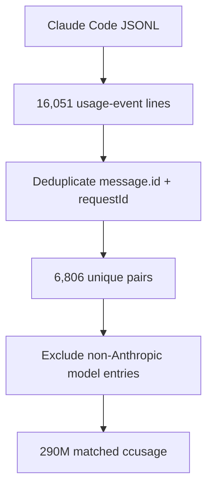

## The first useful meter was not the hard one

I previously published a broader account of how the budget governor evolved in [The Speedometer I Made Up](https://rduffy.uk/writing/the-speedometer-i-made-up/). This episode zooms in on the four-day ticket sequence behind its first major failure: the model-aware recalibration, the misleading 1430M correction, and the transcript deduplication that fixed the local count. Some findings overlap by design; the focus here is the order in which those decisions happened and why each seemed reasonable at the time.

The budget story starts with an uncomfortable comparison.

Codex was easy to instrument.

That was not what I expected. Claude Code was the tool I had already spent weeks living in, and it already had a local hook watching the weekly cap. Codex was the newer lane. But on Friday 12 June, we added **VW-761 — Codex budget governance: rate-limit-aware usage guard mirroring VW-755**. It gave Codex a usage guard that could read server-provided rate-limit data instead of estimating from local transcripts. VW-761 followed **VW-755 — Reduce Claude Code limit consumption: marathon-session context cost + hook-based guards**, the earlier work to measure Claude usage and keep long sessions from burning through the allowance unnoticed.

That mattered because Codex was no longer a toy side lane.

The implementation report for VW-761 records 41 Codex sessions across five active days, 970M tokens total, and about $718.90 at API list prices. The seven-day window was only at 24%, but the five-hour rolling window had moved from 63% to 71% in one evening. That was the kind of short-window acceleration that can lock a tool out before the weekly number looks dramatic.

So the Codex guard did the straightforward thing: read the authoritative number, surface the window, warn when the slope looked wrong.

Claude did not have that.

The Claude guard I had before this saga was a local proxy. It parsed JSONL transcripts under `~/.claude/projects`, applied a weighted-token formula, and guessed where I was in the weekly subscription cap. It also warned when a marathon session got too large, because carrying a huge context forward means paying cache replay again and again. It was a reasonable first version. It was also reading a noisy, incomplete local trace and treating it as if it were the account.

The rest of this episode is the four-day version of that mistake: every time the proxy looked fixed, the next cross-check found another reason it had been wrong.

The constraint I want to keep visible is that none of these changes started as a grand cost-governor design. They started as small operational annoyances. Codex had a short-window rate limit that could move quickly. Claude had a weekly subscription cap that could disappear faster than the prompt made obvious. Long sessions were carrying enough context that a bad compaction decision could change the bill. The work was not "optimize AI spend" in the abstract. It was "make sure I can keep working tomorrow morning."

That is why the Codex comparison was so useful. It gave me a working control case. On one side, a guard could read `used_percent` from server-truth rate-limit metadata. On the other, a guard had to infer account usage from local Claude transcript files. One source already knew the account window. The other was reconstructing it from local evidence.

I did not understand the size of that gap yet.

## The ten-point gap

The first calibration check happened the following morning.

The Claude guard said the account was at about 30.5%. The official `/usage` screen said 41%.

That is too wide a gap to wave away. **VW-774 — Make weekly budget guard model-aware + recalibrate (VW-755 follow-up)** found three errors stacked on top of each other. In plain terms, we changed the Claude usage estimate to account for different model costs, corrected the weekly reset time, and recalibrated its budget baseline.

The first was model blindness. The formula treated every assistant token as if it cost the weekly cap the same amount. That was false. The source material for VW-774 records that Fable 5 was about 60% of token volume that week, and the model multiplier table fixed Fable at 2.0 relative to Opus at 1.0. Sonnet was 0.6. Haiku was 0.2. The price ratios were not a decorative detail; they were the accounting model.

So the proxy had been counting a week dominated by Fable as if it were mostly Opus. The real cap consumption was higher than the proxy thought.

The second error was the denominator. The pre-saga budget figure was 650M weighted tokens, back-solved from an old reading and carried forward as if it still described the account. It did not.

The third was the anchor. The proxy assumed the week reset at midnight. The real weekly anchor was early morning UK time, which meant the code was pulling part of the previous cycle into the new one.

VW-774 fixed all three at once: model multipliers, a fresh calibration, and the corrected weekly anchor. The fresh reading was simple arithmetic: 318M weighted spend at 41% real usage implies about 775M for the cycle. `CACHE_VERSION` moved from 1 to 2 so the local cache would be rebuilt with model-aware accounting.

After that change, the guard reported 41%. It matched the official screen.

That should have been a comforting result. It was only the first fix.

There was one more event that same Saturday that matters for the accounting but not for the control flow: Anthropic suspended Fable 5, tied in the source notes to a US government policy update. The default model had already moved back to Opus 4.8, so the suspension did not disrupt live work. The Fable multiplier stayed in the code because the previous week's history still needed to be counted correctly.

That is the kind of detail a budget tool has to get right. You do not get to delete a model from history just because it stopped being available today.

It also shows why the first fix could feel solid. The model table was not speculative. It had a direct reason. Fable was twice Opus for this accounting model, Sonnet sat below Opus, and Haiku sat below Sonnet. The wrong anchor was known. The old 650M budget had a replacement calculation. The cache was forced to rebuild. Every part of the fix was defensible.

The missing piece was that the parser still trusted every usage line it saw.

## The guard that nearly made spend worse

Two companion changes followed on Saturday. **VW-777 — Relax compact-guard BANDS ceiling for 1M-context model (VW-755/774 follow-up)** adjusted how the context guard set its compaction ceiling. **VW-779 — Make budget-guard pace tiers warn-only (stop force-compacting when merely ahead of pace) — VW-777 follow-up** changed the pace-based response to warnings, because forcing compaction could increase the very spend the guard was meant to control.

The context guard was meant to stop expensive sessions from drifting too far. VW-777 added a pace-based `BANDS` table for compaction ceiling tuning. VW-779 then changed the hard pace-based blocks into warn-only behavior.

The reason is the interesting part.

The audit records the anti-inversion finding: forcing a mid-task compaction can raise weighted burn, because output tokens are much more expensive than cache-read tokens in the local weighting. The notes put the ratio at output tokens 5x, cache-read 0.1x. A guard that interrupts at the wrong moment can make me spend more by forcing the model to rebuild context in fresh output instead of carrying cached context forward.

That is not an argument against compaction. It is an argument against pretending the cheapest-looking control is always cheap in practice.

The guard moved to warnings because the tool had enough evidence to say "this is getting expensive," but not enough authority to decide that stopping mid-task would be cheaper. That distinction matters. A budget hook is allowed to inform. It should be careful about taking over.

That warning-only choice also fits the wider Season 4 pattern. The agent era keeps producing tools that can act with confidence before they have earned it. A hard block is an action. It changes the work. If the guard cannot prove that the block lowers spend, it should not pretend that certainty exists.

## Three fixes in one Monday evening

The next cluster landed on Monday 15 June, in one session.

**VW-829 — Budget-guard subscription-tier lever: switch weekly_budget_weighted between Max 20x / Max 5x** added a tier selector. In practical terms, the budget config gained `max20x` and `max5x` values that could be switched without rewriting the accounting logic. The initial tier values were 775M and 194M. That was useful housekeeping: if the subscription tier changed, the guard needed a controlled knob rather than another manual edit in the middle of the formula.

**VW-838 — Budget-guard: forward-projection clamp (credit recent low burn) replacing static 90% cumulative clamp** added a forward projection. Rather than waiting until cumulative usage crossed a fixed threshold, the guard could estimate where the cycle would end if the recent burn rate continued. The original guard mostly answered a cumulative question: how much of the cycle have I already used? That is necessary, but it is late. Once you are near the cap, a cumulative threshold mostly tells you what has already happened. The new projection used a trailing six-hour burn-rate window to estimate where the cycle would end if the recent pace continued.

Both of those changes were real improvements.

**VW-839 — Recalibrate budget-guard max20x 775M -> 1430M (proxy ran ~1.85x hot vs real /usage)** looked like an improvement because the underlying number was already wrong. The recalibration raised the estimated budget from 775M to 1430M, based on a local spend total that turned out to include duplicate usage entries.

The mid-cycle reading said 701M weighted tokens against 49% on the official `/usage` screen. The arithmetic points at 1430M. I updated the budget to 1430M and explained the gap as model-mix drift. That sounded plausible at the time. The week had changed. The mix had changed. A near-doubling was large, but not impossible if the old denominator had been too tight.

The problem was not the model mix.

The problem was that the proxy was summing repeated usage records.

This is the point where the saga becomes useful to me as more than a budget note. VW-839 had exactly the failure shape that makes local observability dangerous: a real external reading, a real local sum, and a plausible explanation for the difference. Nothing in that chain looked obviously careless. I had a current `/usage` number and a current local-token number. Dividing one by the other gave a clean denominator. The explanation - model mix drift - matched the recent history of Fable-heavy usage.

The only way to break the story was to compare the local parser with another parser over the same files.

## The 2.4x overcount

The thing that caught VW-839 was not another layer of clever calibration. It was an independent parser reading the same files.

`ccusage` reported 290M. The guard reported 706M.

That is a 2.4x difference on the same Claude Code transcript tree. The source ledger records the exact duplicate count from the commit that fixed it: 16,051 usage-event lines, but only 6,806 unique `(message.id, requestId)` pairs. Fifty-eight percent of the entries were duplicates.

The repeats had ordinary causes: sessions resume after a break, context compaction happens, sidechain processing writes entries, and the same request can appear again. The JSONL files did not look corrupt. The totals grew in a way that looked plausible. That is what made the bug useful as a trap: the local proxy was producing a number shaped like reality, but inflated by the transcript format.

**VW-840 — Budget-guard double-counts ~2.4x: no JSONL dedup (58% duplicate usage entries); VW-839 recalibration papered over it** exposed why the 1430M recalibration was wrong. The issue was repeated usage records in the Claude transcripts, not a sudden change in model mix. The fix deduplicated on `(message.id, requestId)`, persisted a per-cycle seen-set so the incremental-offset cache still worked, and excluded non-Anthropic model entries. Codex sessions can leave `gpt-*` model entries in shared transcript files, and those do not belong in the Claude weekly cap.

`CACHE_VERSION` moved from 2 to 3. The history matters:

| Cache version | What it meant |
|---|---|
| v1 | Model-blind, wrong anchor |
| v2 | Model-aware after VW-774 |
| v3 | Deduplicated after VW-840 |

After the deduplication pass, the same source files produced 290M, matching `ccusage` exactly. Against the real `/usage` reading at 50%, that meant a 580M cap.

The chain now looked like this:

| State | Budget set | Why it changed |
|---|---:|---|
| Pre-saga | 650M | Model-blind, wrong anchor |
| Sat 13 Jun | 775M | Model-aware day-one calibration |
| Mon 15 Jun | 1430M | Wrong mid-cycle re-pin from no-dedup spend |
| Mon 15 Jun | 580M | Deduped 290M at 50% real usage |

That table is the first half of the saga in compressed form. Every number was a serious attempt to make the meter honest. Two of them were wrong because the input was wrong. One was right only until the next failure mode appeared. The 580M number was the first one that had survived a cross-check against both the official screen and an independent local parser.

There is a small but important privacy boundary here too. I am describing the Monday work as an evening cluster because the source ledger calls out the work-hours blur rule for that date. The exact clock time is not needed to understand the failure. The useful detail is that all four Monday tickets landed in the same session, so the tier lever, projection clamp, wrong re-pin, and dedup fix were not separate weeks of thought. They were one fast chain of "that helped, wait, now this is wrong."

That pace is part of why the wrong 1430M number survived long enough to be written down. When a fix arrives in the same session as the discovery that invalidates it, the audit trail has to preserve both. Otherwise the final state makes the middle look dumber than it was.

## Why this split belongs here

It would be easy to tell this as a generic "measurement is hard" story. That would be less useful than the ticket trail.

The technical issue was specific. Claude Code's local JSONL was not a clean account ledger. It was a transcript record, and transcript records repeat. The local proxy also knew only about local Claude Code sessions. It did not know about the browser, mobile, or another device. It did not know the account except by inference.

That limitation was not visible on Friday because the first bug was on the Codex side, and Codex gave me server-truth `rate_limits`. It was not visible on Saturday because the model-aware fix made the number match the official screen. It was not visible early Monday because the 1430M recalibration compensated for the duplicate entries by inflating the denominator.

The proxy was not useless. It caught real trends and gave me a place to put controls. But by Monday evening it had already proven that calibration on top of a flawed source can give you a convincing false peace.

There is one detail from VW-840 that I do want to keep plain: matching `ccusage` did not mean the whole account problem was solved. It meant the local Claude Code corpus was being counted correctly. That is a narrower claim. It is also exactly the claim the evidence supports.

At that point, the proxy had earned exactly three claims. It knew the current local Claude Code corpus. It knew how to deduplicate repeated usage entries. It knew how to apply the model multipliers for Anthropic models and ignore non-Anthropic entries. It did not know the browser. It did not know mobile. It did not know another machine. Those missing surfaces are not edge cases when the cap is account-level.

The next ticket made that distinction impossible to ignore.

## The bridge into the next problem

Once the local proxy and `ccusage` agreed, I did the next reasonable thing: I wired the numbers into a digest.

**VW-871 — AI budget digest: twice-daily Claude+Codex usage to WhatsApp + email + Discord** built the visible surface for the budget work. It sent a twice-daily usage report for both tools through WhatsApp, email, and Discord. That is the point where the machine stopped being just a hook in the prompt path and became something I would actually read.

That visibility is also what exposed the next failure.

The digest could show the local Claude number at about 82% while the real account-level weekly cap had reached 100%. The proxy was no longer running hot from duplicates. Now it was reading the wrong source.

That is the hinge between these two episodes. Part one fixed the local meter enough that it agreed with another local meter. Part two starts when the morning report made it obvious that local agreement was not account truth.

Next time: Episode 8, "The Number It Was Reading."
