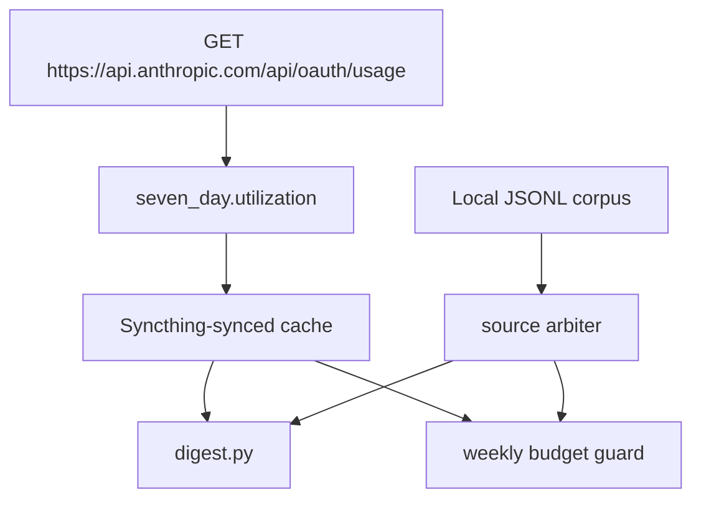

## The digest made the wrong number visible

This episode sits next to the proxy story even though its window runs out to June 27. That is a deliberate adjacency choice: the second half only makes sense if it stays beside the first half.

The previous episode ended with what looked like a real fix. VW-840 — **“Budget-guard double-counts ~2.4x: no JSONL dedup (58% duplicate usage entries); VW-839 recalibration papered over it”** — was the local accounting fix: it stopped duplicate JSONL usage entries being counted twice. The cleaned total matched `ccusage` at 290M weighted tokens; against the official `/usage` reading at 50%, that calibrated the cap to 580M.

That was progress. It was not account truth.

VW-871 — **“AI budget digest: twice-daily Claude+Codex usage to WhatsApp + email + Discord”** — added the twice-daily Claude and Codex usage report, delivered to WhatsApp, email, and Discord. Before that, the guard lived mostly in the prompt path. I would see a warning when I was inside a session, but the system was not putting the bill in front of me as a routine operational signal.

The digest changed that. It gave me a morning and later-day readout across the two AI lanes.

It also exposed the next gap: the local Claude digest could show about 82% while the real account-level weekly cap had reached 100%.

That is the difference between a local proxy and an account meter.

That difference is easy to miss when the interface has one percentage on it. A single number invites a single interpretation: this is how much cap is left. VW-871 made the number visible enough to be useful, but the visibility also made the source ambiguity visible. The digest was now doing operational work. If it was wrong, it would not just be an internal calculation error. It would shape how I planned the day.

The first half of the saga had been about the proxy running hot. It counted duplicate transcript entries, inflated spend by 2.4x, and forced a wrong 1430M calibration. This half starts after that local overcount is fixed. The local corpus can be counted correctly and still be the wrong source for the account.

## The account had spend the corpus could not see

VW-886 — **“AI budget digest: usage arbiter with ccusage and account checkpoints”** — added source-aware selection for the headline number: account checkpoints can cover usage outside local Claude Code logs, matching Mac and desktop transcript corpora count once, and `ccusage` acts as a local validator.

The source problem was straightforward once written down. Claude Code local JSONL only covers local Claude Code sessions. Claude browser sessions, mobile sessions, and sessions from another device all draw from the same account-level weekly cap, but they do not leave a complete trace in the local `~/.claude/projects` tree.

There was a second problem in the other direction. The desktop and the MacBook both had overlapping workspace trees through the multi-device setup. If I simply summed both machines, I could double-count the same logical Claude Code corpus. That would put me back into the same class of bug VW-840 had just fixed, but across hosts instead of within repeated request entries.

VW-886 introduced a source arbiter. It fingerprinted the JSONL corpus by file list, detected when two host trees represented the same logical set, and collapsed them into one. It also added a checkpoint mechanism so an account-level reading from the official screen could be recorded when available.

The dry-render output in the implementation report is the whole problem in a few lines:

```text
CLAUDE - Max 20x account window
  Headline : 100% via account checkpoint (high confidence, CRITICAL)
  Local    : 82% from deduped Claude Code corpus -> proj 84%
  External : +18pp browser/mobile/account delta
```


That `+18pp` is the number that changed the shape of the story.

The local number was not dirty anymore. It was incomplete. It could be internally consistent, deduplicated, and cross-checked against `ccusage`, and still miss account spend outside the corpus.

VW-887 — **“AI budget hooks: prompt context and slash-event usage ledger”** — added low-latency budget context to Claude and Mac Codex prompts, plus a shared record of `/compact`, `/clear`, and `/handover` events that the digest can count. As with VW-886, the point is to show what the number is based on, not just the percentage it computed.

The checkpoint was progress, but it still relied on a human reading the official screen and typing in the number. That was better than pretending the local corpus was the account. It was not a durable answer.

It also made the digest's confidence language matter. A checkpoint from the official screen could be high confidence. A local deduped projection could be useful but narrower. An external delta could explain why those two diverged. Putting those labels beside the number is less tidy than a single percentage, but it is more honest about the evidence.

## The cap moved under the denominator

The following Saturday, the direction flipped again.

After the weekly reset, the hook showed 17.2%. The official `/usage` screen showed 5%.

That is a 3.4x gap, but now the proxy was running hot rather than cold. VW-934 — “Recalibrate budget-guard max20x 580M -> ~2B: Anthropic raised weekly cap, proxy runs 3.4x hot vs /usage” — recorded the reason: Anthropic had raised the weekly cap. The same weighted-token spend represented a smaller fraction of the new cap, but the local denominator still described the old one.

The arithmetic was tempting:

| Reading | Value |
|---|---:|
| Deduped weighted spend | 99.9M |
| Real `/usage` | 5% |
| Implied cap | about 2000M |

So `2000M` went into `budget.json`.

The warning should have made me more cautious: `5%` is a coarse calibration point. If a displayed 5% is really 4.6%, the inferred cap is much larger. If it is really 5.4%, the inferred cap is much smaller. A 0.8 percentage-point swing could move the estimated cap by 330M tokens.

The 2000M figure was not a random guess. It was a real calculation from a real reading. The problem was that the reading was too low-resolution to carry that much responsibility.

That is a different failure mode from duplicate JSONL rows or missing browser sessions. The source was real. The calculation was correct. The anchor was bad.


The 2000M cap sat in the config for a week.

## Not every bill belongs to the weekly cap

There was one nearby borderline ticket: VW-972 — “Make daily-consolidator LLM order env-driven (LLM_PRIORITY), default local-first — cut ~$30/mo Haiku + survive $0 Anthropic balance” — the journal pipeline $0 API-cost fix.

It is billing-adjacent, but it is not the Claude/Codex cap saga. The journal pipeline broke when a paid-API call returned a $0 cost, and the fix belonged to a different system. It is worth one sentence here because it shows how easy it would be to absorb every "cost" issue into the same story.

I am not doing that.

This episode is about the weekly AI usage meter: where the number came from, why it disagreed with the account, and what changed so the guard and digest could read the primary source.

## The digest learned to fetch the live number

The hard turn came on Saturday 27 June.

VW-1034 — “AI budget digest: auto-fetch the real /usage weekly % (eliminate manual re-pin)” — belongs here, not in the later governor episode. It added the live usage fetch to `digest.py`: `_fetch_usage_live()` reads the Anthropic usage endpoint and writes the account reading into a Syncthing-synced cache.

The endpoint is `GET https://api.anthropic.com/api/oauth/usage`, and the field the code reads is `seven_day.utilization`.

That changed the digest from "local proxy plus occasional checkpoint" into "read the account number when the cache is fresh." The local JSONL corpus still mattered for model-weighted spend and historical shape, but it stopped being the primary source for the headline percentage.

VW-1038 — “Weekly budget governor: calibrate cap + consume live /usage (was ~4x loose)” — then wired the weekly budget guard to the same live cache.

The formula is plain:

```text
effective_cap = weighted_spent / live_frac
```

With the live reading, the numbers were:

| Value | Source-supported reading |
|---|---:|
| Weighted spend | 114.86M |
| Real `/usage` | 21% |
| Effective cap | 547M |

That replaced the 2000M denominator from VW-934. The old figure was about four times too large. The reassuring part is that 547M is close to the 580M calibration from VW-840 before the cap-change overcorrection. The dedup work had not been the problem. The denominator had drifted because I was still trying to infer a moving account cap from occasional screen readings.

After VW-1038, the static values in `budget.json` became a fallback for stale or absent live cache, not the main source.

That is the right direction for this tool. Local files are useful for context. The account endpoint is where the cap lives.


The ownership boundary matters here because VW-1034 and VW-1038 are easy to collapse into one "live usage" fix. They are not the same surface. VW-1034 made the digest fetch and cache the account number. VW-1038 made the prompt-time guard consume that cache when deciding how much cap remained. The digest is how I see the state outside a session. The guard is what interrupts or warns me inside one. Both needed the same source of truth.



## The projection was still too flat

There was one more wrong thing in the meter: the future.

VW-838 — “Budget-guard: forward-projection clamp (credit recent low burn) replacing static 90% cumulative clamp” — introduced a forward projection based on recent burn. It was better than a static cumulative threshold, but a flat six-hour rate still treated recent pace as a good predictor of every remaining day. VW-1048 — “Budget-guard: day-of-week-weighted forward projection (replace flat 6h-rate × time-to-reset)” — tested that assumption against the usage history and replaced it with a weekday-shaped model.

The original shortcut was to treat Friday, Saturday, and Sunday as one heavy block. The data rejected that: Sunday was the peak, while Saturday was among the lightest days. In the recorded comparison, the account meter was at 27%, while the flat forecast projected about 175% of cap by cycle end. With weekday weighting, the projection fell to about 103% of cap.

VW-1048 replaced the flat projection with a weekday-weighted model derived from 4.5 months of transcript history, February through June 2026, deduplicated and model-weighted.

The formula is:

```text
shape[weekday] = mean(spend on that weekday over about 10 weeks)
                 / mean(spend over all days over about 10 weeks)

projected_remaining = sum for each remaining weekday:
    recent_daily_level * shape[weekday]

recent_daily_level = mean over about 4 trailing weeks
```


The findings corrected an assumption I would probably have kept making without the data.

Sunday was the clear weekly peak. Saturday was one of the lightest days, comparable to Tuesday and Thursday. "Weekend" was too broad a mental model. The actual shape was Sunday-heavy.

The history also was not stationary. Total usage grew about 5-7x over the four-and-a-half-month period, and the heavy/light day ratio compressed from 1.45x in March-April to 1.15x in May-June. A long fixed shape would over-weight older, lighter months. That is why the model separated the relative shape window from the recent absolute level.

Those were projections from that run, not a guarantee that the model will always match the account meter.

That is not because the weekday model is clever in the abstract. It is because it used the actual shape of my usage instead of assuming the last few hours described the next few days.

This is also why the model uses two windows instead of one. The weekday ratios use a longer window to see a pattern, while the absolute spend level uses a shorter, recent window. The historical analysis found usage had grown about 5–7× across the period, so mixing early low-volume months into the current level would make the forecast look cheaper than the recent reality.

## What the guard looked like by the end

By the end of the work window, the meter had changed in six concrete ways.

It read the live `/usage` percentage from the OAuth endpoint through the synced cache.

It derived the effective cap dynamically from `weighted_spent / live_frac`.

It kept the per-model multipliers from VW-774 — “Make weekly budget guard model-aware + recalibrate (VW-755 follow-up)” — Fable 2.0, Opus 1.0, Sonnet 0.6, Haiku 0.2.

It deduplicated local Claude Code JSONL by `(message.id, requestId)`, excluding non-Anthropic models, following the VW-840 fix.

It used the source arbiter to distinguish the local Claude Code corpus from browser, mobile, and other-device account spend.

It projected the rest of the week with weekday shape rather than a flat recent burn rate.

VW-1051 — “AI budget digest: surface the learned per-weekday burn profile” — was scoped to make that learned profile visible. I could not find an implementation report confirming the exact surface, so I’m leaving the UI detail out. The underlying point stands: a warning is easier to judge when the model can show the shape it used.

That matters because the failure pattern across this whole saga was not only "the math was wrong." It was "the tool hid the source of the math." Once the digest shows account checkpoint, local corpus, external delta, and projection basis, I can argue with the number. Before that, I can only react to it.


## What I would do differently

The first change is source hierarchy. The account cap should come from the account source when available. Local JSONL can explain local Claude Code spend. It cannot prove account-level usage when browser, mobile, and another device exist.

The second change is calibration restraint. A 5% rounded reading is a weak anchor for a denominator. The VW-934 arithmetic was valid, but the input was too coarse, and the result had too much authority for a week.

The third change is to separate "the corpus is clean" from "the account is known." VW-840 made the local corpus clean by matching `ccusage`. VW-886 proved that clean local accounting still missed external account spend. Those are two different claims, and the UI should keep them visibly separate.

The fourth change is to use real history for projection when the pattern is available. The weekday model did not need to be elaborate. It needed to know that Sunday was heavy, Saturday was light, and recent absolute spend had risen sharply compared with the older history.

## The number it was reading

By June 27, the budget tool had stopped being a pile of calibration guesses around local transcripts.

The digest could fetch the live account usage. The guard could derive the cap from that live fraction. The local corpus was deduplicated. The source arbiter could explain the gap between local and account spend. The projection model used the observed weekday shape instead of pretending every quiet few hours meant the rest of the week would stay quiet.

The shortest summary is also the most concrete: the budget denominator moved 650M -> 775M -> 1430M -> 580M -> 2000M -> 547M. Each move had a reason. Most of the reasons were incomplete until the source changed.

The machine that watches the bill did not get better because I found the perfect local formula. It got better when the local formula stopped pretending to be the account.

Next time: Episode 9, "The Night the Mac Died."
